# 	基础篇

## 1、初始JVM

### 1.1 什么是JVM

JVM 全称是 Java Virtual Machine，中文译名 Java虚拟机。JVM 本质上是一个运行在计算机上的程序，他的职责是运行Java字节码文件。

Java源代码执行流程如下：


分为三个步骤：

1、编写Java源代码文件。

2、使用Java编译器（javac命令）将源代码编译成Java字节码文件。

3、使用Java虚拟机加载并运行Java字节码文件，此时会启动一个新的进程。

### 1.2 JVM的功能

- 1 - 解释和运行
- 2 - 内存管理
- 3 - 即时编译

#### 1.2.1 解释和运行

对字节码文件中的指令，实时的解释成机器码，让计算机执行。

字节码文件中包含了字节码指令，计算器无法直接执行，Java虚拟机会将字节码文件中的字节码指令实时地解释成机器码，机器码是计算机可以运行的指令。

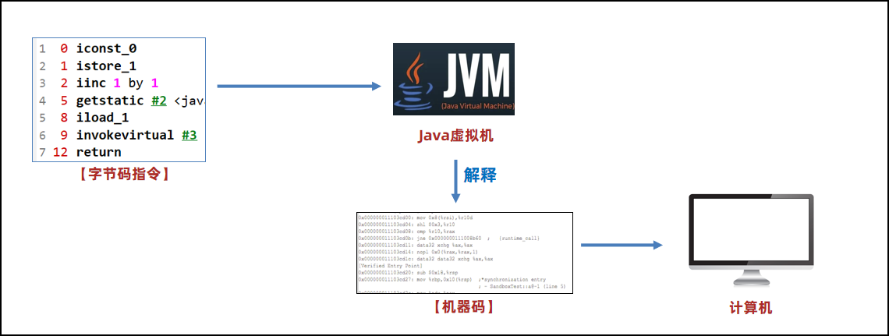

#### 1.2.2 内存管理

- 自动为对象、方法等分配内存
- 自动的垃圾回收机制，回收不再使用的对象

Java虚拟机会帮助程序员为对象分配内存，同时将不用的对象使用垃圾回收器回收掉，这是对比C和C++这些语言的一个优势。在C/C++语言中，对象的回收需要程序员手动去编写代码完成，如果遗漏了这段删除对象的代码，这个对象就会永远占用内存空间，不会再回收。所以JVM的这个功能降低了程序员编写代码的难度。

#### 1.2.3 即时编译

对热点代码进行优化，提升执行效率。即时编译可以说是提升Java程序性能最核心的手段。

#### Java性能低的主要原因和跨平台特性

Java语言如果不做任何的优化，性能其实是不如C和C++语言的。主要原因是：

在程序运行过程中，Java虚拟机需要将字节码指令实时地解释成计算机能识别的机器码，这个过程在运行时可能会反复地执行，所以效率较低。

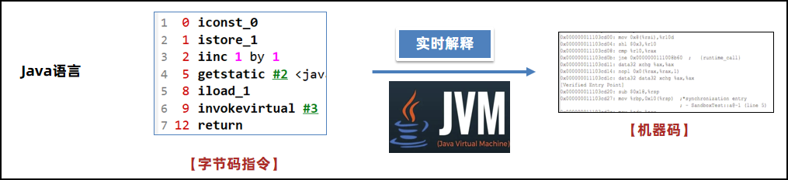

C和C++语言在执行过程中，只需要将源代码编译成可执行文件，就包含了计算机能识别的机器码，无需在运行过程中再实时地解释，所以性能较高。


Java为什么要选择一条执行效率比较低的方式呢？主要是为了实现跨平台的特性。Java的字节码指令，如果希望在不同平台（操作系统+硬件架构），比如在windows或者linux上运行。可以使用同一份字节码指令，交给windows和linux上的Java虚拟机进行解释，这样就可以获得不同平台上的机器码了。这样就实现了Write Once，Run Anywhere 编写一次，到处运行 的目标。

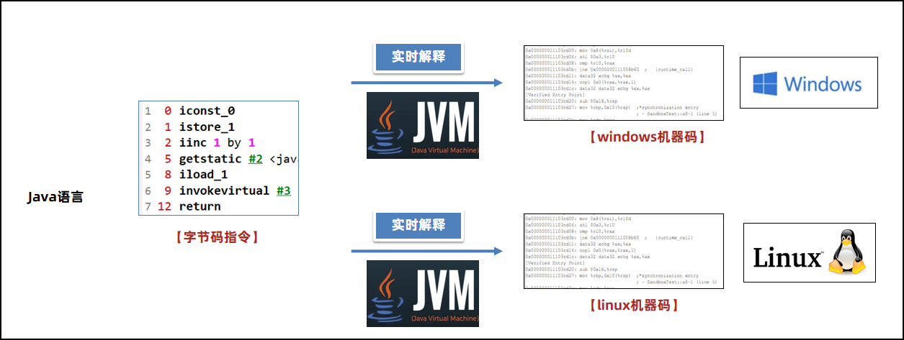

但是C/C++语言，如果要让程序在不同平台上运行，就需要将一份源代码在不同平台上分别进行编译，相对来说比较麻烦。

再回到即时编译，在JDK1.1的版本中就推出了即时编译去优化对应的性能。


虚拟机在运行过程中如果发现某一个方法甚至是循环是热点代码（被非常高频调用），即时编译器会优化这段代码并将优化后的机器码保存在内存中，如果第二次再去执行这段代码。Java虚拟机会将机器码从内存中取出来直接进行调用。这样节省了一次解释的步骤，同时执行的是优化后的代码，效率较高。

Java通过即时编译器获得了接近C/C++语言的性能，在某些特定的场景下甚至可以实现超越。

### 1.3 常见的JVM

#### 1.3.1 Java虚拟机规范

- 《Java虚拟机规范》由Oracle制定，内容主要包含了Java虚拟机在设计和实现时需要遵守的规范，主要包含class字节码文件的定义、类和接口的加载和初始化、指令集等内容。
- 《Java虚拟机规范》是对虚拟机设计的要求，而不是对Java设计的要求，也就是说虚拟机可以运行在其他的语言比如Groovy、Scala生成的class字节码文件之上。
- 官网地址：https://docs.oracle.com/javase/specs/index.html

#### 1.3.2 Java虚拟机规范

平时我们最常用的，就是Hotspot虚拟机。

| 名称                       | 作者    | 支持版本                  | 社区活跃度（github star） | 特性                                                         | 适用场景                             |
| -------------------------- | ------- | ------------------------- | ------------------------- | ------------------------------------------------------------ | ------------------------------------ |
| HotSpot (Oracle JDK版)     | Oracle  | 所有版本                  | 高(闭源)                  | 使用最广泛，稳定可靠，社区活跃JIT支持Oracle JDK默认虚拟机    | 默认                                 |
| HotSpot (Open JDK版)       | Oracle  | 所有版本                  | 中(16.1k)                 | 同上开源，Open JDK默认虚拟机                                 | 默认对JDK有二次开发需求              |
| GraalVM                    | Oracle  | 11, 17,19企业版支持8      | 高（18.7k）               | 多语言支持高性能、JIT、AOT支持                               | 微服务、云原生架构需要多语言混合编程 |
| Dragonwell JDK龙井         | Alibaba | 标准版 8,11,17扩展版11,17 | 低(3.9k)                  | 基于OpenJDK的增强高性能、bug修复、安全性提升JWarmup、ElasticHeap、Wisp特性支持 | 电商、物流、金融领域对性能要求比较高 |
| Eclipse OpenJ9 (原 IBM J9) | IBM     | 8,11,17,19,20             | 低(3.1k)                  | 高性能、可扩展JIT、AOT特性支持                               | 微服务、云原生架构                   |

#### 1.3.3 HotSpot的发展历程

##### 初出茅庐 - 1999年4月  

源自1997年收购的SmallTalk语言的虚拟机，HotSpot虚拟机初次在JDK中使用。在JDK1.2中作为附加功能存在，

JDK1.3之后作为默认的虚拟机。

##### 野蛮生长 - 2006年12月

JDK 6发布，并在虚拟机层面做了大量的优化，这些优化对后续虚拟机的发展产生了深远的影响。

##### 稳步前进 - 2009-2013

JDK7中首次推出了G1垃圾收集器。收购了Sun公司之后，吸纳了JRockIt虚拟机的一些设计思想，JDK8中引入了JMC等工具，去除了永久代。

##### 百家争鸣 - 2018-2019

JDK11优化了G1垃圾收集器的性能,同时推出了ZGC新一代的垃圾回收器，JDK12推出Shenan-doah垃圾回收器。

##### 拥抱云原生 - 2019-至今

以Hotspot为基础的GraalVM虚拟机诞生，不仅让解决了单体应用中多语言整合的难题，同时也提升了这些语言运行时的效率。极高的性能、极快的启动速度也更适用于当下的云原生架构。

## 2、字节码文件详解

### 2.1 Java虚拟机的组成

Java虚拟机主要分为以下几个组成部分：


- 类加载子系统：核心组件类加载器，负责将字节码文件中的内容加载到内存中。
- 运行时数据区：JVM管理的内存，创建出来的对象、类的信息等等内容都会放在这块区域中。
- 执行引擎：包含了即时编译器、解释器、垃圾回收器，执行引擎使用解释器将字节码指令解释成机器码，使用即时编译器优化性能，使用垃圾回收器回收不再使用的对象。
- 本地接口：调用本地使用C/C++编译好的方法，本地方法在Java中声明时，都会带上native关键字，如下图所示。


### 2.2 字节码文件的组成

#### 2.2.1 以正确的姿势打开文件

字节码文件中保存了源代码编译之后的内容，以二进制的方式存储，无法直接用记事本打开阅读。

通过NotePad++使用十六进制插件查看class文件：

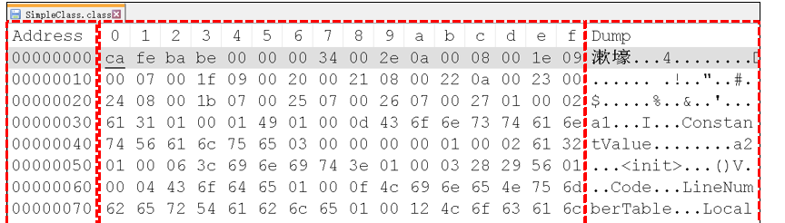

无法解读出文件里包含的内容，推荐使用 jclasslib工具查看字节码文件。 Github地址： https://github.com/ingokegel/jclasslib

安装方式：找到 资料\工具\jclasslib_win64_6_0_4.exe 安装即可


#### 2.2.2 字节码文件的组成

字节码文件总共可以分为以下几个部分：

- **基础信息**：魔数、字节码文件对应的Java版本号、访问标识(public final等等)、父类和接口信息
- **常量池** **：** 保存了字符串常量、类或接口名、字段名，主要在字节码指令中使用
- **字段：** 当前类或接口声明的字段信息
- **方法：** 当前类或接口声明的方法信息，核心内容为方法的字节码指令
- **属性：** 类的属性，比如源码的文件名、内部类的列表等

##### 2.2.2.1 基本信息

基本信息包含了jclasslib中能看到的两块内容：


##### Magic魔数

每个Java字节码文件的前四个字节是固定的，用16进制表示就是0xcafebabe。文件是无法通过文件扩展名来确定文件类型的，文件扩展名可以随意修改不影响文件的内容。软件会使用文件的头几个字节（文件头）去校验文件的类型，如果软件不支持该种类型就会出错。

比如常见的文件格式校验方式如下：

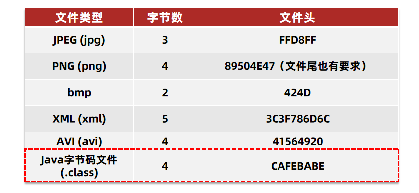

Java字节码文件中，将文件头称为magic魔数。Java虚拟机会校验字节码文件的前四个字节是不是0xcafebabe，如果不是，该字节码文件就无法正常使用，Java虚拟机会抛出对应的错误。

##### 主副版本号

主副版本号指的是编译字节码文件时使用的JDK版本号，主版本号用来标识大版本号，JDK1.0-1.1使用了45.0-45.3，JDK1.2是46之后每升级一个大版本就加1；副版本号是当主版本号相同时作为区分不同版本的标识，一般只需要关心主版本号。

1.2之后大版本号计算方法就是 : 主版本号 – 44，比如主版本号52就是JDK8。


版本号的作用主要是判断当前字节码的版本和运行时的JDK是否兼容。如果使用较低版本的JDK去运行较高版本JDK的字节码文件，无法使用会显示如下错误：

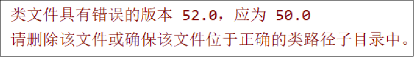

有两种方案：

1.升级JDK版本，将图中使用的JDK6升级至JDK8即可正常运行，容易引发其他的兼容性问题，并且需要大量的测试。

2.将第三方依赖的版本号降低或者更换依赖，以满足JDK版本的要求。建议使用这种方案

##### 其他基础信息

其他基础信息包括访问标识、类和接口索引，如下：

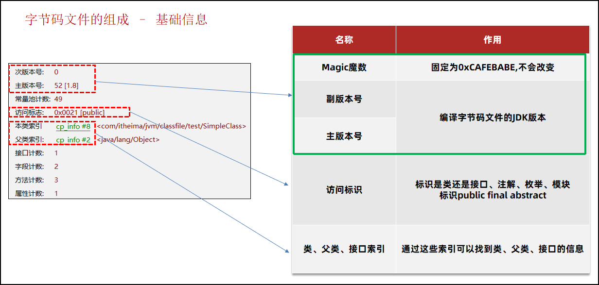

##### 2.2.2.2 常量池

字节码文件中常量池的作用：避免相同的内容重复定义，节省空间。如下图，常量池中定义了一个字符串，字符串的字面量值为123。


比如在代码中，编写了两个相同的字符串“我爱北京天安门”，字节码文件甚至将来在内存中使用时其实只需要保存一份，此时就可以将这个字符串以及字符串里边包含的字面量，放入常量池中以达到节省空间的作用。

```Java
String str1 = "我爱北京天安门";
String str2 = "我爱北京天安门";
```

常量池中的数据都有一个编号，编号从1开始。比如“我爱北京天安门”这个字符串，在常量池中的编号就是7。在字段或者字节码指令中通过编号7可以快速的找到这个字符串。

字节码指令中通过编号引用到常量池的过程称之为符号引用。


##### 2.2.2.3 字段

字段中存放的是当前类或接口声明的字段信息。

如下图中，定义了两个字段a1和a2，这两个字段就会出现在字段这部分内容中。同时还包含字段的名字、描述符（字段的类型）、访问标识（public/private static final等）。


##### 2.2.2.4 方法

字节码中的方法区域是存放**字节码** **指令**的核心位置，字节码指令的内容存放在方法的Code属性中。


通过分析方法的字节码指令，可以清楚地了解一个方法到底是如何执行的。先来看如下案例：

```Java
int i = 0;
int j = i + 1;
```

这段代码编译成字节码指令之后是如下内容：


要理解这段字节码指令是如何执行的，我们需要先理解两块内存区域：操作数栈和局部变量表。

**操作数栈**是用来存放临时数据的内容，是一个栈式的结构，先进后出。

**局部变量****表**是存放方法中的局部变量，包含方法的参数、方法中定义的局部变量，在编译期就已经可以确定方法有多少个局部变量。

1、iconst_0，将常量0放入操作数栈。此时栈上只有0。


2、istore_1会从操作数栈中，将栈顶的元素弹出来，此时0会被弹出，放入局部变量表的1号位置。局部变量表中的1号位置，在编译时就已经确定是局部变量i使用的位置。完成了对局部变量i的赋值操作。


3、iload_1将局部变量表1号位置的数据放入操作数栈中，此时栈中会放入0。

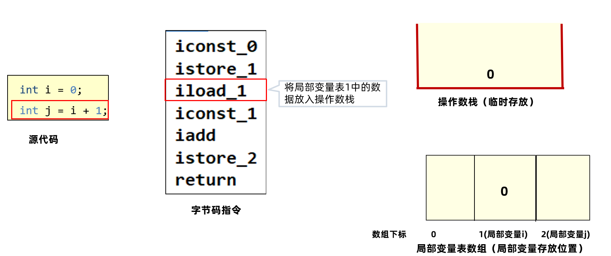

4、iconst_1会将常量1放入操作数栈中。


5、iadd会将操作数栈顶部的两个数据相加，现在操作数栈上有两个数0和1，相加之后结果为1放入操作数栈中，此时栈上只有一个数也就是相加的结果1。

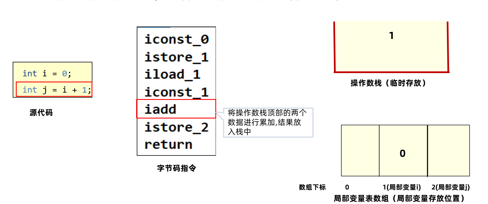

6、istore_2从操作数栈中将1弹出，并放入局部变量表的2号位置，2号位置是j在使用。完成了对局部变量j的赋值操作。

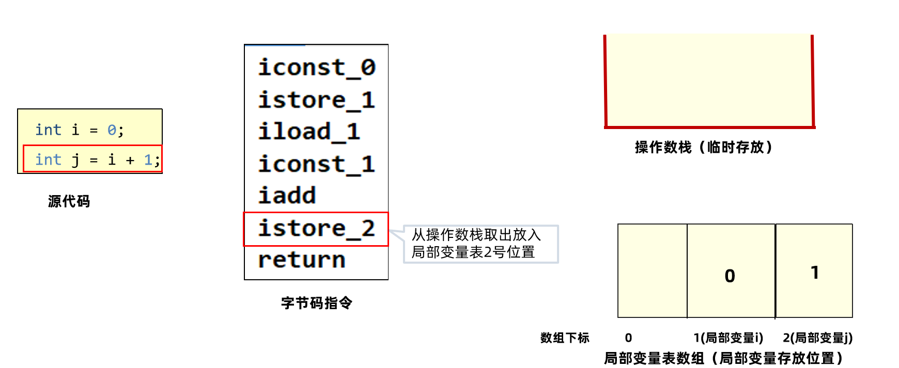

7、return语句执行，方法结束并返回。

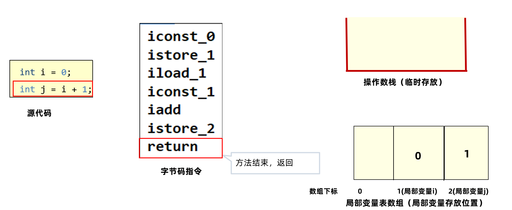

同理，同学们可以自行分析下i++和++i的字节码指令执行的步骤。

i++的字节码指令如下，其中iinc 1 by 1指令指的是将局部变量表1号位置增加1，其实就实现了i++的操作。

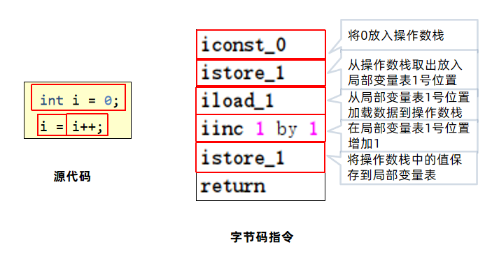

而++i只是对两个字节码指令的顺序进行了更改：

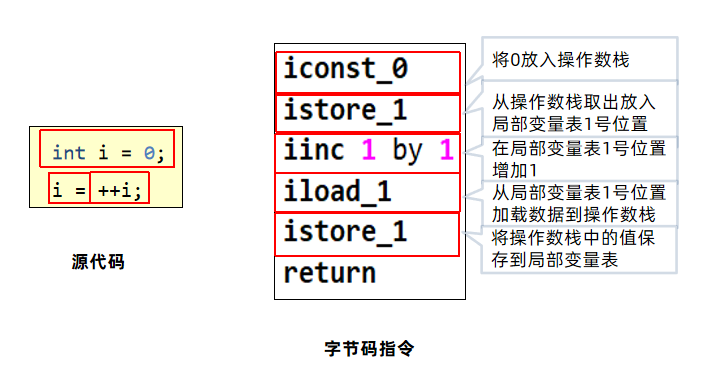

##### 面试题：

问：int i = 0; i = i++; 最终i的值是多少？

答：答案是0，我通过分析字节码指令发现，i++先把0取出来放入临时的操作数栈中，

接下来对i进行加1，i变成了1，最后再将之前保存的临时值0放入i，最后i就变成了0。

#### 2.2.2.5 属性

##### 属性主要指的是类的属性，比如源码的文件名、内部类的列表等。

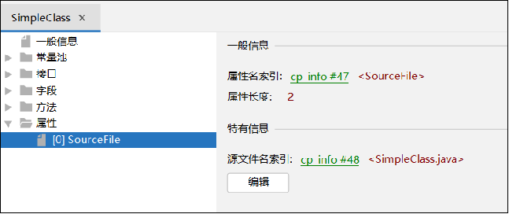

#### 2.2.3 玩转字节码常用工具

##### 2.2.3.1 javap

javap是JDK自带的反编译工具，可以通过控制台查看字节码文件的内容。适合在服务器上查看字节码文件内容。

直接输入javap查看所有参数。输入`javap -v` 字节码文件名称 查看具体的字节码信息。如果jar包需要先使用 `jar –xvf` 命令解压。


##### 2.2.3.2 jclasslib插件

jclasslib也有Idea插件版本，建议开发时使用Idea插件版本，可以在代码编译之后实时看到字节码文件内容。

安装方式：

1、打开idea的插件页面，搜索jclasslib


2、选中要查看的源代码文件，选择 视图(View) - Show Bytecode With Jclasslib


右侧会展示对应源代码编译后的字节码文件内容：

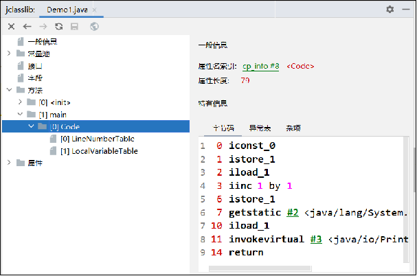

> tips:
>
> 1、一定要选择文件再点击视图(view)菜单，否则菜单项不会出现。
>
> 2、文件修改后一定要重新编译之后，再点击刷新按钮。

##### 2.2.3.3 Arthas

Arthas 是一款线上监控诊断产品，通过全局视角实时查看应用 load、内存、gc、线程的状态信息，并能在不修改应用代码的情况下，对业务问题进行诊断，大大提升线上问题排查效率。 官网：https://arthas.aliyun.com/doc/ Arthas的功能列表如下：


**安装方法：**

1、将 资料/工具/arthas-boot.jar 文件复制到任意工作目录。

2、使用`java -jar arthas-boot.jar ` 启动程序。

3、输入需要Arthas监控的进程id。


4、输入命令即可使用。

**dump**

命令详解：https://arthas.aliyun.com/doc/dump.html

dump命令可以将字节码文件保存到本地，如下将`java.lang.String` 的字节码文件保存到了/tmp/output目录下：

```Bash
$ dump -d /tmp/output java.lang.String

 HASHCODE  CLASSLOADER  LOCATION
 null                   /tmp/output/java/lang/String.class
Affect(row-cnt:1) cost in 138 ms.
```

**jad**

命令详解：https://arthas.aliyun.com/doc/jad.html

jad命令可以将类的字节码文件进行反编译成源代码，用于确认服务器上的字节码文件是否是最新的，如下将demo.MathGame的源代码进行了显示。

```Java
$ jad --source-only demo.MathGame
/*
 * Decompiled with CFR 0_132.
 */
package demo;

import java.io.PrintStream;
import java.util.ArrayList;
import java.util.Iterator;
import java.util.List;
import java.util.Random;
import java.util.concurrent.TimeUnit;

public class MathGame {
    private static Random random = new Random();
    public int illegalArgumentCount = 0;
...
```

### 2.3、类的生命周期

类的生命周期描述了一个类加载、使用、卸载的整个过程。整体可以分为：

- 加载
- 连接，其中又分为验证、准备、解析三个子阶段
- 初始化
- 使用
- 卸载


#### 2.3.1 加载阶段

1、加载(Loading)阶段第一步是类加载器根据类的全限定名通过不同的渠道以二进制流的方式获取字节码信息，程序员可以使用Java代码拓展的不同的渠道。

- 从本地磁盘上获取文件
- 运行时通过动态代理生成，比如Spring框架
- Applet技术通过网络获取字节码文件

2、类加载器在加载完类之后，Java虚拟机会将字节码中的信息保存到方法区中，方法区中生成一个InstanceKlass对象，保存类的所有信息，里边还包含实现特定功能比如多态的信息。


4、Java虚拟机同时会在堆上生成与方法区中数据类似的java.lang.Class对象，作用是在Java代码中去获取类的信息以及存储静态字段的数据（JDK8及之后）。


#### 2.3.2 连接阶段

连接阶段分为三个子阶段:

- 验证，验证内容是否满足《Java虚拟机规范》。
- 准备，给静态变量赋初值。
- 解析，将常量池中的符号引用替换成指向内存的直接引用。

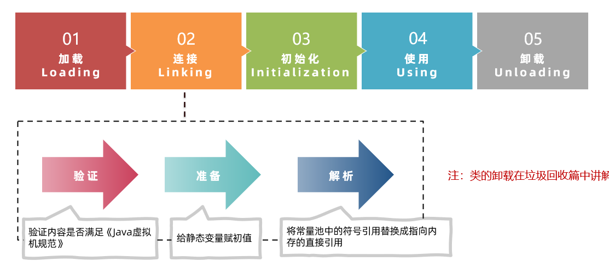

##### 验证

验证的主要目的是检测Java字节码文件是否遵守了《Java虚拟机规范》中的约束。这个阶段一般不需要程序员参与。主要包含如下四部分，具体详见《Java虚拟机规范》：

1、文件格式验证，比如文件是否以0xCAFEBABE开头，主次版本号是否满足当前Java虚拟机版本要求。


2、元信息验证，例如类必须有父类（super不能为空）。

3、验证程序执行指令的语义，比如方法内的指令执行中跳转到不正确的位置。

4、符号引用验证，例如是否访问了其他类中private的方法等。

对版本号的验证，在JDK8的源码中如下：


编译文件的主版本号不能高于运行环境主版本号，如果主版本号相等，副版本号也不能超过。

##### 准备

准备阶段为静态变量（static）分配内存并设置初值，每一种基本数据类型和引用数据类型都有其初值。

| **数据类型**          | **初始值**   |
| --------------------- | ------------ |
| **int**               | **0**        |
| **long**              | **0L**       |
| **short**             | **0**        |
| **char**              | **‘\u0000’** |
| **byte**              | **0**        |
| **boolean**           | **false**    |
| **double**            | **0.0**      |
| **引用** **数据类型** | **null**     |

如下代码s

```Java
public class Student{

public static int value = 1;

}
```

在准备阶段会为value分配内存并赋初值为0，在初始化阶段才会将值修改为1。

> final修饰的基本数据类型的静态变量，准备阶段直接会将代码中的值进行赋值。
>
> 如下例子中，变量加上final进行修饰，在准备阶段value值就直接变成1了，因为final修饰的变量后续不会发生值的变更。

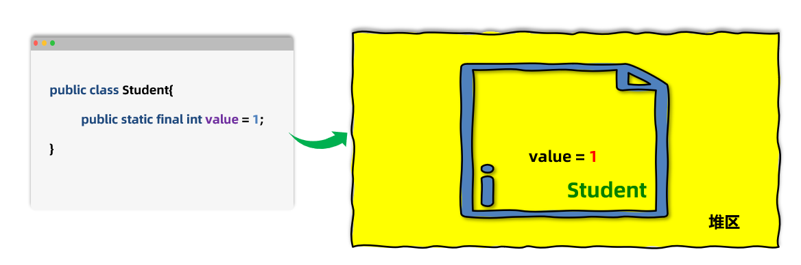

来看这个案例：

```Java
public class HsdbDemo {
    public static final int i = 2;
    public static void main(String[] args) throws IOException, InstantiationException, IllegalAccessException {
        HsdbDemo hsdbDemo = new HsdbDemo();
        System.out.println(i);
        System.in.read();
    }
}
```

从字节码文件也可以看到，编译器已经确定了该字段指向了常量池中的常量2：


##### 解析

解析阶段主要是将常量池中的符号引用替换为直接引用，符号引用就是在字节码文件中使用编号来访问常量池中的内容。


直接引用不在使用编号，而是使用内存中地址进行访问具体的数据。

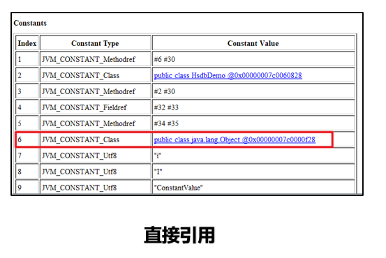

#### 2.3.3 初始化阶段

初始化阶段会执行字节码文件中clinit（class init 类的初始化）方法的字节码指令，包含了静态代码块中的代码，并为静态变量赋值。

如下代码编译成字节码文件之后，会生成三个方法：

```Java
public class Demo1 {

    public static int value = 1;
    static {
        value = 2;
    }
   
    public static void main(String[] args) {

    }
}
```


- init方法，会在对象初始化时执行
- main方法，主方法
- clinit方法，类的初始化阶段执行

继续来看clinit方法中的字节码指令：

1、iconst_1，将常量1放入操作数栈。此时栈中只有1这个数。


2、putstatic指令会将操作数栈上的数弹出来，并放入堆中静态变量的位置，字节码指令中#2指向了常量池中的静态变量value，在解析阶段会被替换成变量的地址。

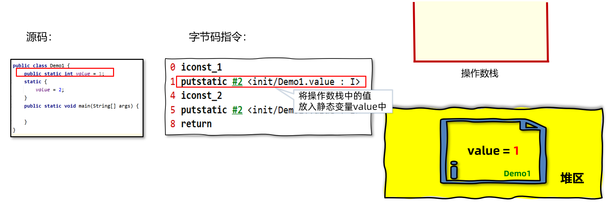

3、后两步操作类似，执行value=2，将堆上的value赋值为2。

如果将代码的位置互换：

```Java
public class Demo1 {
    static {
        value = 2;
    }
   
    public static int value = 1;
   
    public static void main(String[] args) {

    }
}
```

字节码指令的位置也会发生变化：


这样初始化结束之后，最终value的值就变成了1而不是2。

以下几种方式会导致类的初始化：

1.访问一个类的静态变量或者静态方法，注意变量是final修饰的并且等号右边是常量不会触发初始化。

2.调用Class.forName(String className)。

3.new一个该类的对象时。

4.执行Main方法的当前类。

添加-XX:+TraceClassLoading 参数可以打印出加载并初始化的类

##### 面试题1：

如下代码的输出结果是什么？

```Java
public class Test1 {
    public static void main(String[] args) {
        System.out.println("A");
        new Test1();
        new Test1();
    }

    public Test1(){
        System.out.println("B");
    }

    {
        System.out.println("C");
    }

    static {
        System.out.println("D");
    }
}
```

分析步骤：

1、执行main方法之前，先执行clinit指令。


指令会输出D

2、执行main方法的字节码指令。

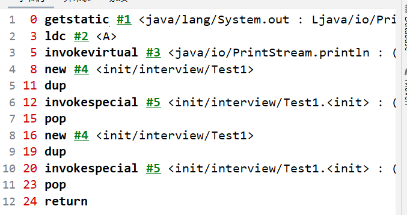

指令会输出A

3、创建两个对象，会执行两次对象初始化的指令。

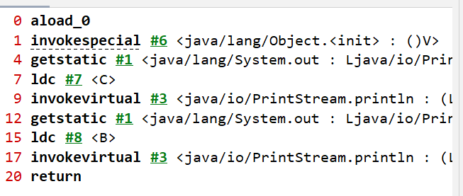

这里会输出CB，源代码中输出C这行，被放到了对象初始化的一开始来执行。

所以最后的结果应该是DACBCB

##### clinit不会执行的几种情况

如下几种情况是不会进行初始化指令执行的：

1.无静态代码块且无静态变量赋值语句。

2.有静态变量的声明，但是没有赋值语句。


3.静态变量的定义使用final关键字，这类变量会在准备阶段直接进行初始化。


##### 面试题2：

如下代码的输出结果是什么？

```Java
public class Demo01 {
    public static void main(String[] args) {
        new B02();
        System.out.println(B02.a);
    }
}

class A02{
    static int a = 0;
    static {
        a = 1;
    }
}

class B02 extends A02{
    static {
        a = 2;
    }
}
```

分析步骤：

1、调用new创建对象，需要初始化B02，优先初始化父类。

2、执行A02的初始化代码，将a赋值为1。

3、B02初始化，将a赋值为2。

###### 变化

将`new B02();`注释掉会怎么样？

分析步骤：

1、访问父类的静态变量，只初始化父类。

2、执行A02的初始化代码，将a赋值为1。

##### 补充练习题

分析如下代码执行结果:

```Java
public class Test2 {
    public static void main(String[] args) {
        Test2_A[] arr = new Test2_A[10];

    }
}

class Test2_A {
    static {
        System.out.println("Test2 A的静态代码块运行");
    }
}
```

数组的创建不会导致数组中元素的类进行初始化。

```Java
public class Test4 {
    public static void main(String[] args) {
        System.out.println(Test4_A.a);
    }
}

class Test4_A {
    public static final int a = Integer.valueOf(1);

    static {
        System.out.println("Test3 A的静态代码块运行");
    }
}
```

final修饰的变量如果赋值的内容需要执行指令才能得出结果，会执行clinit方法进行初始化。

### 2.4、类加载器

#### 2.4.1 什么是类加载器

类加载器（ClassLoader）是Java虚拟机提供给应用程序去实现获取类和接口字节码数据的技术，类加载器只参与加载过程中的字节码获取并加载到内存这一部分。

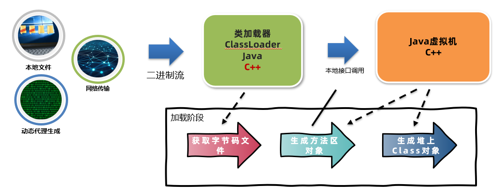

类加载器会通过二进制流的方式获取到字节码文件的内容，接下来将获取到的数据交给Java虚拟机，虚拟机会在方法区和堆上生成对应的对象保存字节码信息。

#### 2.4.2 类加载器的分类

类加载器分为两类，一类是Java代码中实现的，一类是Java虚拟机底层源码实现的。

- 虚拟机底层实现：源代码位于Java虚拟机的源码中，实现语言与虚拟机底层语言一致，比如Hotspot使用C++。主要目的是保证Java程序运行中基础类被正确地加载，比如java.lang.String，Java虚拟机需要确保其可靠性。
- JDK中默认提供或者自定义：JDK中默认提供了多种处理不同渠道的类加载器，程序员也可以自己根据需求定制，使用Java语言。所有Java中实现的类加载器都需要继承ClassLoader这个抽象类。

类加载器的设计JDK8和8之后的版本差别较大，首先来看JDK8及之前的版本，这些版本中默认的类加载器有如下几种：

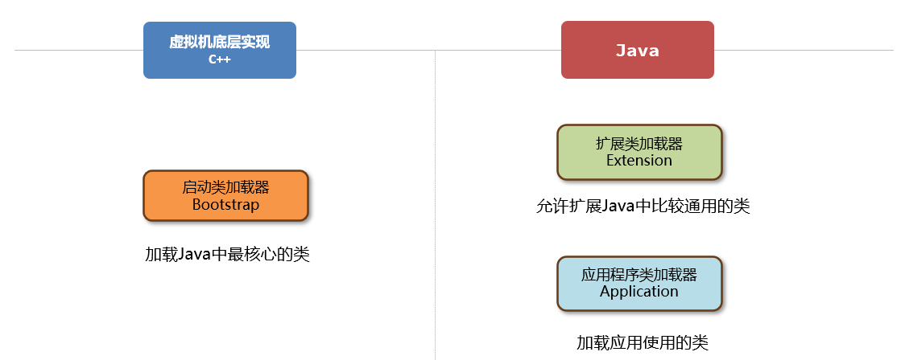

类加载器的详细信息可以通过Arthas的classloader命令查看：

> java -jar arthas-boot.jar
>
> `classloader` - 查看 classloader 的继承树，urls，类加载信息，使用 classloader 去 getResource


- BootstrapClassLoader是启动类加载器，numberOfInstances是类加载器的数量只有1个，loadedCountTotal是加载类的数量1861个。
- ExtClassLoader是扩展类加载器
- AppClassLoader是应用程序类加载器

#### 2.4.3 启动类加载器

- 启动类加载器（Bootstrap ClassLoader）是由Hotspot虚拟机提供的、使用C++编写的类加载器。
- 默认加载Java安装目录/jre/lib下的类文件，比如rt.jar，tools.jar，resources.jar等。

运行如下代码：

```Java
/**
 * 启动程序类加载器案例
 */
public class BootstrapClassLoaderDemo {
    public static void main(String[] args) throws IOException {
        ClassLoader classLoader = String.class.getClassLoader();
        System.out.println(classLoader);

        System.in.read();
    }
}
```

这段代码通过String类获取到它的类加载器并且打印，结果是`null`。这是因为启动类加载器在JDK8中是由C++语言来编写的，在Java代码中去获取既不适合也不安全，所以才返回`null`

在Arthas中可以通过`sc -d 类名`的方式查看加载这个类的类加载器详细的信息，比如：

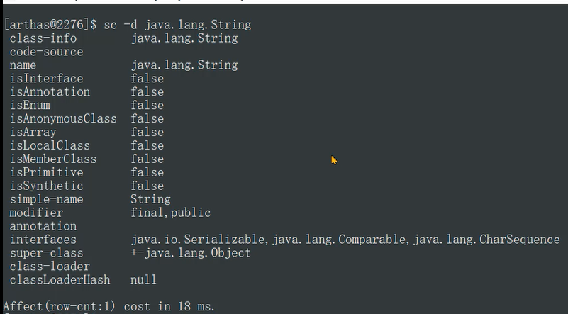

通过上图可以看到，java.lang.String类的类加载器是空的，Hash值也是null。

##### 用户扩展基础jar包

如果用户想扩展一些比较基础的jar包，让启动类加载器加载，有两种途径：

- **放入jre/lib下进行扩展**。不推荐，尽可能不要去更改JDK安装目录中的内容，会出现即时放进去由于文件名不匹配的问题也不会正常地被加载。
- **使用参数进行扩展。**推荐，使用-Xbootclasspath/a:jar包目录/jar包名 进行扩展，参数中的/a代表新增。

如下图，在IDEA配置中添加虚拟机参数，就可以加载`D:/jvm/jar/classloader-test.jar`这个jar包了。

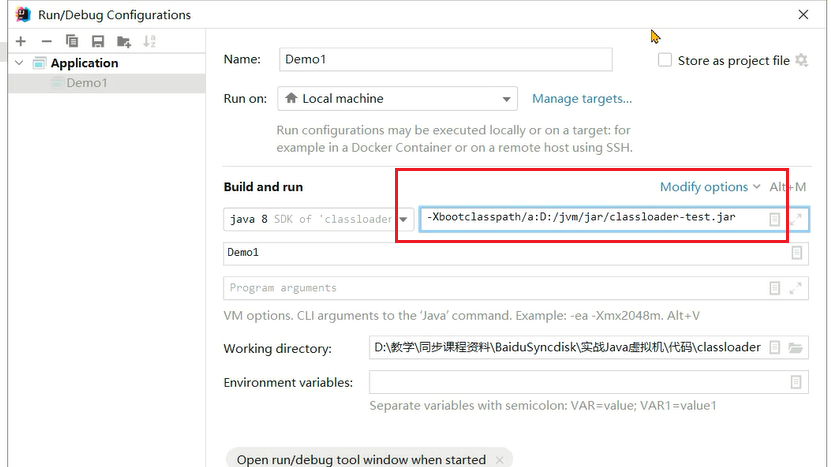

#### 2.4.4 扩展类加载器和应用程序类加载器

- 扩展类加载器和应用程序类加载器都是JDK中提供的、使用Java编写的类加载器。
- 它们的源码都位于sun.misc.Launcher中，是一个静态内部类。继承自URLClassLoader。具备通过目录或者指定jar包将字节码文件加载到内存中。

继承关系图如下：


- ClassLoader类定义了具体的行为模式，简单来说就是先从本地或者网络获得字节码信息，然后调用虚拟机底层的方法创建方法区和堆上的对象。这样的好处就是让子类只需要去实现如何获取字节码信息这部分代码。
- SecureClassLoader提供了证书机制，提升了安全性。
- URLClassLoader提供了根据URL获取目录下或者指定jar包进行加载，获取字节码的数据。
- 扩展类加载器和应用程序类加载器继承自URLClassLoader，获得了上述的三种能力。

##### 扩展类加载器

扩展类加载器（Extension Class Loader）是JDK中提供的、使用Java编写的类加载器。默认加载Java安装目录/jre/lib/ext下的类文件。


如下代码会打印ScriptEnvironment类的类加载器。ScriptEnvironment是nashorn框架中用来运行javascript语言代码的环境类，他位于nashorn.jar包中被扩展类加载器加载

```Java
/**
 * 扩展类加载器
 */
public class ExtClassLoaderDemo {
    public static void main(String[] args) throws IOException {
        ClassLoader classLoader = ScriptEnvironment.class.getClassLoader();
        System.out.println(classLoader);
    }
}
```

打印结果如下：


通过扩展类加载器去加载用户jar包：

- **放入/jre/lib/ext下进行扩展**。不推荐，尽可能不要去更改JDK安装目录中的内容。
- **使用参数进行扩展使用参数进行扩展**。推荐，使用-Djava.ext.dirs=jar包目录 进行扩展,这种方式会覆盖掉原始目录，可以用;(windows):(macos/linux)追加上原始目录

如下图中：


使用`引号`将整个地址包裹起来，这样路径中即便是有空格也不需要额外处理。路径中要包含原来ext文件夹，同时在最后加上扩展的路径。

#####  应用程序加载器

应用程序类加载器会加载classpath下的类文件，默认加载的是项目中的类以及通过maven引入的第三方jar包中的类。

如下案例中，打印出`Student`和`FileUtils`的类加载器：

```Java
/**
 * 应用程序类加载器案例
 */
public class AppClassLoaderDemo {
    public static void main(String[] args) throws IOException, InterruptedException {
        //当前项目中创建的Student类
        Student student = new Student();
        ClassLoader classLoader = Student.class.getClassLoader();
        System.out.println(classLoader);

        //maven依赖中包含的类
        ClassLoader classLoader1 = FileUtils.class.getClassLoader();
        System.out.println(classLoader1);

        Thread.sleep(1000);
        System.in.read();

    }
}
```

输出结果如下：


这两个类均由应用程序类加载器加载。

类加载器的加载路径可以通过classloader –c hash值 查看：


### 2.5、双亲委派机制

双亲委派机制指的是：当一个类加载器接收到加载类的任务时，会自底向上查找是否加载过，

再由顶向下进行加载。

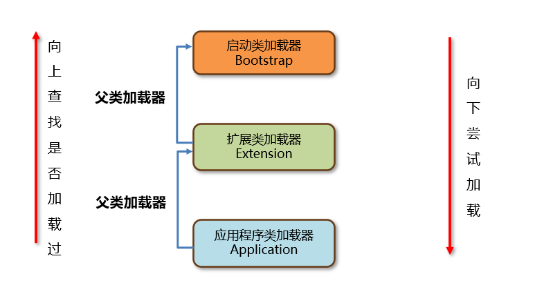

详细流程：

每个类加载器都有一个父类加载器。父类加载器的关系如下，启动类加载器没有父类加载器：

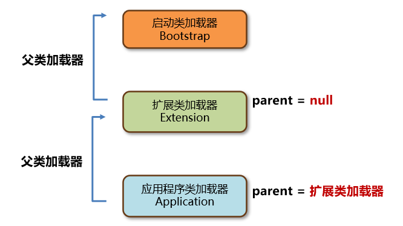

在类加载的过程中，每个类加载器都会先检查是否已经加载了该类，如果已经加载则直接返回，否则会将加载请求委派给父类加载器。

#### 案例1：

比如com.itheima.my.A假设在启动类加载器的加载目录中，而应用程序类加载器接到了加载类的任务。

1、应用程序类加载器首先判断自己加载过没有，没有加载过就交给父类加载器 - 扩展类加载器。


2、扩展类加载器也没加载过，交给他的父类加载器 - 启动类加载器。


3、启动类加载器发现已经加载过，直接返回。


#### 案例2：

B类在扩展类加载器加载路径中，同样应用程序类加载器接到了加载任务，按照案例1中的方式一层一层向上查找，发现都没有加载过。那么启动类加载器会首先尝试加载。它发现这类不在它的加载目录中，向下传递给扩展类加载器。

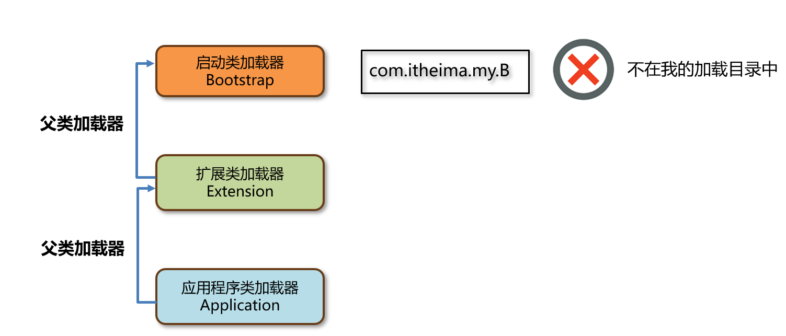

扩展类加载器发现这个类在它加载路径中，加载成功并返回。


如果第二次再接收到加载任务，同样地向上查找。扩展类加载器发现已经加载过，就可以返回了。

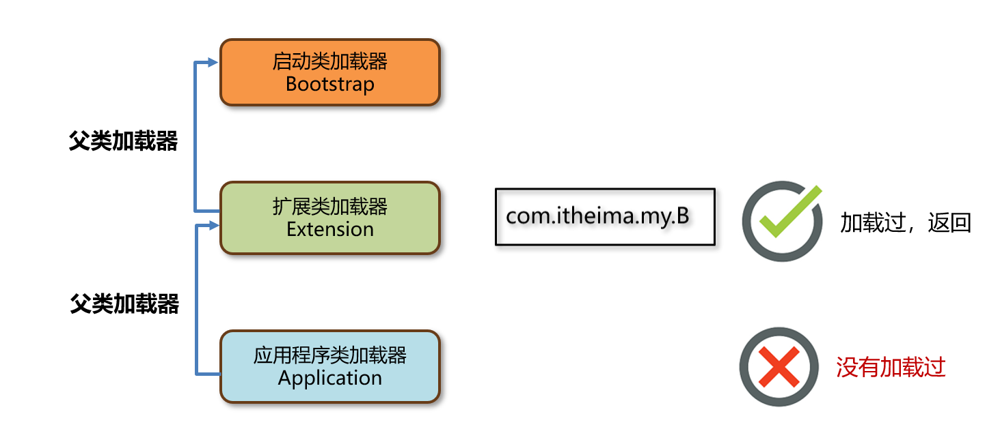

#### 双亲委派机制的作用

1.保证类加载的安全性。通过双亲委派机制避免恶意代码替换JDK中的核心类库，比如java.lang.String，确保核心类库的完整性和安全性。

2.避免重复加载。双亲委派机制可以避免同一个类被多次加载。

#### 如何指定加载类的类加载器？

在Java中如何使用代码的方式去主动加载一个类呢？

方式1：使用Class.forName方法，使用当前类的类加载器去加载指定的类。

方式2：获取到类加载器，通过类加载器的loadClass方法指定某个类加载器加载。

例如：


#### 三个面试题

1、如果一个类重复出现在三个类加载器的加载位置，应该由谁来加载？

启动类加载器加载，根据双亲委派机制，它的优先级是最高的

2、String类能覆盖吗，在自己的项目中去创建一个java.lang.String类，会被加载吗？

不能，会返回启动类加载器加载在rt.jar包中的String类。

3、**类的双亲委派机制是什么？**

- 当一个类加载器去加载某个类的时候，会自底向上查找是否加载过，如果加载过就直接返回，如果一直到最顶层的类加载器都没有加载，再由顶向下进行加载。
- 应用程序类加载器的父类加载器是扩展类加载器，扩展类加载器的父类加载器是启动类加载器。
- 双亲委派机制的好处有两点：第一是避免恶意代码替换JDK中的核心类库，比如java.lang.String，确保核心类库的完整性和安全性。第二是避免一个类重复地被加载。

### 2.6、打破双亲委派机制

打破双亲委派机制历史上有三种方式，但本质上只有第一种算是真正的打破了双亲委派机制：

- 自定义类加载器并且重写loadClass方法。Tomcat通过这种方式实现应用之间类隔离，《面试篇》中分享它的做法。
- 线程上下文类加载器。利用上下文类加载器加载类，比如JDBC和JNDI等。
- Osgi框架的类加载器。历史上Osgi框架实现了一套新的类加载器机制，允许同级之间委托进行类的加载，目前很少使用。

#### 自定义类加载器

一个Tomcat程序中是可以运行多个Web应用的，如果这两个应用中出现了相同限定名的类，比如Servlet类，Tomcat要保证这两个类都能加载并且它们应该是不同的类。如果不打破双亲委派机制，当应用类加载器加载Web应用1中的MyServlet之后，Web应用2中相同限定名的MyServlet类就无法被加载了。

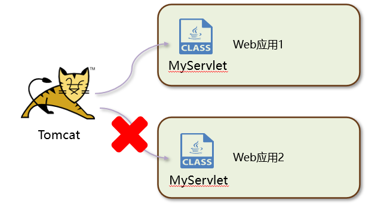

Tomcat使用了自定义类加载器来实现应用之间类的隔离。 每一个应用会有一个独立的类加载器加载对应的类。


那么自定义加载器是如何能做到的呢？首先我们需要先了解，双亲委派机制的代码到底在哪里，接下来只需要把这段代码消除即可。

ClassLoader中包含了4个核心方法，双亲委派机制的核心代码就位于loadClass方法中。

```Java
public Class<?> loadClass(String name)
类加载的入口，提供了双亲委派机制。内部会调用findClass   重要

protected Class<?> findClass(String name)
由类加载器子类实现,获取二进制数据调用defineClass ，比如URLClassLoader会根据文件路径去获取类文件中的二进制数据。重要

protected final Class<?> defineClass(String name, byte[] b, int off, int len)
做一些类名的校验，然后调用虚拟机底层的方法将字节码信息加载到虚拟机内存中

protected final void resolveClass(Class<?> c)
执行类生命周期中的连接阶段
```

1、入口方法：

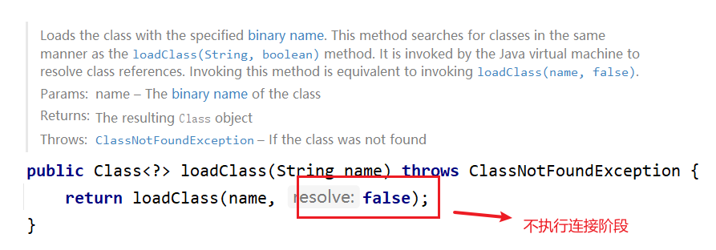

2、再进入看下：

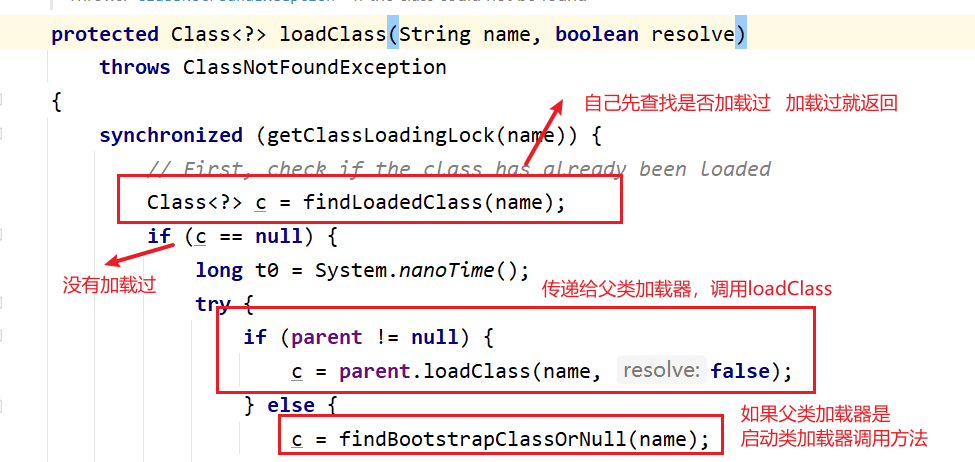

如果查找都失败，进入加载阶段，首先会由启动类加载器加载，这段代码在`findBootstrapClassOrNull`中。如果失败会抛出异常，接下来执行下面这段代码：

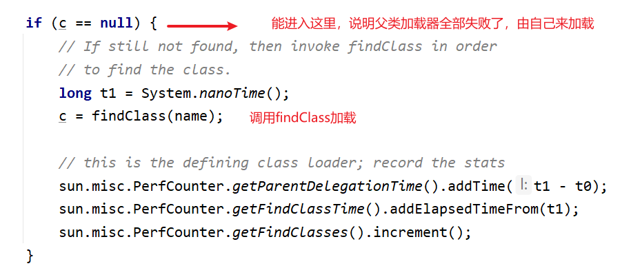

父类加载器加载失败就会抛出异常，回到子类加载器的这段代码，这样就实现了加载并向下传递。

3、最后根据传入的参数判断是否进入连接阶段：

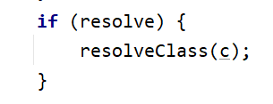

接下来实现打破双亲委派机制：

```Java
package classloader.broken;//package com.itheima.jvm.chapter02.classloader.broken;

import org.apache.commons.io.IOUtils;

import java.io.File;
import java.io.FileInputStream;
import java.io.IOException;
import java.io.InputStream;
import java.nio.charset.StandardCharsets;
import java.security.ProtectionDomain;
import java.util.regex.Matcher;

/**
 * 打破双亲委派机制 - 自定义类加载器
 */

public class BreakClassLoader1 extends ClassLoader {

    private String basePath;
    private final static String FILE_EXT = ".class";

    //设置加载目录
    public void setBasePath(String basePath) {
        this.basePath = basePath;
    }

    //使用commons io 从指定目录下加载文件
    private byte[] loadClassData(String name)  {
        try {
            String tempName = name.replaceAll("\\.", Matcher.quoteReplacement(File.separator));
            FileInputStream fis = new FileInputStream(basePath + tempName + FILE_EXT);
            try {
                return IOUtils.toByteArray(fis);
            } finally {
                IOUtils.closeQuietly(fis);
            }

        } catch (Exception e) {
            System.out.println("自定义类加载器加载失败，错误原因：" + e.getMessage());
            return null;
        }
    }

    //重写loadClass方法
    @Override
    public Class<?> loadClass(String name) throws ClassNotFoundException {
        //如果是java包下，还是走双亲委派机制
        if(name.startsWith("java.")){
            return super.loadClass(name);
        }
        //从磁盘中指定目录下加载
        byte[] data = loadClassData(name);
        //调用虚拟机底层方法，方法区和堆区创建对象
        return defineClass(name, data, 0, data.length);
    }

    public static void main(String[] args) throws ClassNotFoundException, InstantiationException, IllegalAccessException, IOException {
        //第一个自定义类加载器对象
        BreakClassLoader1 classLoader1 = new BreakClassLoader1();
        classLoader1.setBasePath("D:\\lib\\");

        Class<?> clazz1 = classLoader1.loadClass("com.itheima.my.A");
         //第二个自定义类加载器对象
        BreakClassLoader1 classLoader2 = new BreakClassLoader1();
        classLoader2.setBasePath("D:\\lib\\");

        Class<?> clazz2 = classLoader2.loadClass("com.itheima.my.A");

        System.out.println(clazz1 == clazz2);

        Thread.currentThread().setContextClassLoader(classLoader1);

        System.out.println(Thread.currentThread().getContextClassLoader());

        System.in.read();
     }
}
```

##### 自定义类加载器父类怎么是AppClassLoader呢？

默认情况下自定义类加载器的父类加载器是应用程序类加载器：


以Jdk8为例，ClassLoader类中提供了构造方法设置parent的内容：


这个构造方法由另外一个构造方法调用，其中父类加载器由getSystemClassLoader方法设置，该方法返回的是AppClassLoader。


##### 两个自定义类加载器加载相同限定名的类，不会冲突吗？

不会冲突，在同一个Java虚拟机中，只有相同类加载器+相同的类限定名才会被认为是同一个类。

在Arthas中使用sc –d 类名的方式查看具体的情况。

如下代码：

```Java
 public static void main(String[] args) throws ClassNotFoundException, InstantiationException, IllegalAccessException, IOException {
        //第一个自定义类加载器对象
        BreakClassLoader1 classLoader1 = new BreakClassLoader1();
        classLoader1.setBasePath("D:\\lib\\");

        Class<?> clazz1 = classLoader1.loadClass("com.itheima.my.A");
         //第二个自定义类加载器对象
        BreakClassLoader1 classLoader2 = new BreakClassLoader1();
        classLoader2.setBasePath("D:\\lib\\");

        Class<?> clazz2 = classLoader2.loadClass("com.itheima.my.A");

        System.out.println(clazz1 == clazz2);
     }
```

打印的应该是false，因为两个类加载器不同，尽管加载的是同一个类名，最终Class对象也不是相同的。

通过Arthas看：


也会出现两个不同的A类。

#### 线程上下文类加载器

利用上下文类加载器加载类，比如JDBC和JNDI等。

我们来看下JDBC的案例：

1、JDBC中使用了DriverManager来管理项目中引入的不同数据库的驱动，比如mysql驱动、oracle驱动。

```Java
package classloader.broken;//package com.itheima.jvm.chapter02.classloader.broken;

import com.mysql.cj.jdbc.Driver;

import java.sql.*;

/**
 * 打破双亲委派机制 - JDBC案例
 */

public class JDBCExample {
    // JDBC driver name and database URL
    static final String JDBC_DRIVER = "com.mysql.cj.jdbc.Driver";
    static final String DB_URL = "jdbc:mysql:///bank1";

    //  Database credentials
    static final String USER = "root";
    static final String PASS = "123456";

    public static void main(String[] args) {
        Connection conn = null;
        Statement stmt = null;
        try {
            conn = DriverManager.getConnection(DB_URL, USER, PASS);
            stmt = conn.createStatement();
            String sql;
            sql = "SELECT id, account_name FROM account_info";
            ResultSet rs = stmt.executeQuery(sql);

            //STEP 4: Extract data from result set
            while (rs.next()) {
                //Retrieve by column name
                int id = rs.getInt("id");
                String name = rs.getString("account_name");

                //Display values
                System.out.print("ID: " + id);
                System.out.print(", Name: " + name + "\n");
            }
            //STEP 5: Clean-up environment
            rs.close();
            stmt.close();
            conn.close();
        } catch (SQLException se) {
            //Handle errors for JDBC
            se.printStackTrace();
        } catch (Exception e) {
            //Handle errors for Class.forName
            e.printStackTrace();
        } finally {
            //finally block used to close resources
            try {
                if (stmt != null)
                    stmt.close();
            } catch (SQLException se2) {
            }// nothing we can do
            try {
                if (conn != null)
                    conn.close();
            } catch (SQLException se) {
                se.printStackTrace();
            }//end finally try
        }//end try
    }//end main
}//end FirstExample
```

2、DriverManager类位于rt.jar包中，由启动类加载器加载。

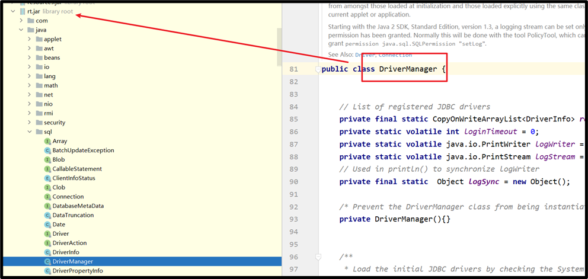

3、依赖中的mysql驱动对应的类，由应用程序类加载器来加载。

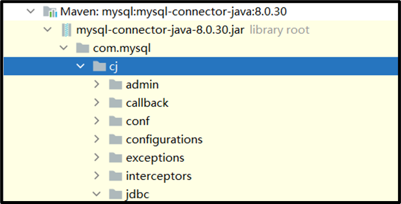

在类中有初始化代码：


DriverManager属于rt.jar是启动类加载器加载的。而用户jar包中的驱动需要由应用类加载器加载，*这就违反了双亲委派机制*。（这点存疑，一会儿再讨论）

那么问题来了，DriverManager怎么知道jar包中要加载的驱动在哪儿？

1、在类的初始化代码中有这么一个方法`LoadInitialDrivers`：

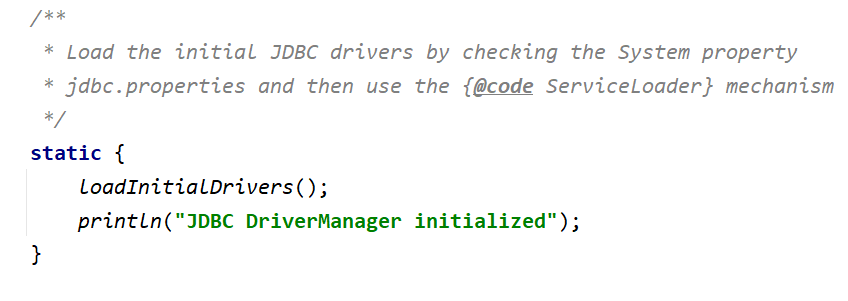

2、这里使用了SPI机制，去加载所有jar包中实现了Driver接口的实现类。

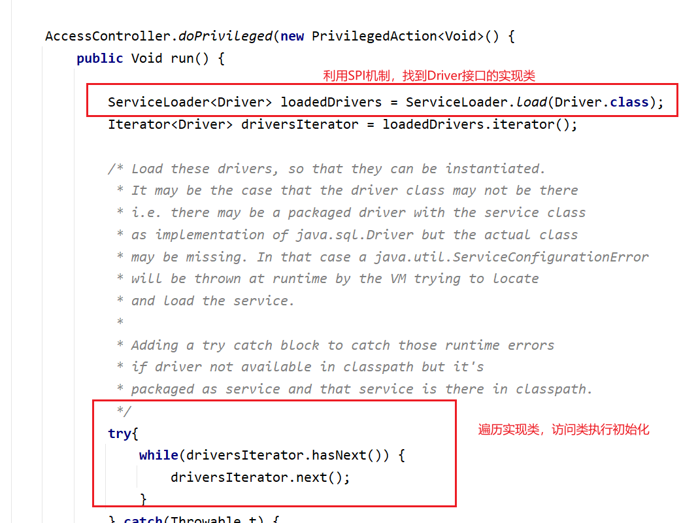

3、SPI机制就是在这个位置下存放了一个文件，文件名是接口名，文件里包含了实现类的类名。这样SPI机制就可以找到实现类了。

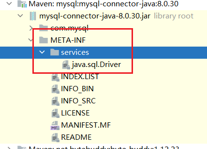


4、SPI中利用了线程上下文类加载器（应用程序类加载器）去加载类并创建对象。


总结：

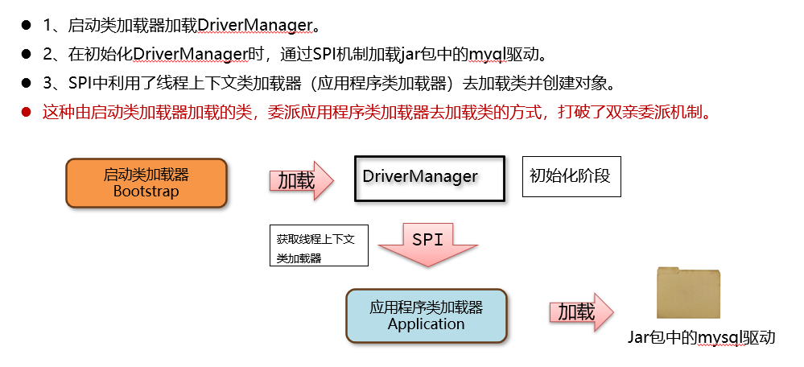

##### JDBC案例中真的打破了双亲委派机制吗？

最早这个论点提出是在周志明《深入理解Java虚拟机》中，他认为打破了双亲委派机制，这种由启动类加载器加载的类，委派应用程序类加载器去加载类的方式，所以打破了双亲委派机制。

但是如果我们分别从DriverManager以及驱动类的加载流程上分析，JDBC只是在DriverManager加载完之后，通过初始化阶段触发了驱动类的加载，类的加载依然遵循双亲委派机制。

所以我认为这里没有打破双亲委派机制，只是用一种巧妙的方法让启动类加载器加载的类，去引发的其他类的加载。

#### Osgi框架的类加载器

历史上，OSGi模块化框架。它存在同级之间的类加载器的委托加载。OSGi还使用类加载器实现了热部署的功能。热部署指的是在服务不停止的情况下，动态地更新字节码文件到内存中。


由于这种机制使用已经不多，所以不再过多讨论OSGi，着重来看下热部署在实际项目中的应用。

#### 案例：使用阿里arthas不停机解决线上问题

**背景：**

小李的团队将代码上线之后，发现存在一个小bug，但是用户急着使用，如果重新打包再发布需要一个多小时的时间，所以希望能使用arthas尽快的将这个问题修复。

**思路：**

1. 在出问题的服务器上部署一个 arthas，并启动。
2. jad --source-only 类全限定名 > 目录/文件名.java      jad 命令反编译，然后可以用其它编译器，比如 vim 来修改源码
3. mc –c 类加载器的hashcode 目录/文件名.java -d 输出目录

​      mc 命令用来编译修改过的代码

1.  retransform class文件所在目录/xxx.class

​      用 retransform 命令加载新的字节码

**详细流程：**

1、这段代码编写有误，在枚举中的类型判断上使用了`==` 而不是`equals`。

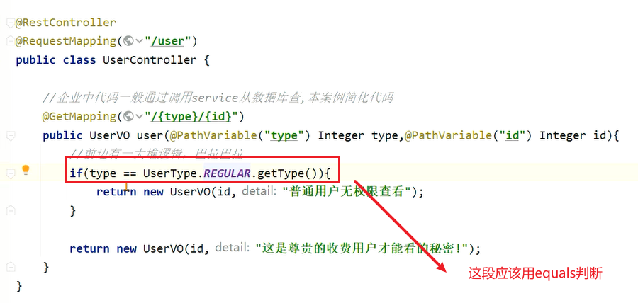

2、枚举中是这样定义的，1001是普通用户，1002是VIP用户：

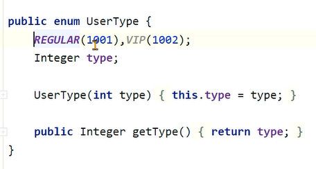

3、由于代码有误，导致传递1001参数时，返回的是收费用户的内容。


4、`jad --source-only 类全限定名 > 目录/文件名.java` 使用 jad 命令反编译，然后可以用其它编译器，比如 vim 来修改源码


这里直接双击文件使用finalShell编辑：


5、`mc –c 类加载器的hashcode 目录/文件名.java -d 输出目录` 使用mc 命令用来编译修改过的代码

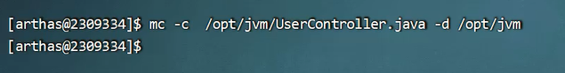

6、`retransform class文件所在目录/xxx.class` 用 retransform 命令加载新的字节码


7、测试：

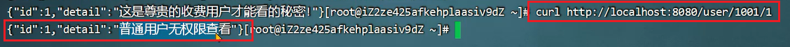

**注意事项：**

1、程序重启之后，字节码文件会恢复，除非将class文件放入jar包中进行更新。

2、使用retransform不能添加方法或者字段，也不能更新正在执行中的方法。

### 2.7、JDK9之后的类加载器

JDK8及之前的版本中，扩展类加载器和应用程序类加载器的源码位于rt.jar包中的sun.misc.Launcher.java。

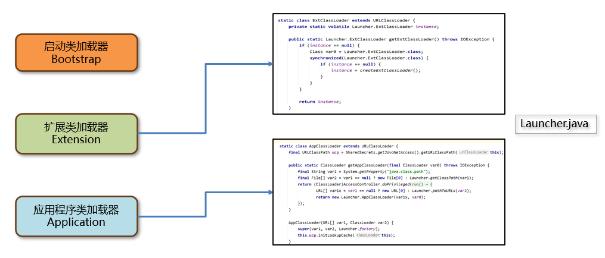

由于JDK9引入了module的概念，类加载器在设计上发生了很多变化。

1.启动类加载器使用Java编写，位于jdk.internal.loader.ClassLoaders类中。

   Java中的BootClassLoader继承自BuiltinClassLoader实现从模块中找到要加载的字节码资源文件。

   启动类加载器依然无法通过java代码获取到，返回的仍然是null，保持了统一。

2、扩展类加载器被替换成了平台类加载器（Platform Class Loader）。

​     平台类加载器遵循模块化方式加载字节码文件，所以继承关系从URLClassLoader变成了BuiltinClassLoader，BuiltinClassLoader实现了从模块中加载字节码文件。平台类加载器的存在更多的是为了与老版本的设计方案兼容，自身没有特殊的逻辑。

## 3、运行时数据区

Java虚拟机在运行Java程序过程中管理的内存区域，称之为运行时数据区。《Java虚拟机规范》中规定了每一部分的作用。


### 3.1 程序计数器

程序计数器（Program Counter Register）也叫PC寄存器，每个线程会通过程序计数器记录当前要执行的的字节码指令的地址。


一个程序计数器的具体案例：

在加载阶段，虚拟机将字节码文件中的指令读取到内存之后，会将原文件中的偏移量转换成内存地址。每一条字节码指令都会拥有一个内存地址。

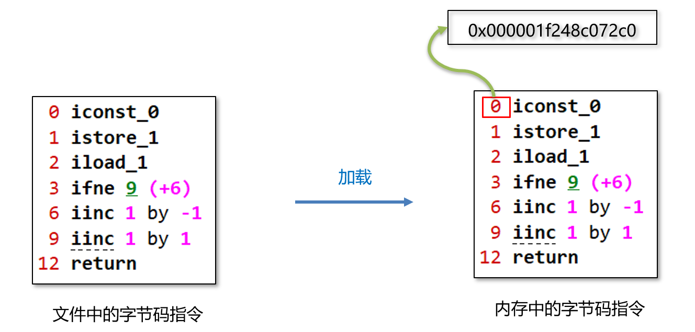

在代码执行过程中，程序计数器会记录下一行字节码指令的地址。执行完当前指令之后，虚拟机的执行引擎根据程序计数器执行下一行指令。这里为了简单起见，使用偏移量代替，真实内存中执行时保存的应该是地址。

比如当前执行的是偏移量为0的指令，那么程序计数器中保存的就是下一条的地址（偏移量1）。


一路向下执行


一直执行到方法的最后一行指令，此时方法执行return语句，当前方法执行结束，程序计数器中会放入方法出口的地址（栈中讲解，简单来说就是这个B方法结束了，A调用了B，那么要回到A方法）


所以，程序计数器可以控制程序指令的进行，实现分支、跳转、异常等逻辑。不管是分支、跳转、异常，只需要在程序计数器中放入下一行要执行的指令地址即可。

在多线程执行情况下，Java虚拟机需要通过程序计数器记录CPU切换前解释执行到那一句指令并继续解释运行。


#### 程序计数器会出现内存溢出吗？

内存溢出指的是程序在使用某一块内存区域时，存放的数据需要占用的内存大小超过了虚拟机能提供的内存上限。由于每个线程只存储一个固定长度的内存地址，程序计数器是不会发生内存溢出的。程序员无需对程序计数器做任何处理。

### 3.2 Java虚拟机栈

Java虚拟机栈（Java Virtual Machine Stack）采用栈的数据结构来管理方法调用中的基本数据，先进后出（First In Last Out）,每一个方法的调用使用一个栈帧（Stack Frame）来保存。

```Java
public class MethodDemo {   
    public static void main(String[] args) {        
         study();    
     }

    public static void study(){
        eat();

        sleep();
    }   
    
    public static void eat(){       
         System.out.println("吃饭");   
    }    
    
    public static void sleep(){        
        System.out.println("睡觉");    
        }
  }
```

main方法执行时，会创建main方法的栈帧：

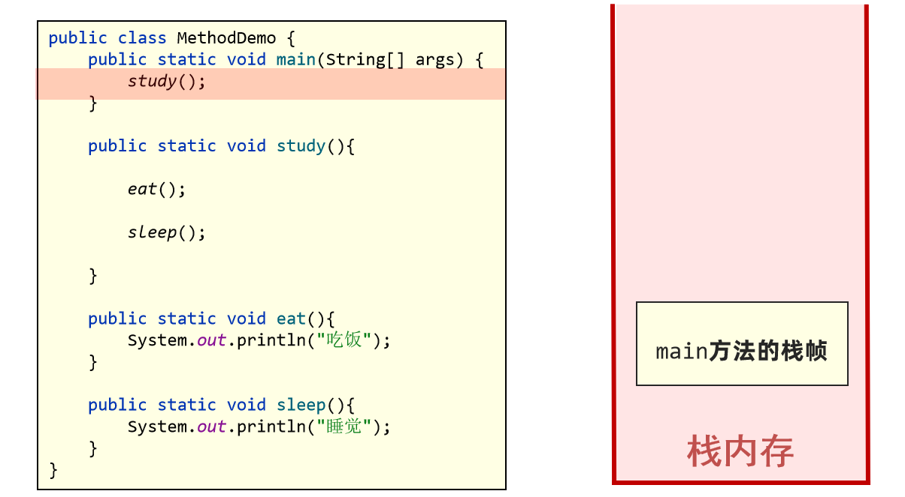

接下来执行study方法，会创建study方法的栈帧


进入eat方法，创建eat方法的栈帧


eat方法执行完之后，会弹出它的栈帧：

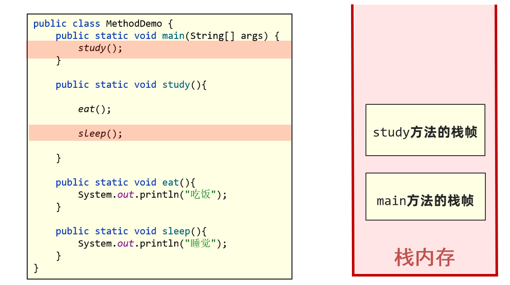

然后调用sleep方法，创建sleep方法栈帧


最后study方法结束之后弹出栈帧，main方法结束之后弹出main的栈帧。

在IDEA中也可以看到对应的栈帧：

```Java
package chapter03.frame;

/**
 * 栈帧测试1
 */
public class FrameDemo {
    public static void main(String[] args) {
        A();
    }

    public static void A() {
        System.out.println("A执行了...");
        B();
    }

    public static void B() {
        System.out.println("B执行了...");
        C();
    }

    public static void C() {
        System.out.println("C执行了...");
        throw new RuntimeException("测试");
    }
}
```

打上断点debug之后会出现栈帧内容：

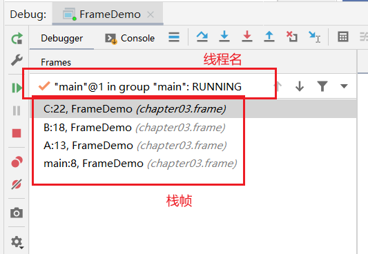

Java虚拟机栈随着线程的创建而创建，而回收则会在线程的销毁时进行。由于方法可能会在不同线程中执行，每个线程都会包含一个自己的虚拟机栈。如下就有两个线程的虚拟机栈，main线程和线程A。

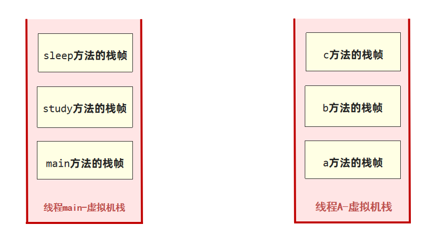

Java虚拟机栈的栈帧中主要包含三方面的内容：

- 局部变量表，局部变量表的作用是在运行过程中存放所有的局部变量
- 操作数栈，操作数栈是栈帧中虚拟机在执行指令过程中用来存放临时数据的一块区域
- 帧数据，帧数据主要包含动态链接、方法出口、异常表的引用

#### 局部变量表

局部变量表的作用是在方法执行过程中存放所有的局部变量。局部变量表分为两种，一种是字节码文件中的，另外一种是栈帧中的也就是保存在内存中。栈帧中的局部变量表是根据字节码文件中的内容生成的。

我们先来看下字节码文件中的局部变量表：编译成字节码文件时就可以确定局部变量表的内容。

```Java
public static void test1(){
    int i = 0;
    long j = 1;
}
```

test1方法的局部变量表如下：

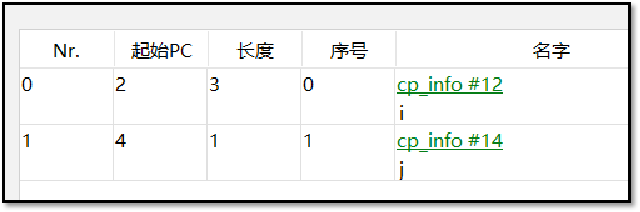

局部变量表中保存了字节码指令生效的偏移量：


比如`i`这个变量，它的起始PC是2，代表从`lconst_1`这句指令开始才能使用`i`，长度为3，也就是2-4这三句指令都可以使用`i`。为什么从2才能使用，因为0和1这两句字节码指令还在处理`int i = 0`这句赋值语句。`j`这个变量只有等3指令执行完之后也就是`long j = 1`代码执行完之后才能使用，所以起始PC为4，只能在4这行字节码指令中使用。

接下来看下栈帧中的局部变量表，栈帧中的局部变量表是一个数组，数组中每一个位置称之为槽(slot) ，long和double类型占用两个槽，其他类型占用一个槽。

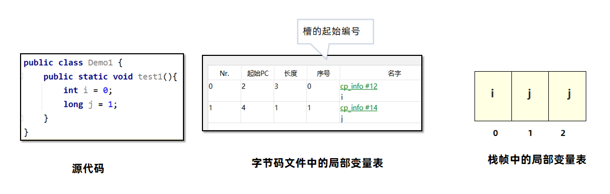

`i`占用数组下标为0的位置，`j`占用数组下标1-2的位置。

刚才看到的是静态方法，实例方法中的序号为0的位置存放的是this，指的是当前调用方法的对象，运行时会在内存中存放实例对象的地址。

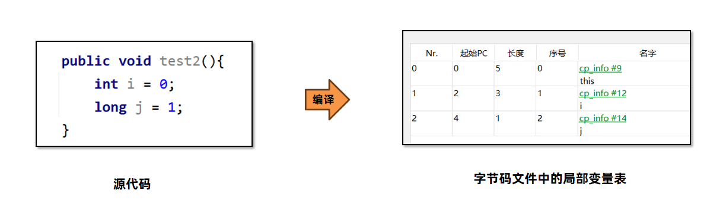

方法参数也会保存在局部变量表中，其顺序与方法中参数定义的顺序一致。局部变量表保存的内容有：实例方法的this对象，方法的参数，方法体中声明的局部变量。

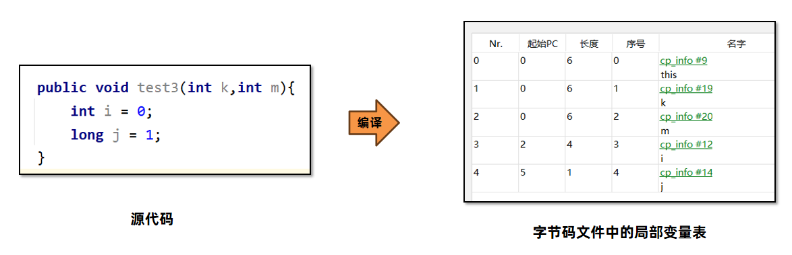

test3方法中包含两个参数`k`,`m`，这两个参数也会被加入到局部变量表中。

**以下代码的局部变量表中会占用几个槽？**

```Java
public void test4(int k,int m){
    {
        int a = 1;
        int b = 2;
    }
    {
        int c = 1;
    }
    int i = 0;
    long j = 1;
}
```

为了节省空间，局部变量表中的槽是可以复用的，一旦某个局部变量不再生效，当前槽就可以再次被使用。

1、方法执行时，实例对象`this`、`k`、`m` 会被放入局部变量表中，占用3个槽


2、将1的值放入局部变量表下标为3的位置上，相当于给a进行赋值。

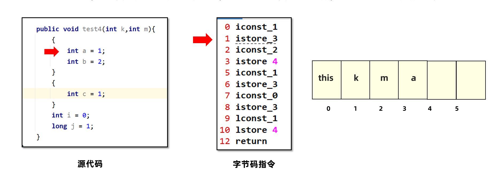

3、将2放入局部变量表下标为4的位置，给b赋值为2。


4、ab已经脱离了生效范围，所以下标为3和4的这两个位置可以复用。此时c的值1就可以放入下标为3的位置。

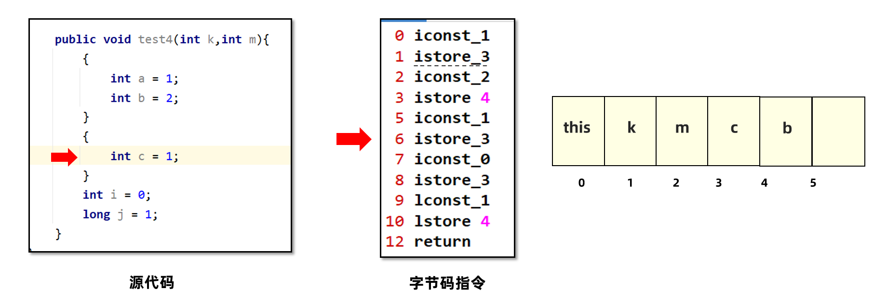

4、脱离c的生效范围之后，给i赋值就可以复用c的位置。

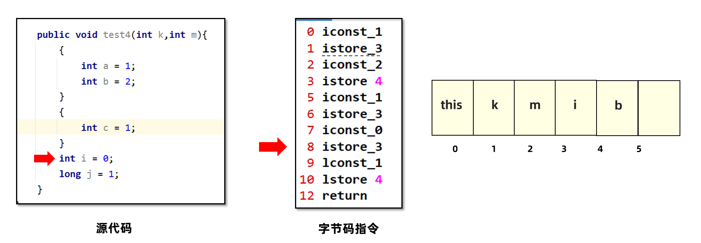

5、最后放入j，j是一个long类型，占用两个槽。但是可以复用b所在的位置，所以占用4和5这两个位置


所以，局部变量表数值的长度为6。这一点在编译期间就可以确定了，运行过程中只需要在栈帧中创建长度为6的数组即可。


#### 操作数栈

操作数栈是栈帧中虚拟机在执行指令过程中用来存放中间数据的一块区域。他是一种栈式的数据结构，如果一条指令将一个值压入操作数栈，则后面的指令可以弹出并使用该值。

在编译期就可以确定操作数栈的最大深度，从而在执行时正确的分配内存大小。


比如之前的相加案例中，操作数栈最大的深入会出现在这个时刻：


所以操作数栈的深度会定义为2。

#### 帧数据

帧数据主要包含动态链接、方法出口、异常表的引用。

##### 动态链接

当前类的字节码指令引用了其他类的属性或者方法时，需要将符号引用（编号）转换成对应的运行时常量池中的内存地址。动态链接就保存了编号到运行时常量池的内存地址的映射关系。


##### 方法出口

方法出口指的是方法在正确或者异常结束时，当前栈帧会被弹出，同时程序计数器应该指向上一个栈帧中的下一条指令的地址。所以在当前栈帧中，需要存储此方法出口的地址。

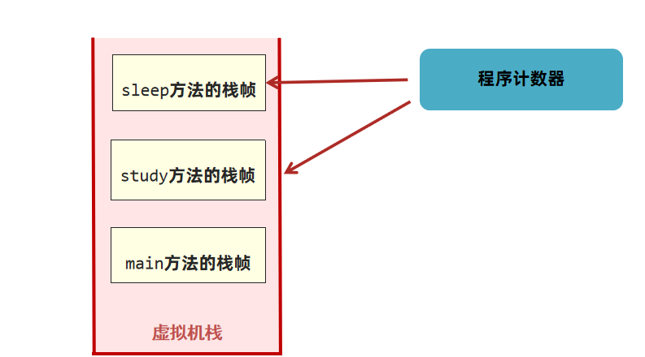

##### 异常表

异常表存放的是代码中异常的处理信息，包含了异常捕获的生效范围以及异常发生后跳转到的字节码指令位置。


`如下案例：i=1`这行源代码编译成字节码指令之后，会包含偏移量2-4这三行指令。其中2-3是对i进行赋值1的操作，4的没有异常就跳转到10方法结束。如果出现异常的情况下，继续执行到7这行指令，7会将异常对象放入操作数栈中，这样在catch代码块中就可以使用异常对象了。接下来执行8-9，对i进行赋值为2的操作。

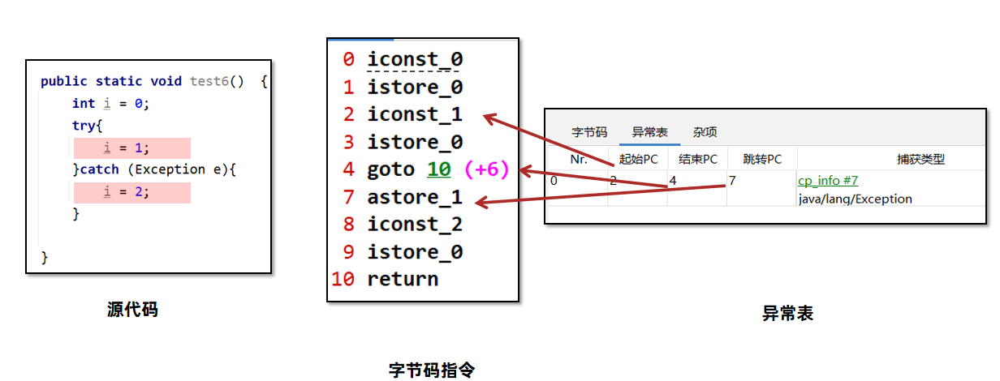

所以异常表中，异常捕获的起始偏移量就是2，结束偏移量是4，在2-4执行过程中抛出了`java.lang.Exception`对象或者子类对象，就会将其捕获，然后跳转到偏移量为7的指令。

#### 栈内存溢出

Java虚拟机栈如果栈帧过多，占用内存超过栈内存可以分配的最大大小就会出现内存溢出。Java虚拟机栈内存溢出时会出现StackOverflowError的错误。


如果我们不指定栈的大小，JVM 将创建一个具有默认大小的栈。大小取决于操作系统和计算机的体系结构。


我们来模拟下栈内存的溢出情况:

```Java
public static int count = 0;
     //递归方法调用自己
     public static void recursion(){
         System.out.println(++count);
         recursion();
     }
```

使用递归让方法调用自身，但是不设置退出条件。定义调用次数的变量，每一次调用让变量加1。查看错误发生时总调用的次数。

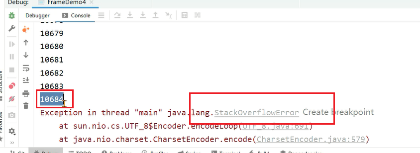

执行之后可以打印出溢出时总栈帧的数量，并且发现虚拟机已经抛出了StackOverflow的错误。

要修改Java虚拟机栈的大小，可以使用虚拟机参数 -Xss 。

- 语法：-Xss栈大小
- 单位：字节（默认，必须是 1024 的倍数）、k或者K(KB)、m或者M(MB)、g或者G(GB)

例如：

```Java
-Xss1048576 
-Xss1024K      
-Xss1m
-Xss1g
```

操作步骤如下，不同IDEA版本的设置方式会略有不同：

1、点击修改配置Modify options

2、点击Add VM options

3、添加参数


调成512k之后，明显发现最大栈帧数量减少了：


**注意事项：**

1、与-Xss类似，也可以使用 -XX:ThreadStackSize 调整标志来配置堆栈大小。

格式为： `-XX:ThreadStackSize=1024`

2、HotSpot JVM对栈大小的最大值和最小值有要求：

​      比如测试如下两个参数，会直接报错:

```
-Xss1k
-Xss1025m
```

Windows（64位）下的JDK8测试最小值为`180k`，最大值为`1024m`。

3、局部变量过多、操作数栈深度过大也会影响栈内存的大小。我们在这段代码中添加一些局部变量。

```Java
//递归方法调用自己
public static void recursion() {
    long a,b,c,d,f,g,h,i,j,k;
    System.out.println(++count);
    recursion();
}
```

使用默认大小来测试之后，发现栈帧数量从10000+减少了到8000+

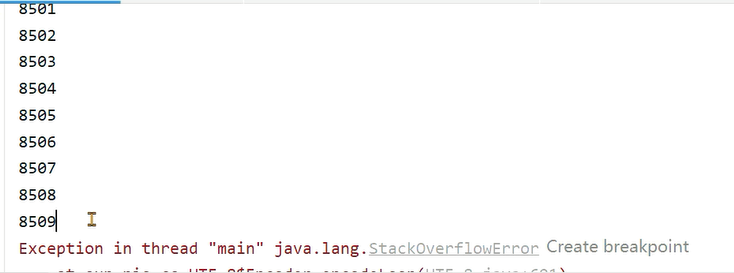

一般情况下，工作中即便使用了递归进行操作，栈的深度最多也只能到几百,不会出现栈的溢出。所以此参数可以手动指定为-Xss256k节省内存。

### 3.3 本地方法栈

Java虚拟机栈存储了Java方法调用时的栈帧，而本地方法栈存储的是native本地方法的栈帧。

在Hotspot虚拟机中，Java虚拟机栈和本地方法栈实现上使用了同一个栈空间。本地方法栈会在栈内存上生成一个栈帧，临时保存方法的参数同时方便出现异常时也把本地方法的栈信息打印出来。


比如测试下这段代码：

```Java
/**
 * 本地方法栈
 */
public class NativeDemo1 {
    public static void main(String[] args) {
        try {
            FileOutputStream fileOutputStream = new FileOutputStream("E:\\123.txt");
            fileOutputStream.write(1);
        } catch (FileNotFoundException e) {
            e.printStackTrace();
        } catch (IOException e) {
            e.printStackTrace();
        }
    }
}
```

执行之后发生异常，会打印出所有栈帧的名字：

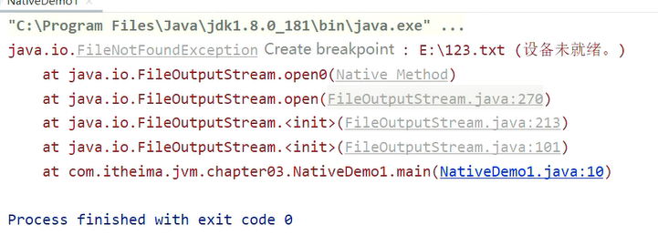

`open0`是一个本地方法，所以创建了本地方法的栈帧。本地方法和Java虚拟机方法的栈帧在一个栈上。

### 3.4 堆内存

一般Java程序中堆内存是空间最大的一块内存区域。创建出来的对象都存在于堆上。栈上的局部变量表中，可以存放堆上对象的引用。静态变量也可以存放堆对象的引用，通过静态变量就可以实现对象在线程之间共享。

```Java
public class Test {    
    public static void main(String[] args) {        
        Student s1 = new Student();        
        s1.name = "张三";       
        s1.age = 18;       
        s1.id = 1;
        s1.printTotalScore();        
        s1.printAverageScore();        
        
        Student s2 = new Student();       
        s2.name = "李四";        
        s2.age = 19;        
        s2.id= 2;        
        s2.printTotalScore();        
        s2.printAverageScore();    
    }
}
```

这段代码中通过`new`关键字创建了两个`Student`类的对象，这两个对象会被存放在堆上。在栈上通过`s1`和`s2`两个局部变量保存堆上两个对象的地址，从而实现了引用关系的建立。


#### 堆内存的溢出

通过new关键字不停创建对象，放入集合中，模拟堆内存的溢出，观察堆溢出之后的异常信息。

```Java
package chapter03.heap;

import java.io.IOException;
import java.util.ArrayList;

/**
 * 堆内存的使用和回收
 */
public class Demo1 {
    public static void main(String[] args) throws InterruptedException, IOException {

        ArrayList<Object> objects = new ArrayList<Object>();
        System.in.read();
        while (true){
            objects.add(new byte[1024 * 1024 * 100]);
            Thread.sleep(1000);
        }


    }
}
```

堆内存大小是有上限的，当对象一直向堆中放入对象达到上限之后，就会抛出OutOfMemory错误。在这段代码中，不停创建100M大小的字节数组并放入ArrayList集合中，最终超过了堆内存的上限。抛出如下错误：


#### 三个重要的值

堆空间有三个需要关注的值，used、total、max。used指的是当前已使用的堆内存，total是java虚拟机已经分配的可用堆内存，max是java虚拟机可以分配的最大堆内存。


堆内存used total max三个值可以通过dashboard命令看到。

> 手动指定刷新频率（不指定默认5秒一次）：`dashboard –i  刷新频率(毫秒)`

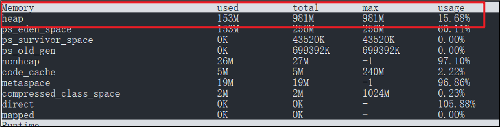

随着堆中的对象增多，当total可以使用的内存即将不足时，java虚拟机会继续分配内存给堆。


此时used达到了total的大小，Java虚拟机会向操作系统申请更大的内存。


但是这个申请过程不是无限的，total最多只能与max相等。


那么是不是当used = max = total的时候，堆内存就溢出了呢？

不是，堆内存溢出的判断条件比较复杂，在下一章《垃圾回收器》中会详细介绍。

如果不设置任何的虚拟机参数，max默认是系统内存的1/4，total默认是系统内存的1/64。在实际应用中一般都需要设置total和max的值。 Oracle官方文档：https://docs.oracle.com/javase/8/docs/technotes/tools/unix/java.html

#### 设置堆的大小

要修改堆的大小，可以使用虚拟机参数 –Xmx（max最大值）和-Xms (初始的total)。

语法：`-Xmx值 -Xms值`

单位：字节（默认，必须是 1024 的倍数）、k或者K(KB)、m或者M(MB)、g或者G(GB)

限制：Xmx必须大于 2 MB，Xms必须大于1MB

```Java
-Xms6291456
-Xms6144k
-Xms6m
-Xmx83886080
-Xmx81920k
-Xmx80m
```

这样可以将max和初始的total都设置为4g，在启动后就已经获得了最大的堆内存大小。运行过程中不需要向操作系统申请。

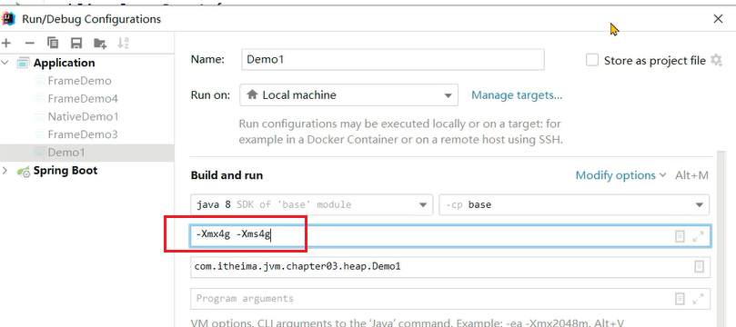

使用`arthas`的`memory`命令同样可以看到：

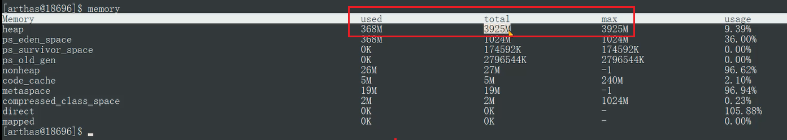

为什么arthas中显示的heap堆大小与设置的值不一样呢？

arthas中的heap堆内存使用了JMX技术中内存获取方式，这种方式与垃圾回收器有关，计算的是可以分配对象的内存，而不是整个内存。

**建议：**

Java服务端程序开发时，建议将-Xmx和-Xms设置为相同的值，这样在程序启动之后可使用的总内存就是最大内存，而无需向java虚拟机再次申请，减少了申请并分配内存时间上的开销，同时也不会出现内存过剩之后堆收缩的情况。-Xmx具体设置的值与实际的应用程序运行环境有关，在《实战篇》中会给出设置方案。

### 3.5 方法区

方法区是存放基础信息的位置，线程共享，主要包含三部分内容：

- 类的元信息，保存了所有类的基本信息
- 运行时常量池，保存了字节码文件中的常量池内容
- 字符串常量池，保存了字符串常量

#### 类的元信息

方法区是用来存储每个类的基本信息（元信息），一般称之为InstanceKlass对象。在类的加载阶段完成。其中就包含了类的字段、方法等字节码文件中的内容，同时还保存了运行过程中需要使用的虚方法表（实现多态的基础）等信息。


#### 运行时常量池

方法区除了存储类的元信息之外，还存放了运行时常量池。常量池中存放的是字节码中的常量池内容。

字节码文件中通过编号查表的方式找到常量，这种常量池称为静态常量池。当常量池加载到内存中之后，可以通过内存地址快速的定位到常量池中的内容，这种常量池称为运行时常量池。


#### 方法区的实现

方法区是《Java虚拟机规范》中设计的虚拟概念，每款Java虚拟机在实现上都各不相同。Hotspot设计如下：

JDK7及之前的版本将方法区存放在堆区域中的永久代空间，堆的大小由虚拟机参数来控制。

JDK8及之后的版本将方法区存放在元空间中，元空间位于操作系统维护的直接内存中，默认情况下只要不超过操作系统承受的上限，可以一直分配。


可以通过arthas的`memory`命令看到方法区的名称以及大小：

- JDK7及之前的版本查看ps_perm_gen属性。


- JDK8及之后的版本查看metaspace属性。


#### 方法区的溢出

通过ByteBuddy框架，动态创建类并将字节码数据加载到内存中。通过死循环不停地加载到方法区，观察方法区是否会出现内存溢出的情况。分别在JDK7和JDK8上运行上述代码。

ByteBuddy是一个基于Java的开源库，用于生成和操作Java字节码。

1.引入依赖

```XML
<dependency>
    <groupId>net.bytebuddy</groupId>
    <artifactId>byte-buddy</artifactId>
    <version>1.12.23</version>
 </dependency>
```

2.创建ClassWriter对象

```Java
 ClassWriter classWriter = new ClassWriter(0);
```

3.调用visit方法，创建字节码数据。

```Java
classWriter.visit(Opcodes.V1_7,Opcodes.ACC_PUBLIC,name,null ,"java/lang/Object",null);
byte[] bytes = classWriter.toByteArray();
```

代码：

```Java
package chapter03.methodarea;

import net.bytebuddy.jar.asm.ClassWriter;
import net.bytebuddy.jar.asm.Opcodes;

import java.io.IOException;

/**
 * 方法区的溢出测试
 */
public class Demo1 extends ClassLoader {
    public static void main(String[] args) throws IOException {
        System.in.read();
        Demo1 demo1 = new Demo1();
        int count = 0;
        while (true) {
            String name = "Class" + count;
            ClassWriter classWriter = new ClassWriter(0);
            classWriter.visit(Opcodes.V1_8, Opcodes.ACC_PUBLIC, name, null
                    , "java/lang/Object", null);
            byte[] bytes = classWriter.toByteArray();
            demo1.defineClass(name, bytes, 0, bytes.length);
            System.out.println(++count);
        }
    }
}
```

实验发现，JDK7上运行大概十几万次，就出现了错误。

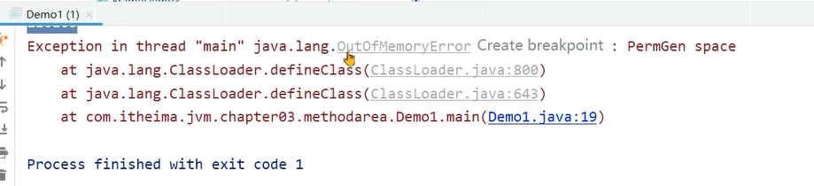

在JDK8上运行百万次，程序都没有出现任何错误，但是内存会直线升高。这说明JDK7和JDK8在方法区的存放上，采用了不同的设计。

- JDK7将方法区存放在堆区域中的永久代空间，堆的大小由虚拟机参数-XX:MaxPermSize=值来控制。
- JDK8将方法区存放在元空间中，元空间位于操作系统维护的直接内存中，默认情况下只要不超过操作系统承受的上限，可以一直分配。可以使用-XX:MaxMetaspaceSize=值将元空间最大大小进行限制。

在JDK8中将最大元空间内存设置为256m，再次测试

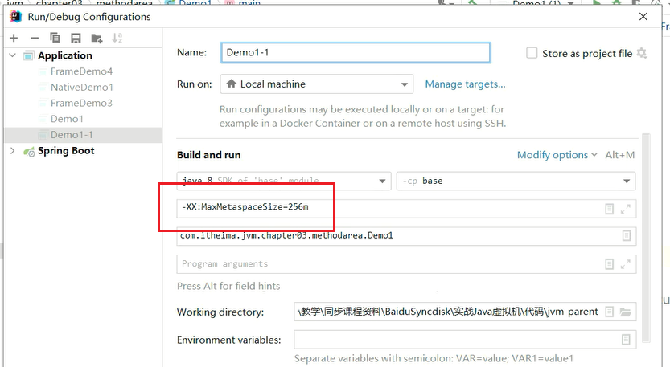

这次就出现了MetaSpace溢出的错误：


#### 字符串常量池

方法区中除了类的元信息、运行时常量池之外，还有一块区域叫字符串常量池(StringTable)。

字符串常量池存储在代码中定义的常量字符串内容。比如“123” 这个123就会被放入字符串常量池。

如下代码执行时，代码中包含`abc`字符串，就会被直接放入字符串常量池。在堆上创建String对象，并通过局部变量s1引用堆上的对象。

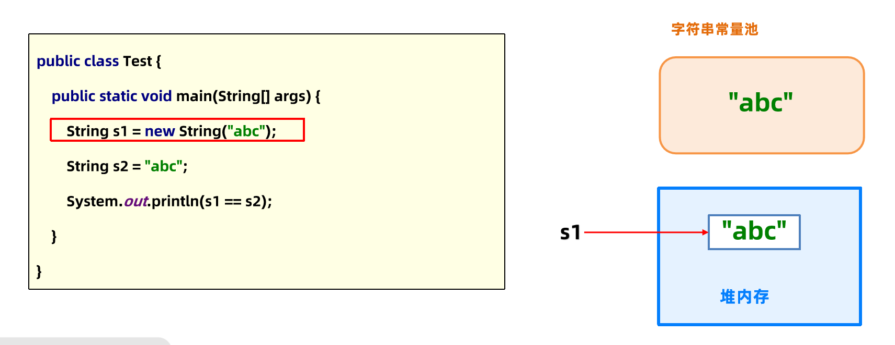

接下来通过s2局部变量引用字符串常量池的`abc`。


所以s1和s2指向的不是同一个对象，打印出`false`。

##### 字符串常量池和运行时常量池有什么关系？

早期设计时，字符串常量池是属于运行时常量池的一部分，他们存储的位置也是一致的。后续做出了调整，将字符串常量池和运行时常量池做了拆分。


##### StringTable的练习题1：

```Java
/**
 * 字符串常量池案例
 */
public class Demo2 {
    public static void main(String[] args) {
        String a = "1";
        String b = "2";
        String c = "12";
        String d = a + b;
        System.out.println(c == d);
    }
}
```

1、首先将`1`放入字符串常量池，通过局部变量a引用字符串常量池中的`1`字符串。

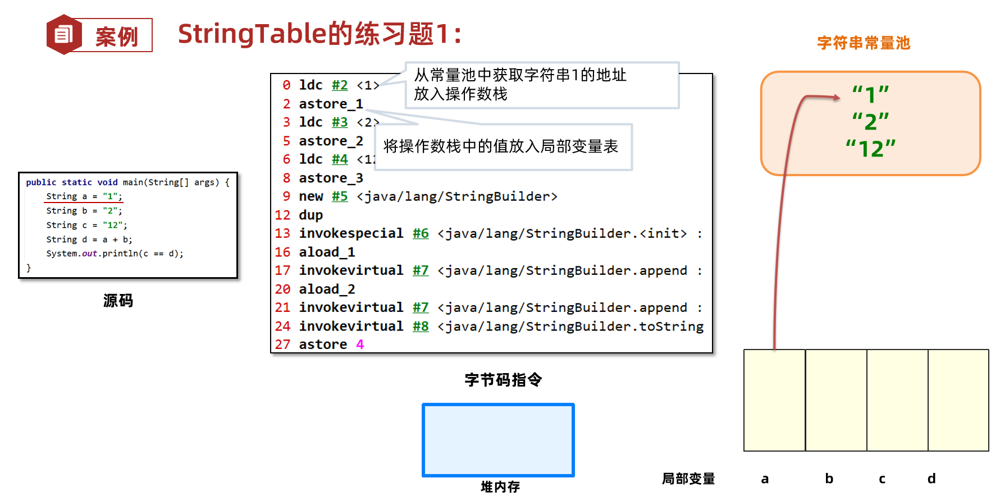

2、同理处理b和c：


3、将a和b指向的字符串进行连接，本质上就是使用StringBuilder进行连接，最后创建了一个新的字符串放入堆中。然后将局部变量d指向堆上的对象。

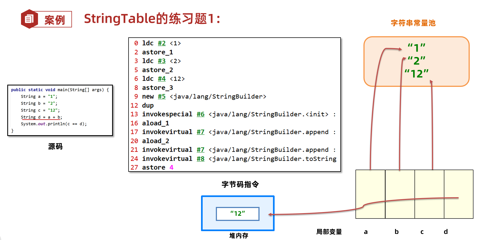

4、所以c和d指向的不是同一个对象，打印出的结果就是false。

##### StringTable的练习题2：

```Java
package chapter03.stringtable;

/**
 * 字符串常量池案例
 */
public class Demo3 {
    public static void main(String[] args) {
        String a = "1";
        String b = "2";
        String c = "12";
        String d = "1" + "2";
        System.out.println(c == d);
    }
}
```

编译之后的字节码指令如下：

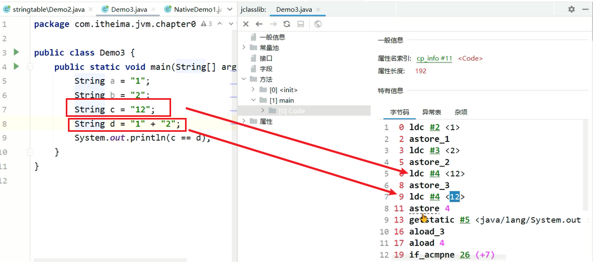

说明在编译阶段，已经将1和2进行连接，最终生成12的字符串常量池中的结果。所以返回结果就是true，c和d都指向字符串常量池中的对象。

总结一下：

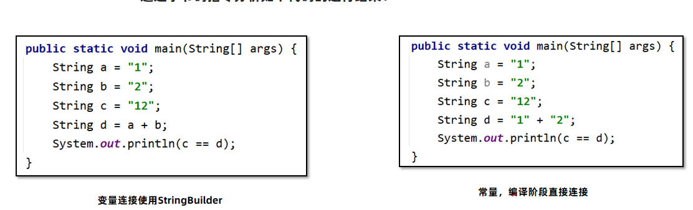

##### 神奇的intern

String.intern()方法是可以手动将字符串放入字符串常量池中，分别在JDK6 JDK8下执行代码，JDK6 中结果是false false ，JDK8中是true false

```Java
package chapter03.stringtable;

/**
 * intern案例
 */
public class Demo4 {
    public static void main(String[] args) {
        String s1 = new StringBuilder().append("think").append("123").toString();

        System.out.println(s1.intern() == s1);
//        System.out.println(s1.intern() == s1.intern());

        String s2 = new StringBuilder().append("ja").append("va").toString();

        System.out.println(s2.intern() == s2);
    }
}
```

先来分析JDK6中，代码执行步骤如下：

1、使用StringBuilder的将`think`和`123`拼接成`think123`，转换成字符串，在堆上创建一个字符串对象。局部变量`s1`指向堆上的对象。

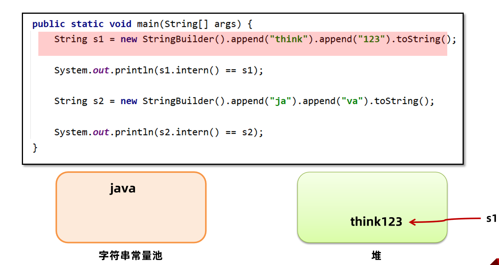

2、调用s1.intern方法，会在字符串常量池中创建think123的对象，最后将对象引用返回。所以s1.intern和s1指向的不是同一个对象。打印出false。

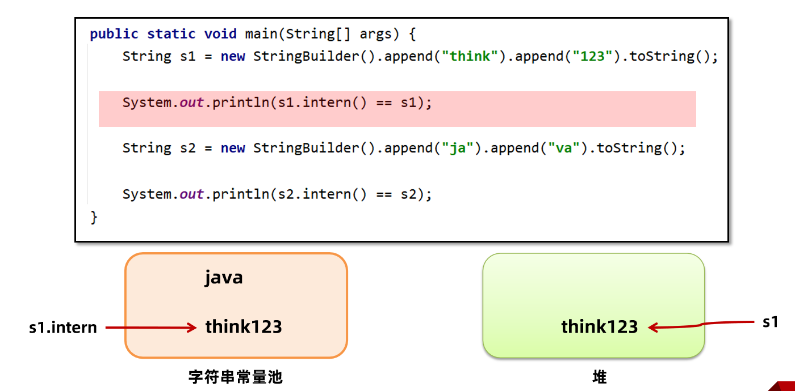

3、同理，通过StringBuilder在堆上创建java字符串对象。这里注意字符串常量池中本来就有一个java字符串对象，这是java虚拟机自身使用的所以启动时就会创建出来。

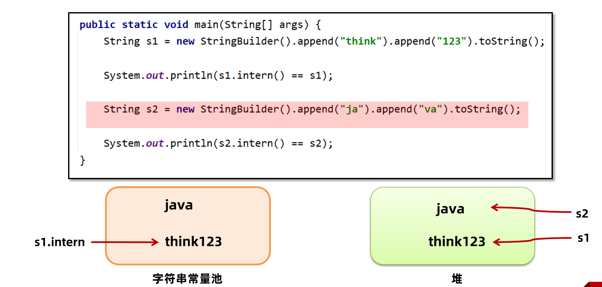

4、调用s2.intern发现字符串常量池中已经有java字符串对象了，就将引用返回。所以s2.intern指向的是字符串常量池中的对象，而s2指向的是堆中的对象。打印结果为false。


接下来分析JDK7中，JDK7及之后版本中由于字符串常量池在堆上，所以intern () 方法会把第一次遇到的字符串的引用放入字符串常量池。

代码执行步骤如下：

1、执行第二句代码时，由于字符串常量池中没有think123的字符串，所以直接创建一个引用，指向堆中的think123对象。所以s1.intern和s1指向的都是堆上的对象，打印结果为true。


2、s2.intern方法调用时，字符串常量池中已经有java字符串了，所以将引用返回。这样打印出来的结果就是false。


> 后续JDK版本中，如果Java虚拟机不需要使用java字符串，那么字符串常量池中就不会存放`java`。打印结果有可能会出现两个true。

####  面试题：静态变量存储在哪里呢？

- JDK6及之前的版本中，静态变量是存放在方法区中的，也就是永久代。
- JDK7及之后的版本中，静态变量是存放在堆中的Class对象中，脱离了永久代。具体源码可参考虚拟机源码：BytecodeInterpreter针对putstatic指令的处理。

### 3.6 直接内存

直接内存（Direct Memory）并不在《Java虚拟机规范》中存在，所以并不属于Java运行时的内存区域。

在 JDK 1.4 中引入了 NIO 机制，使用了直接内存，主要为了解决以下两个问题:

1、Java堆中的对象如果不再使用要回收，回收时会影响对象的创建和使用。

2、IO操作比如读文件，需要先把文件读入直接内存（缓冲区）再把数据复制到Java堆中。

现在直接放入直接内存即可，同时Java堆上维护直接内存的引用，减少了数据复制的开销。写文件也是类似的思路。

使用堆创建对象的过程：

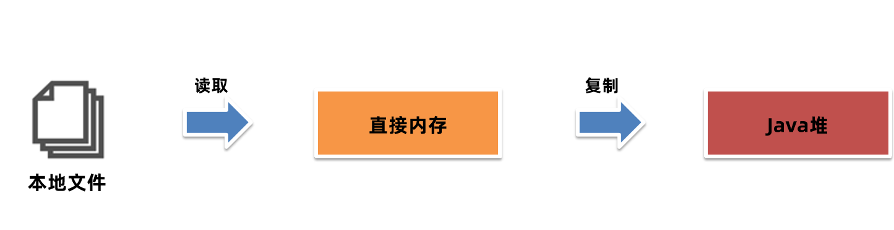

使用直接内存创建对象的过程，不需要进行复制对象，数据直接存放在直接内存中：


#### 使用方法：

要创建直接内存上的数据，可以使用`ByteBuffer`。

语法： `ByteBuffer directBuffer = ByteBuffer.allocateDirect(size);`

注意事项： arthas的memory命令可以查看直接内存大小，属性名direct。


代码：

```Java
package chapter03.direct;

import java.io.IOException;
import java.nio.ByteBuffer;
import java.util.ArrayList;
import java.util.List;

/**
 * 直接内存的使用和回收
 */
public class Demo1 {
    public static int size = 1024 * 1024 * 100; //100mb
    public static List<ByteBuffer> list = new ArrayList<ByteBuffer>();
    public static int count = 0;

    public static void main(String[] args) throws IOException, InterruptedException {
        System.in.read();
        while (true) {
            //1.创建DirectByteBuffer对象并返回
            //2.在DirectByteBuffer构造方法中，向操作系统申请直接内存空间
            ByteBuffer directBuffer = ByteBuffer.allocateDirect(size);
            //directBuffer = null;

            list.add(directBuffer);
            System.out.println(++count);
            Thread.sleep(5000);
        }

    }
}
```

运行之后，用arthas监控发现，每隔5秒直接内存会增长100M：


如果将`Thread.`*`sleep`*`(5000);`注释掉，让直接内存快速大量分配。操作系统内存不足时就会报错：

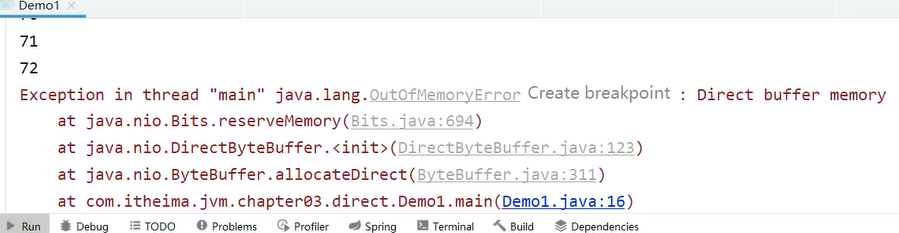

但是工作中服务器上有可能部署了其他应用，为了避免将内存耗尽，需要设置直接内存的最大值。如果需要手动调整直接内存的大小，可以使用`XX:MaxDirectMemorySize=大小`

单位k或K表示千字节，m或M表示兆字节，g或G表示千兆字节。默认不设置该参数情况下，JVM 自动选择 最大分配的大小。

以下示例以不同的单位说明如何将 直接内存大小设置为 1024 KB：

```Java
-XX:MaxDirectMemorySize=1m
-XX:MaxDirectMemorySize=1024k
-XX:MaxDirectMemorySize=1048576
```

在Idea中设置直接内存最大值为1g：


直接循环11次之后，超过最大值就会报错：

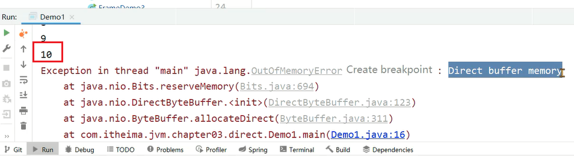

## 4、垃圾回收

在C/C++这类没有自动垃圾回收机制的语言中，一个对象如果不再使用，需要手动释放，否则就会出现内存泄漏。

内存泄漏指的是不再使用的对象在系统中未被回收，内存泄漏的积累可能会导致内存溢出。   

在这段代码中，通过死循环不停创建Test类的对象，每一轮循环结束之后，这次创建的对象就不再使用了。但是没有手动调用删除对象的方法，此时对象就会出现内存泄漏。     

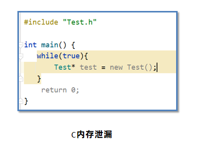

这段代码中，手动调用`delete`删除对象，就不会出现内存泄漏。

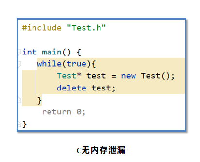

我们称这种释放对象的过程为垃圾回收，而需要程序员编写代码进行回收的方式为手动回收。手动回收的方式相对来说回收比较及时，删除代码执行之后对象就被回收了，可以快速释放内存。缺点是对程序员要求比较高，很容易出现创建完对象之后，程序员忘记释放对象。

Java中为了简化对象的释放，引入了自动的垃圾回收（Garbage Collection简称GC）机制。通过垃圾回收器来对不再使用的对象完成自动的回收，垃圾回收器主要负责对堆上的内存进行回收。其他很多现代语言比如C#、Python、Go都拥有自己的垃圾回收器。

垃圾回收器如果发现某个对象不再使用，就可以回收该对象。

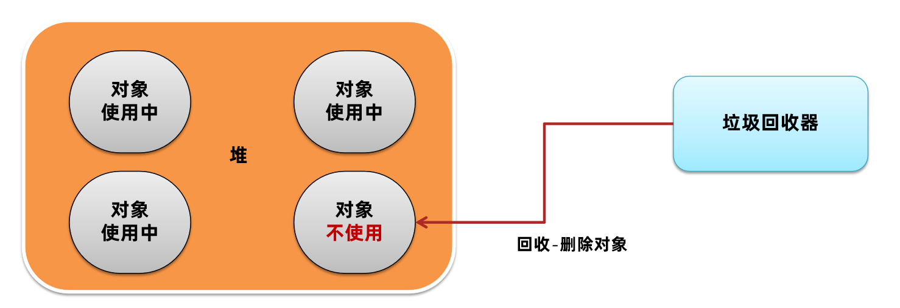

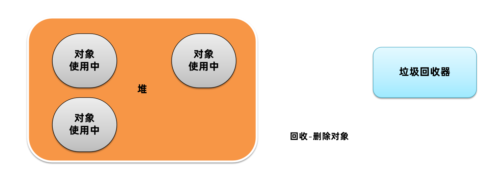

- 自动垃圾回收，自动根据对象是否使用由虚拟机来回收对象
  - 优点：降低程序员实现难度、降低对象回收bug的可能性
  - 缺点：程序员无法控制内存回收的及时性
- 手动垃圾回收，由程序员编程实现对象的删除
  - 优点：回收及时性高，由程序员把控回收的时机
  - 缺点：编写不当容易出现悬空指针、重复释放、内存泄漏等问题

那么垃圾回收器需要负责对哪些部分的内存进行回收呢？

首先是线程不共享的部分，都是伴随着线程的创建而创建，线程的销毁而销毁。而方法的栈帧在执行完方法之后就会自动弹出栈并释放掉对应的内存。所以这一部分不需要垃圾回收器负责回收。


### 4.1 方法区的回收

方法区中能回收的内容主要就是不再使用的类。

判定一个类可以被卸载。需要同时满足下面三个条件：

1、此类所有实例对象都已经被回收，在堆中不存在任何该类的实例对象以及子类对象。

这段代码中就将局部变量对堆上实例对象的引用去除了，所以对象就可以被回收。


2、加载该类的类加载器已经被回收。

这段代码让局部变量对类加载器的引用去除，类加载器就可以回收。


3、该类对应的 java.lang.Class 对象没有在任何地方被引用。

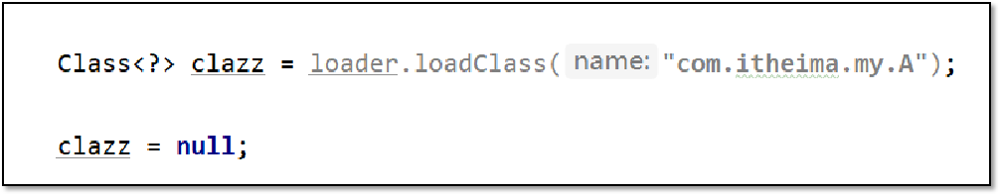

代码:

```Java
package chapter04.gc;

import java.net.URL;
import java.net.URLClassLoader;
import java.util.ArrayList;

/**
 * 类的卸载
 */
public class ClassUnload {
    public static void main(String[] args) throws InterruptedException {

        try {
            ArrayList<Class<?>> classes = new ArrayList<>();
            ArrayList<URLClassLoader> loaders = new ArrayList<>();
            ArrayList<Object> objs = new ArrayList<>();
            while (true) {

                URLClassLoader loader = new URLClassLoader(
                        new URL[]{new URL("file:D:\\lib\\")});
                Class<?> clazz = loader.loadClass("com.itheima.my.A");
                Object o = clazz.newInstance();


//                objs.add(o);
//                classes.add(clazz);
//                 loaders.add(loader);

                 System.gc();

            }


        } catch (Exception e) {

            e.printStackTrace();
        }
    }
}
```

添加这两个虚拟机参数进行测试：

```Java
-XX:+TraceClassLoading -XX:+TraceClassUnloading
```

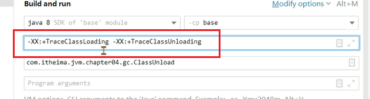

如果注释掉代码中三句add调用，就可以同时满足3个条件。但是需要手动调用`System.gc()`方法，让垃圾回收器进行回收。

> 如果需要手动触发垃圾回收，可以调用System.gc()方法。
>
> 语法： `System.gc()`
>
> 注意事项：
>
>    调用System.gc()方法并不一定会立即回收垃圾，仅仅是向Java虚拟机发送一个垃圾回收的请求，具体是否需要执行垃圾回收Java虚拟机会自行判断。

执行之后，日志中就会打印出类卸载的内容：

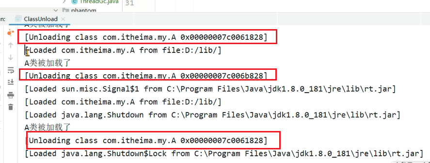

那么类卸载主要用在什么场景下呢？

开发中此类场景一般很少出现，主要在如 OSGi、JSP 的热部署等应用场景中。

每个jsp文件对应一个唯一的类加载器，当一个jsp文件修改了，就直接卸载这个jsp类加载器。重新创建类加载器，重新加载jsp文件。

### 4.2 如何判断对象可以回收

垃圾回收器要回收对象的第一步就是判断哪些对象可以回收。Java中的对象是否能被回收，是根据对象是否被引用来决定的。如果对象被引用了，说明该对象还在使用，不允许被回收。

比如下面代码的内存结构图：

第一行代码执行之后，堆上创建了Demo类的实例对象，同时栈上保存局部变量引用堆上的对象。

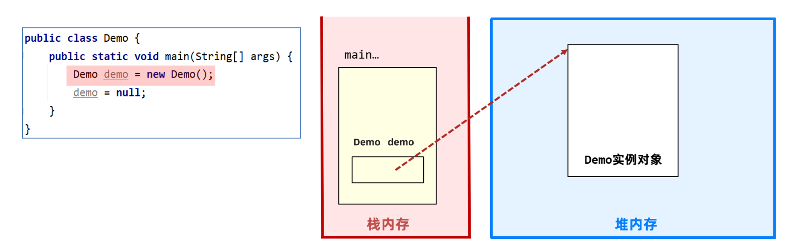

第二行代码执行之后，局部变量对堆上的对象引用去掉，那么堆上的对象就可以被回收了。

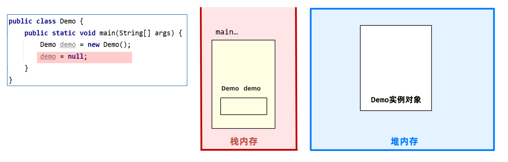

一个更复杂的案例：

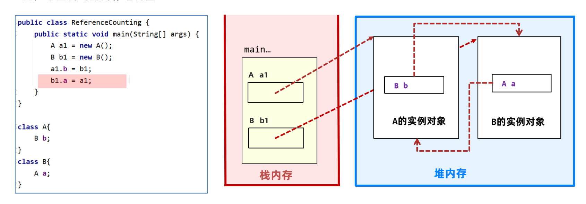

这个案例中，如果要让对象a和b回收，必须将局部变量到堆上的引用去除。

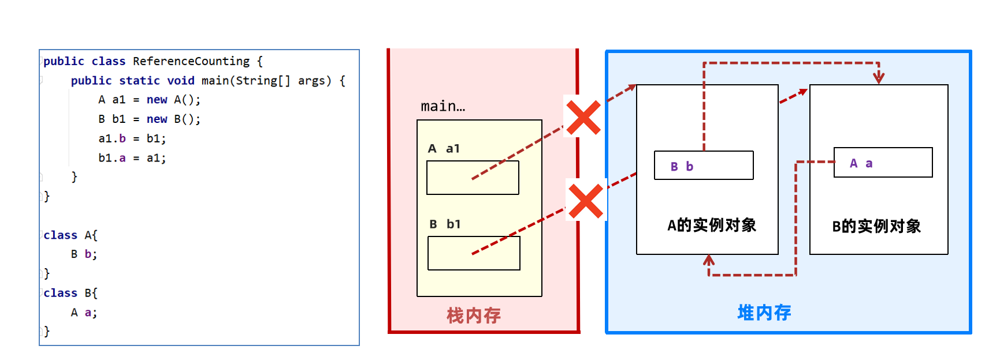

那么问题来了，A和B互相之间的引用需要去除吗？答案是不需要，因为局部变量都没引用这两个对象了，在代码中已经无法访问这两个对象，即便他们之间互相有引用关系，也不影响对象的回收。

判断对象是否可以回收，主要有两种方式：引用计数法和可达性分析法。

#### 引用计数法

引用计数法会为每个对象维护一个引用计数器，当对象被引用时加1，取消引用时减1。

比如下图中，对象A的计数器初始为0，局部变量a1对它引用之后，计数器加1就变成了1。同样A对B产生了引用，B的计数器也是1。


引用计数法的优点是实现简单，C++中的智能指针就采用了引用计数法，但是它也存在缺点，主要有两点：

1.每次引用和取消引用都需要维护计数器，对系统性能会有一定的影响

2.存在循环引用问题，所谓循环引用就是当A引用B，B同时引用A时会出现对象无法回收的问题。

这张图上，由于A和B之间存在互相引用，所以计数器都为1，两个对象都不能被回收。但是由于没有局部变量对这两个代码产生引用，代码中已经无法访问到这两个对象，理应可以被回收。

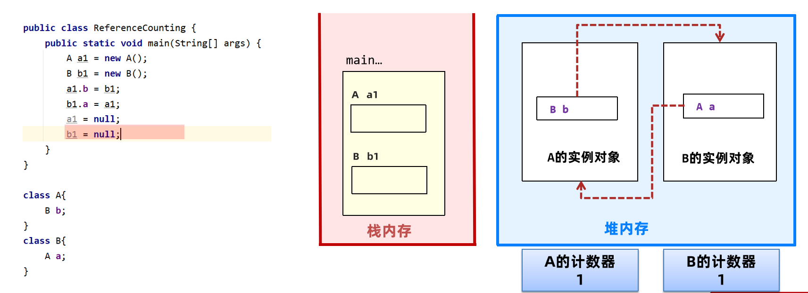

我们来做一个实验，验证下Java中循环引用不会导致内存泄漏，因为Java虚拟机根本没有使用引用计数法。首先我们要学会去看一个对象有没有被回收，可以通过垃圾回收日志来查看。

如果想要查看垃圾回收的信息，可以使用`-verbose:gc`参数。

语法： `-verbose:gc`


加上这个参数之后执行代码，发现对象确实被回收了：

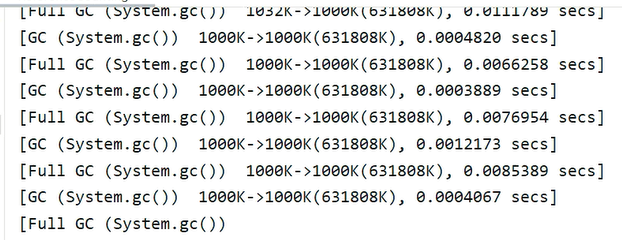

通过不同的死循环创建对象，内存并没有上升，一直维持在1000K,说明每轮循环创建的两个对象在垃圾回收之后都被回收了。

#### 可达性分析法

Java使用的是可达性分析算法来判断对象是否可以被回收。可达性分析将对象分为两类：垃圾回收的根对象（GC Root）和普通对象，对象与对象之间存在引用关系。

下图中A到B再到C和D，形成了一个引用链，可达性分析算法指的是如果从某个到GC Root对象是可达的，对象就不可被回收。


哪些对象被称之为GC Root对象呢？

- 线程Thread对象，引用线程栈帧中的方法参数、局部变量等。
- 系统类加载器加载的java.lang.Class对象，引用类中的静态变量。


- 监视器对象，用来保存同步锁synchronized关键字持有的对象。

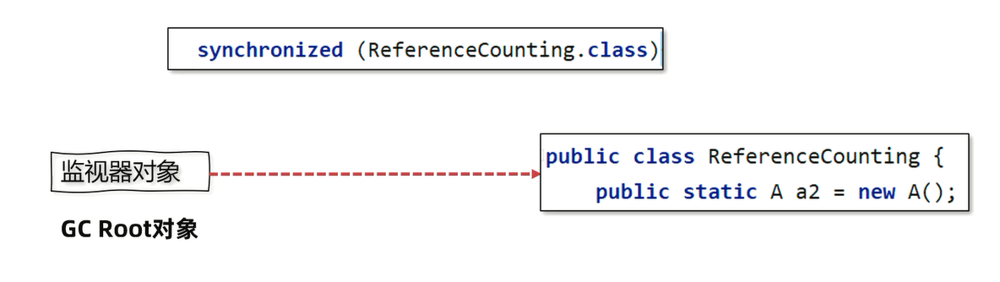

- 本地方法调用时使用的全局对象。

通过arthas和eclipse Memory Analyzer (MAT) 工具可以查看GC Root，MAT工具是eclipse推出的Java堆内存检测工具。具体操作步骤如下：

1、使用arthas的heapdump命令将堆内存快照保存到本地磁盘中。

2、使用MAT工具打开堆内存快照文件。

3、选择GC Roots功能查看所有的GC Root。

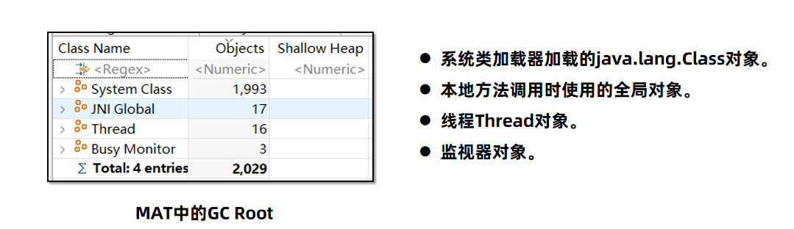

步骤详解：

1、代码如下：

```Java
package com.itheima.jvm.chapter04;

import java.io.IOException;

public class ReferenceCounting {
    public static A a2 = null;
    public static void main(String[] args) throws IOException {
//        while (true){
            A a1 = new A();
            B b1 = new B();
            a1.b = b1;
            b1.a = a1;
            a2 = a1;
            System.in.read();
//            a1 = null;
//            b1 = null;
//        }

    }
}

class A {
    B b;
//    byte[] t = new byte[1024 * 1024 * 10];
}

class B {
    A a;
//    byte[] t = new byte[1024 * 1024 * 10];
}
```

2、使用arthas连接到程序，输入如下命令:

```Java
heapdump 目录/test2.hprof
```

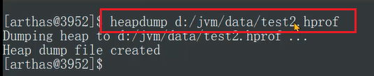

这样就生成了一个堆内存快照（后面介绍，简单来说就是包含了所有堆中的对象信息）。

3、打开资料中提供的MAT工具，如果出现如下错误，请将环境变量中的JDK版本升级到17以上。

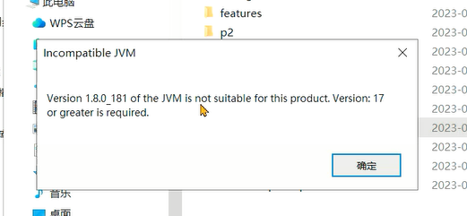

4、选择菜单中的打开堆内存快照功能，并选择刚才生成的文件。

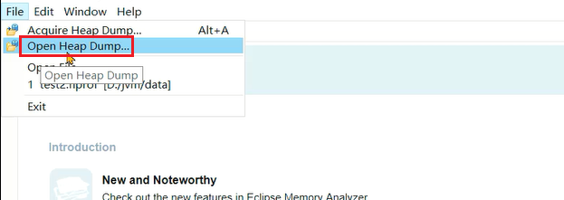

5、选择内存泄漏检测报告，并确定。

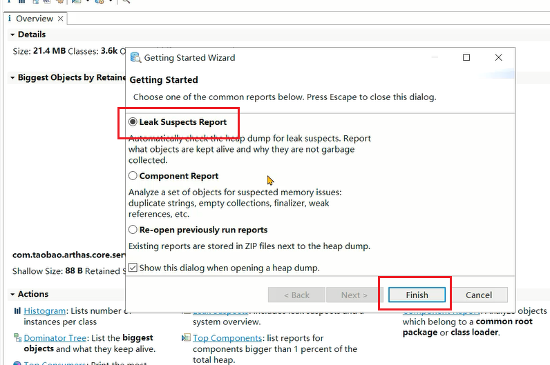

6、通过菜单找到GC Roots。

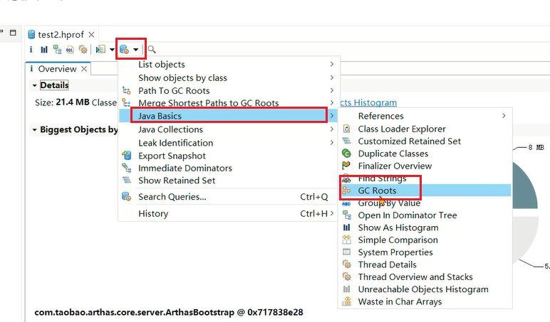

7、MAT对4类GC Root对象做了分类。

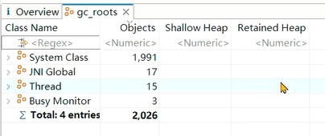

8、找到静态变量。

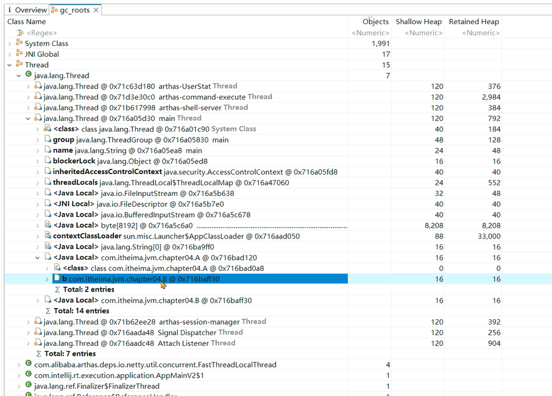

9、找到局部变量

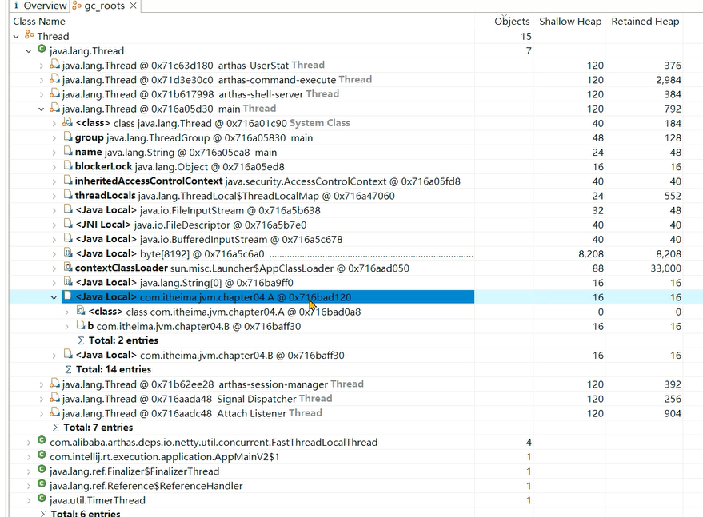

###  4.3 常见的引用对象

可达性算法中描述的对象引用，一般指的是强引用，即是GCRoot对象对普通对象有引用关系，只要这层关系存在，普通对象就不会被回收。除了强引用之外，Java中还设计了几种其他引用方式：

- 软引用
- 弱引用
- 虚引用
- 终结器引用

#### 软引用

软引用相对于强引用是一种比较弱的引用关系，如果一个对象只有软引用关联到它，当程序内存不足时，就会将软引用中的数据进行回收。在JDK 1.2版之后提供了SoftReference类来实现软引用，软引用常用于缓存中。

如下图中，对象A被GC Root对象强引用了，同时我们创建了一个软引用SoftReference对象（它本身也是一个对象），软引用对象中引用了对象A。

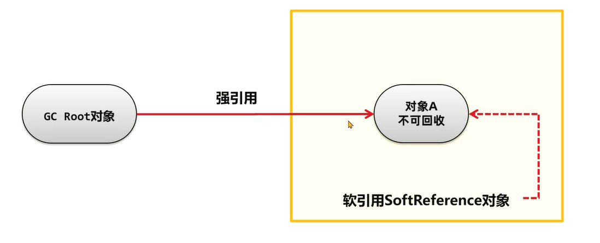

接下来强引用被去掉之后，对象A暂时还是处于不可回收状态，因为有软引用存在并且内存还够用。

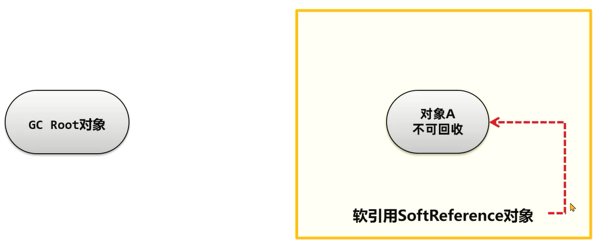

如果内存出现不够用的情况，对象A就处于可回收状态，可以被垃圾回收器回收。

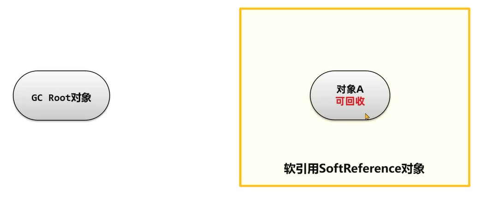

这样做有什么好处？如果对象A是一个缓存，平时会保存在内存中，如果想访问数据可以快速访问。但是如果内存不够用了，我们就可以将这部分缓存清理掉释放内存。即便缓存没了，也可以从数据库等地方获取数据，不会影响到业务正常运行，这样可以减少内存溢出产生的可能性。

**特别注意：**

软引用对象本身，也需要被强引用，否则软引用对象也会被回收掉。

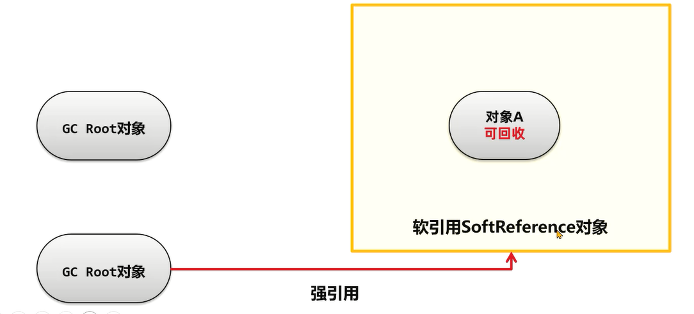

##### 软引用的使用方法

软引用的执行过程如下：

1.将对象使用软引用包装起来，new SoftReference<对象类型>(对象)。

2.内存不足时，虚拟机尝试进行垃圾回收。

3.如果垃圾回收仍不能解决内存不足的问题，回收软引用中的对象。

4.如果依然内存不足，抛出OutOfMemory异常。

代码：

```Java
/**
 * 软引用案例2 - 基本使用
 */
public class SoftReferenceDemo2 {
    public static void main(String[] args) throws IOException {

        byte[] bytes = new byte[1024 * 1024 * 100];
        SoftReference<byte[]> softReference = new SoftReference<byte[]>(bytes);
        bytes = null;
        System.out.println(softReference.get());

        byte[] bytes2 = new byte[1024 * 1024 * 100];
        System.out.println(softReference.get());
//
//        byte[] bytes3 = new byte[1024 * 1024 * 100];
//        softReference = null;
//        System.gc();
//
//        System.in.read();
    }
}
```

添加虚拟机参数，限制最大堆内存大小为200m：

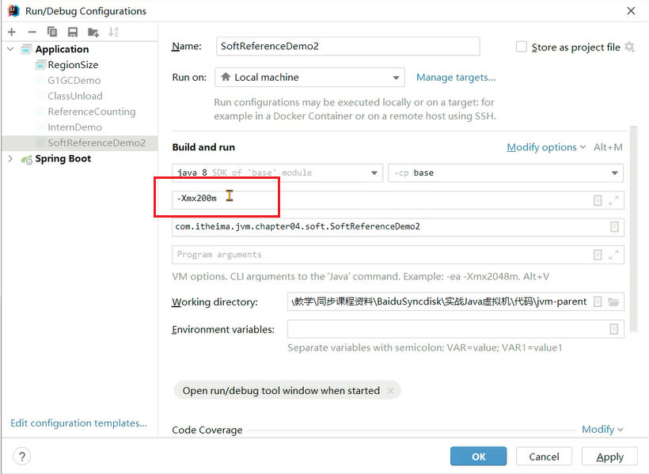

执行后发现，第二个100m对象创建之后需，软引用中包含的对象已经被回收了。

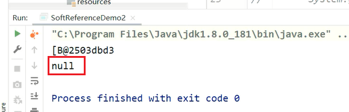

##### 软引用对象本身怎么回收呢？

如果软引用对象里边包含的数据已经被回收了，那么软引用对象本身其实也可以被回收了。

SoftReference提供了一套队列机制：

1、软引用创建时，通过构造器传入引用队列

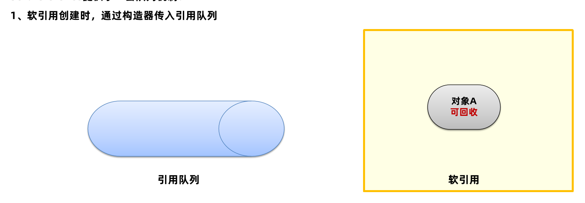

2、在软引用中包含的对象被回收时，该软引用对象会被放入引用队列

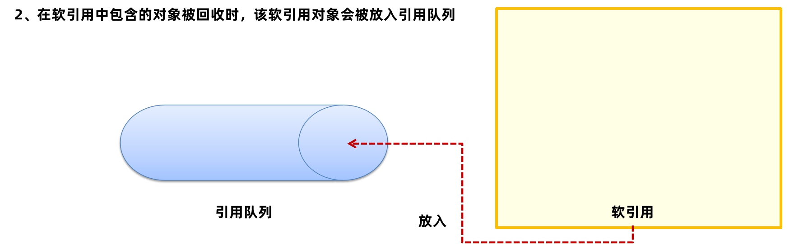

3、通过代码遍历引用队列，将SoftReference的强引用删除

代码

```Java
/**
 * 软引用案例3 - 引用队列使用
 */
public class SoftReferenceDemo3 {

    public static void main(String[] args) throws IOException {

        ArrayList<SoftReference> softReferences = new ArrayList<>();
        ReferenceQueue<byte[]> queues = new ReferenceQueue<byte[]>();
        for (int i = 0; i < 10; i++) {
            byte[] bytes = new byte[1024 * 1024 * 100];
            SoftReference studentRef = new SoftReference<byte[]>(bytes,queues);
            softReferences.add(studentRef);
        }

        SoftReference<byte[]> ref = null;
        int count = 0;
        while ((ref = (SoftReference<byte[]>) queues.poll()) != null) {
            count++;
        }
        System.out.println(count);

    }
}
```

最终展示的结果是：

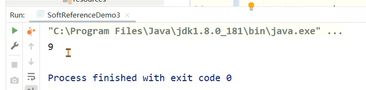

这9个软引用对象中包含的数据已经被回收掉，所以可以手动从ArrayList中去掉，这样就可以释放这9个对象。

##### 软引用的缓存案例

使用软引用实现学生信息的缓存，能支持内存不足时清理缓存。

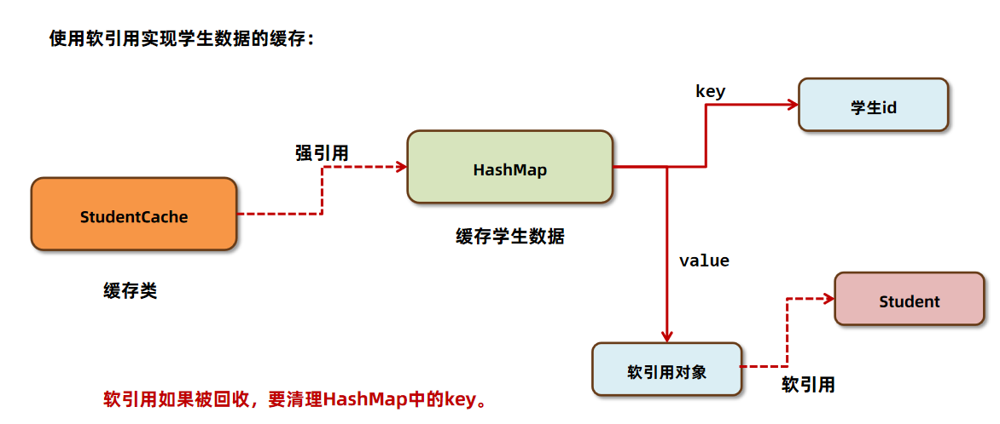

代码：

```Java
package chapter04.soft;

import java.lang.ref.ReferenceQueue;
import java.lang.ref.SoftReference;
import java.util.HashMap;
import java.util.Map;
/**
 * 软引用案例4 - 学生信息的缓存
 */
public class StudentCache {

    private static StudentCache cache = new StudentCache();

    public static void main(String[] args) {
        for (int i = 0; ; i++) {
            StudentCache.getInstance().cacheStudent(new Student(i, String.valueOf(i)));
        }
    }

    private Map<Integer, StudentRef> StudentRefs;// 用于Cache内容的存储
    private ReferenceQueue<Student> q;// 垃圾Reference的队列

    // 继承SoftReference，使得每一个实例都具有可识别的标识。
    // 并且该标识与其在HashMap内的key相同。
    private class StudentRef extends SoftReference<Student> {
        private Integer _key = null;

        public StudentRef(Student em, ReferenceQueue<Student> q) {
            super(em, q);
            _key = em.getId();
        }
    }

    // 构建一个缓存器实例
    private StudentCache() {
        StudentRefs = new HashMap<Integer, StudentRef>();
        q = new ReferenceQueue<Student>();
    }

    // 取得缓存器实例
    public static StudentCache getInstance() {
        return cache;
    }

    // 以软引用的方式对一个Student对象的实例进行引用并保存该引用
    private void cacheStudent(Student em) {
        cleanCache();// 清除垃圾引用
        StudentRef ref = new StudentRef(em, q);
        StudentRefs.put(em.getId(), ref);
        System.out.println(StudentRefs.size());
    }

    // 依据所指定的ID号，重新获取相应Student对象的实例
    public Student getStudent(Integer id) {
        Student em = null;
// 缓存中是否有该Student实例的软引用，如果有，从软引用中取得。
        if (StudentRefs.containsKey(id)) {
            StudentRef ref = StudentRefs.get(id);
            em = ref.get();
        }
// 如果没有软引用，或者从软引用中得到的实例是null，重新构建一个实例，
// 并保存对这个新建实例的软引用
        if (em == null) {
            em = new Student(id, String.valueOf(id));
            System.out.println("Retrieve From StudentInfoCenter. ID=" + id);
            this.cacheStudent(em);
        }
        return em;
    }

    // 清除那些所软引用的Student对象已经被回收的StudentRef对象
    private void cleanCache() {
        StudentRef ref = null;
        while ((ref = (StudentRef) q.poll()) != null) {
            StudentRefs.remove(ref._key);
        }
    }

//    // 清除Cache内的全部内容
//    public void clearCache() {
//        cleanCache();
//        StudentRefs.clear();
//        //System.gc();
//        //System.runFinalization();
//    }
}

class Student {
    int id;
    String name;

    public Student(int id, String name) {
        this.id = id;
        this.name = name;
    }

    public int getId() {
        return id;
    }

    public void setId(int id) {
        this.id = id;
    }

    public String getName() {
        return name;
    }

    public void setName(String name) {
        this.name = name;
    }
}
```

#### 弱引用

弱引用的整体机制和软引用基本一致，区别在于弱引用包含的对象在垃圾回收时，不管内存够不够都会直接被回收。在JDK 1.2版之后提供了WeakReference类来实现弱引用，弱引用主要在ThreadLocal中使用。

弱引用对象本身也可以使用引用队列进行回收。

```Java
package chapter04.weak;

import java.io.IOException;
import java.lang.ref.WeakReference;

/**
 * 弱引用案例 - 基本使用
 */
public class WeakReferenceDemo2 {
    public static void main(String[] args) throws IOException {

        byte[] bytes = new byte[1024 * 1024 * 100];
        WeakReference<byte[]> weakReference = new WeakReference<byte[]>(bytes);
        bytes = null;
        System.out.println(weakReference.get());

        System.gc();

        System.out.println(weakReference.get());
    }
}
```

执行之后发现gc执行之后，对象已经被回收了。

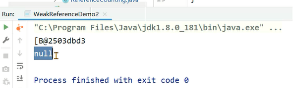

#### 虚引用和终结器引用

这两种引用在常规开发中是不会使用的。

- 虚引用也叫幽灵引用/幻影引用，不能通过虚引用对象获取到包含的对象。虚引用唯一的用途是当对象被垃圾回收器回收时可以接收到对应的通知。Java中使用PhantomReference实现了虚引用，直接内存中为了及时知道直接内存对象不再使用，从而回收内存，使用了虚引用来实现。

- 终结器引用指的是在对象需要被回收时，终结器引用会关联对象并放置在Finalizer类中的引用队列中，在稍后由一条由FinalizerThread线程从队列中获取对象，然后执行对象的finalize方法，在对象第二次被回收时，该对象才真正的被回收。在这个过程中可以在finalize方法中再将自身对象使用强引用关联上，但是不建议这样做。

```Java
package chapter04.finalreference;

/**
 * 终结器引用案例
 */
public class FinalizeReferenceDemo {
    public static FinalizeReferenceDemo reference = null;

    public void alive() {
        System.out.println("当前对象还存活");
    }

    @Override
    protected void finalize() throws Throwable {
        try{
            System.out.println("finalize()执行了...");
            //设置强引用自救
            reference = this;
        }finally {
            super.finalize();
        }
    }

    public static void main(String[] args) throws Throwable {
        reference = new FinalizeReferenceDemo();
       test();
       test();
    }

    private static void test() throws InterruptedException {
        reference = null;
        //回收对象
        System.gc();
        //执行finalize方法的优先级比较低，休眠500ms等待一下
        Thread.sleep(500);
        if (reference != null) {
            reference.alive();
        } else {
            System.out.println("对象已被回收");
        }
    }
}
```

### 4.4 垃圾回收算法

Java是如何实现垃圾回收的呢？简单来说，垃圾回收要做的有两件事：

1、找到内存中存活的对象

2、释放不再存活对象的内存，使得程序能再次利用这部分空间 

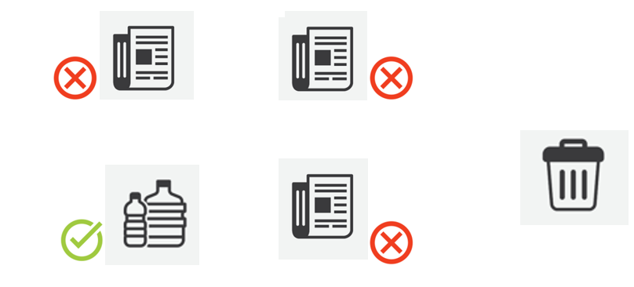

#### 垃圾回收算法的历史和分类

1960年John McCarthy发布了第一个GC算法：标记-清除算法。

1963年Marvin L. Minsky 发布了复制算法。

本质上后续所有的垃圾回收算法，都是在上述两种算法的基础上优化而来。

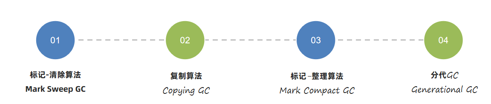

#### 垃圾回收算法的评价标准

Java垃圾回收过程会通过单独的GC线程来完成，但是不管使用哪一种GC算法，都会有部分阶段需要停止所有的用户线程。这个过程被称之为Stop The World简称STW，如果STW时间过长则会影响用户的使用。

如下图，用户代码执行和垃圾回收执行让用户线程停止执行（STW）是交替执行的。

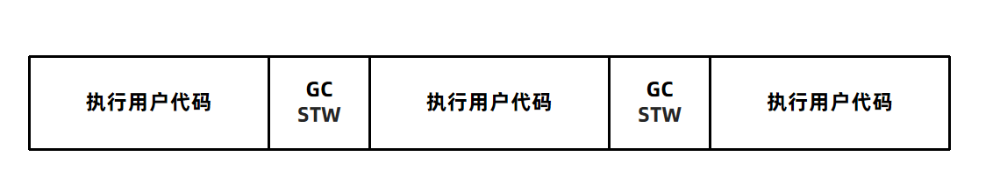

所以判断GC算法是否优秀，可以从三个方面来考虑：

1.吞吐量

吞吐量指的是 CPU 用于执行用户代码的时间与 CPU 总执行时间的比值，即吞吐量 = 执行用户代码时间 /（执行用户代码时间 + GC时间）。吞吐量数值越高，垃圾回收的效率就越高。


2.最大暂停时间

最大暂停时间指的是所有在垃圾回收过程中的STW时间最大值。比如如下的图中，黄色部分的STW就是最大暂停时间，显而易见上面的图比下面的图拥有更少的最大暂停时间。最大暂停时间越短，用户使用系统时受到的影响就越短。

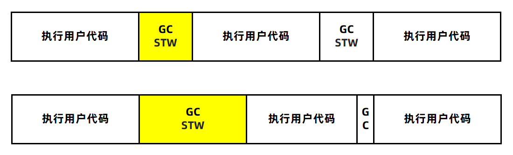

3.堆使用效率

不同垃圾回收算法，对堆内存的使用方式是不同的。比如标记清除算法，可以使用完整的堆内存。而复制算法会将堆内存一分为二，每次只能使用一半内存。从堆使用效率上来说，标记清除算法要优于复制算法。

上述三种评价标准：堆使用效率、吞吐量，以及最大暂停时间不可兼得。

一般来说，堆内存越大，最大暂停时间就越长。想要减少最大暂停时间，就会降低吞吐量。


没有一个垃圾回收算法能兼顾上述三点评价标准，所以不同的垃圾回收算法它的侧重点是不同的，适用于不同的应用场景。

#### 标记清除算法

标记清除算法的核心思想分为两个阶段：

1.标记阶段，将所有存活的对象进行标记。Java中使用可达性分析算法，从GC Root开始通过引用链遍历出所有存活对象。

2.清除阶段，从内存中删除没有被标记也就是非存活对象。

第一个阶段，从GC Root对象开始扫描，将对象A、B、C在引用链上的对象标记出来：

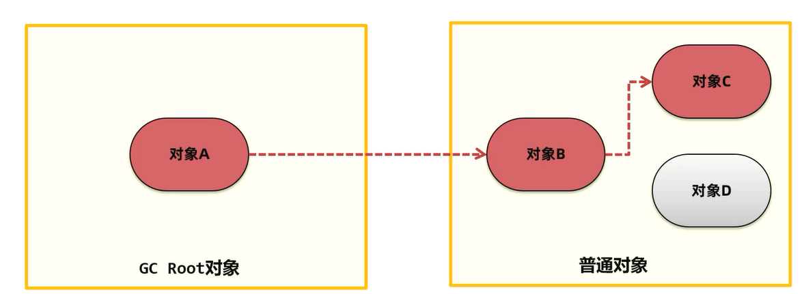

第二个阶段，将没有标记的对象清理掉，所以对象D就被清理掉了。

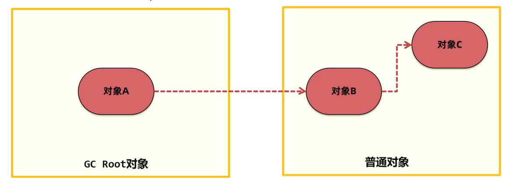

优点：实现简单，只需要在第一阶段给每个对象维护标志位，第二阶段删除对象即可。

缺点：1.碎片化问题

由于内存是连续的，所以在对象被删除之后，内存中会出现很多细小的可用内存单元。如果我们需要的是一个比较大的空间，很有可能这些内存单元的大小过小无法进行分配。

如下图，红色部分已经被清理掉了，总共回收了9个字节，但是每个都是一个小碎片，无法为5个字节的对象分配空间。

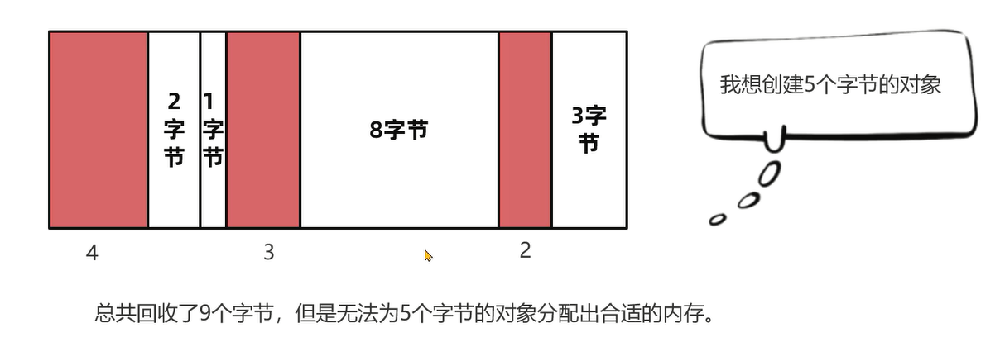

标记清除算法的缺点：

2.分配速度慢。由于内存碎片的存在，需要维护一个空闲链表，极有可能发生每次需要遍历到链表的最后才能获得合适的内存空间。 我们需要用一个链表来维护，哪些空间可以分配对象，很有可能需要遍历这个链表到最后，才能发现这块空间足够我们去创建一个对象。如下图，遍历到最后才发现有足够的空间分配3个字节的对象了。如果链表很长，遍历也会花费较长的时间。


#### 复制算法

复制算法的核心思想是：

1.准备两块空间From空间和To空间，每次在对象分配阶段，只能使用其中一块空间（From空间）。

对象A首先分配在From空间：


2.在垃圾回收GC阶段，将From中存活对象复制到To空间。

在垃圾回收阶段，如果对象A存活，就将其复制到To空间。然后将From空间直接清空。


3.将两块空间的From和To名字互换。

接下来将两块空间的名称互换，下次依然在From空间上创建对象。


完整的复制算法的例子：

1.将堆内存分割成两块From空间 To空间，对象分配阶段，创建对象。


2.GC阶段开始，将GC Root搬运到To空间

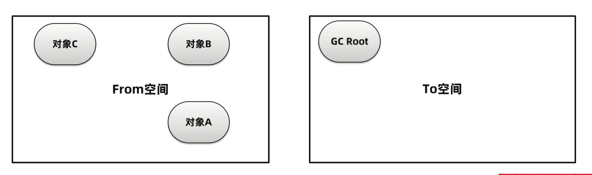

3.将GC Root关联的对象，搬运到To空间

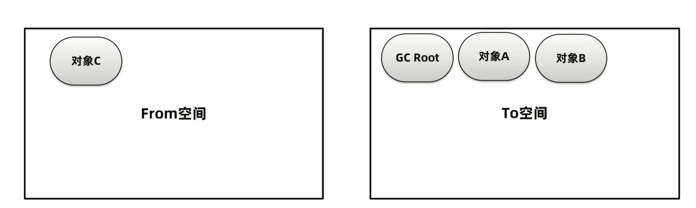

4.清理From空间，并把名称互换


优点：

- 吞吐量高，复制算法只需要遍历一次存活对象复制到To空间即可，比标记-整理算法少了一次遍历的过程，因而性能较好，但是不如标记-清除算法，因为标记清除算法不需要进行对象的移动
- 不会发生碎片化，复制算法在复制之后就会将对象按顺序放入To空间中，所以对象以外的区域都是可用空间，不存在碎片化内存空间。

缺点：

内存使用效率低，每次只能让一半的内存空间来为创建对象使用。

#### 标记整理算法

标记整理算法也叫标记压缩算法，是对标记清理算法中容易产生内存碎片问题的一种解决方案。

核心思想分为两个阶段：

1.标记阶段，将所有存活的对象进行标记。Java中使用可达性分析算法，从GC Root开始通过引用链遍历出所有存活对象。

2.整理阶段，将存活对象移动到堆的一端。清理掉存活对象的内存空间。


优点：

- 内存使用效率高，整个堆内存都可以使用，不会像复制算法只能使用半个堆内存
- 不会发生碎片化，在整理阶段可以将对象往内存的一侧进行移动，剩下的空间都是可以分配对象的有效空间

缺点：

整理阶段的效率不高，整理算法有很多种，比如Lisp2整理算法需要对整个堆中的对象搜索3次，整体性能不佳。可以通过Two-Finger、表格算法、ImmixGC等高效的整理算法优化此阶段的性能。

#### 分代垃圾回收算法

现代优秀的垃圾回收算法，会将上述描述的垃圾回收算法组合进行使用，其中应用最广的就是分代垃圾回收算法(Generational GC)。

分代垃圾回收将整个内存区域划分为年轻代和老年代：

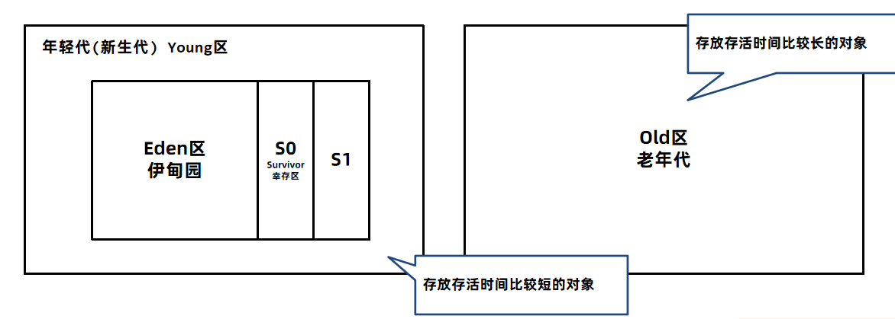

我们通过arthas来验证下内存划分的情况：

在JDK8中，添加-XX:+UseSerialGC参数使用分代回收的垃圾回收器，运行程序。

在arthas中使用memory命令查看内存，显示出三个区域的内存情况。


Eden + survivor 这两块区域组成了年轻代。

tenured_gen指的是晋升区域，其实就是老年代。

另外还可以选择的虚拟机参数如下

| 参数名                        | 参数含义                                                     | 示例                                                    |
| ----------------------------- | ------------------------------------------------------------ | ------------------------------------------------------- |
| -Xms                          | 设置堆的最小和初始大小，必须是1024倍数且大于1MB              | 比如初始大小6MB的写法： -Xms6291456 -Xms6144k -Xms6m    |
| -Xmx                          | 设置最大堆的大小，必须是1024倍数且大于2MB                    | 比如最大堆80 MB的写法： -Xmx83886080 -Xmx81920k -Xmx80m |
| -Xmn                          | 新生代的大小                                                 | 新生代256 MB的写法： -Xmn256m -Xmn262144k -Xmn268435456 |
| -XX:SurvivorRatio             | 伊甸园区和幸存区的比例，默认为8 新生代1g内存，伊甸园区800MB,S0和S1各100MB | 比例调整为4的写法：-XX:SurvivorRatio=4                  |
| -XX:+PrintGCDetailsverbose:gc | 打印GC日志                                                   | 无                                                      |

代码：

```Java
package chapter04.gc;

import java.io.IOException;
import java.util.ArrayList;
import java.util.List;

/**
 * 垃圾回收器案例1
 */
//-XX:+UseSerialGC  -Xms60m -Xmn20m -Xmx60m -XX:SurvivorRatio=3  -XX:+PrintGCDetails
public class GcDemo0 {

    public static void main(String[] args) throws IOException {
        List<Object> list = new ArrayList<>();
        int count = 0;
        while (true){
            System.in.read();
            System.out.println(++count);
            //每次添加1m的数据
            list.add(new byte[1024 * 1024 * 1]);
        }
    }
}
```

使用arthas的memory展示出来的效果：

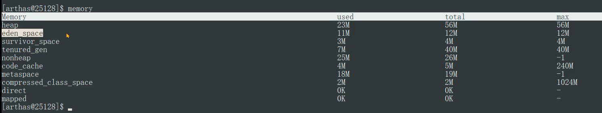

heap展示的是可用堆，survivor区每次只有一块能使用，所以60 - 4 = 56m。

1、分代回收时，创建出来的对象，首先会被放入Eden伊甸园区。


2、随着对象在Eden区越来越多，如果Eden区满，新创建的对象已经无法放入，就会触发年轻代的GC，称为Minor GC或者Young GC。

Minor GC会把需要eden中和From需要回收的对象回收，把没有回收的对象放入To区。


3、接下来，S0会变成To区，S1变成From区。当eden区满时再往里放入对象，依然会发生Minor GC。


此时会回收eden区和S1(from)中的对象，并把eden和from区中剩余的对象放入S0。

注意：每次Minor GC中都会为对象记录他的年龄，初始值为0，每次GC完加1。


4、如果Minor GC后对象的年龄达到阈值（最大15，默认值和垃圾回收器有关），对象就会被晋升至老年代。

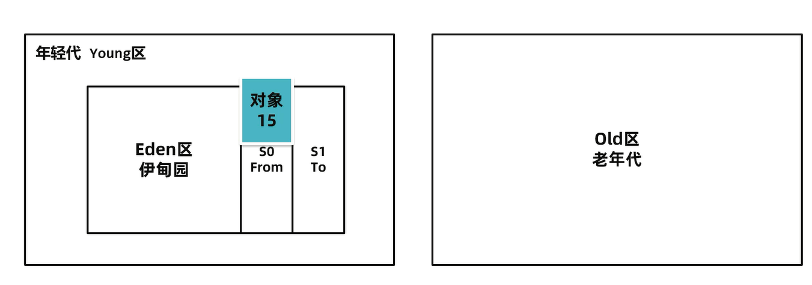


当老年代中空间不足，无法放入新的对象时，先尝试minor gc如果还是不足，就会触发Full GC，Full GC会对整个堆进行垃圾回收。

如果Full GC依然无法回收掉老年代的对象，那么当对象继续放入老年代时，就会抛出Out Of Memory异常。


下图中的程序为什么会出现OutOfMemory？

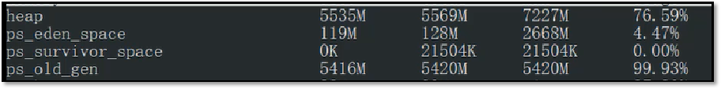

从上图可以看到，Full GC无法回收掉老年代的对象，那么当对象继续放入老年代时，就会抛出Out Of Memory异常。

继续使用这段代码测试：

```Java
//-XX:+UseSerialGC  -Xms60m -Xmn20m -Xmx60m -XX:SurvivorRatio=3  -XX:+PrintGCDetails
public class GcDemo0 {

    public static void main(String[] args) throws IOException {
        List<Object> list = new ArrayList<>();
        int count = 0;
        while (true){
            System.in.read();
            System.out.println(++count);
            //每次添加1m的数据
            list.add(new byte[1024 * 1024 * 1]);
        }
    }
}
```

结果如下：


老年代已经满了，而且垃圾回收无法回收掉对象，如果还想往里面放就发生了`OutOfMemoryError`。

### 4.5 垃圾回收器

为什么分代GC算法要把堆分成年轻代和老年代？首先我们要知道堆内存中对象的特性：

- 系统中的大部分对象，都是创建出来之后很快就不再使用可以被回收，比如用户获取订单数据，订单数据返回给用户之后就可以释放了。
- 老年代中会存放长期存活的对象，比如Spring的大部分bean对象，在程序启动之后就不会被回收了。
- 在虚拟机的默认设置中，新生代大小要远小于老年代的大小。

分代GC算法将堆分成年轻代和老年代主要原因有：

1、可以通过调整年轻代和老年代的比例来适应不同类型的应用程序，提高内存的利用率和性能。

2、新生代和老年代使用不同的垃圾回收算法，新生代一般选择复制算法，老年代可以选择标记-清除和标记-整理算法，由程序员来选择灵活度较高。

3、分代的设计中允许只回收新生代（minor gc），如果能满足对象分配的要求就不需要对整个堆进行回收(full gc),STW时间就会减少。

垃圾回收器是垃圾回收算法的具体实现。

由于垃圾回收器分为年轻代和老年代，除了G1之外其他垃圾回收器必须成对组合进行使用。

具体的关系图如下：


#### 年轻代-Serial垃圾回收器

Serial是是一种单线程串行回收年轻代的垃圾回收器。


**回收年代和算法：**

年轻代

复制算法

**优点**

单CPU处理器下吞吐量非常出色

**缺点**

多CPU下吞吐量不如其他垃圾回收器，堆如果偏大会让用户线程处于长时间的等待

**适用场景**

Java编写的客户端程序或者硬件配置有限的场景

#### 老年代-SerialOld垃圾回收器

SerialOld是Serial垃圾回收器的老年代版本，采用单线程串行回收

-XX:+UseSerialGC 新生代、老年代都使用串行回收器。


**回收年代和算法：**

老年代

标记-整理算法

**优点**

单CPU处理器下吞吐量非常出色

**缺点**

多CPU下吞吐量不如其他垃圾回收器，堆如果偏大会让用户线程处于长时间的等待

**适用场景**

与Serial垃圾回收器搭配使用，或者在CMS特殊情况下使用

#### 年轻代-ParNew垃圾回收器

ParNew垃圾回收器本质上是对Serial在多CPU下的优化，使用多线程进行垃圾回收

-XX:+UseParNewGC 新生代使用ParNew回收器， 老年代使用串行回收器

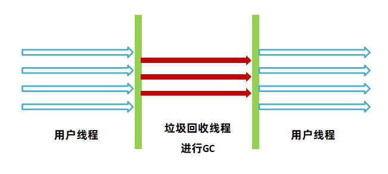

**回收年代和算法：**

年轻代

复制算法

**优点**

多CPU处理器下停顿时间较短

**缺点**

吞吐量和停顿时间不如G1，所以在JDK9之后不建议使用

**适用场景**

 JDK8及之前的版本中，与CMS老年代垃圾回收器搭配使用

#### 老年代- CMS(Concurrent Mark Sweep)垃圾回收器

CMS垃圾回收器关注的是系统的暂停时间，允许用户线程和垃圾回收线程在某些步骤中同时执行，减少了用户线程的等待时间。

参数：XX:+UseConcMarkSweepGC

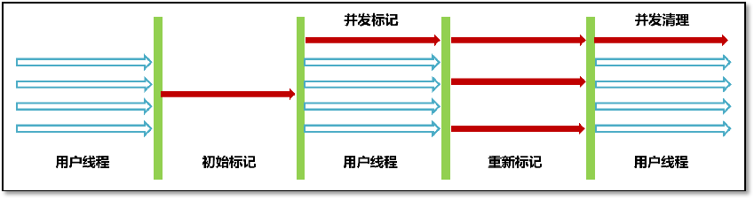

**回收年代和算法：**

老年代

标记清除算法

**优点**

系统由于垃圾回收出现的停顿时间较短，用户体验好

**缺点**

1、内存碎片问题

2、退化问题

3、浮动垃圾问题

**适用场景**

 大型的互联网系统中用户请求数据量大、频率高的场景，比如订单接口、商品接口等

CMS执行步骤：

1.初始标记，用极短的时间标记出GC Roots能直接关联到的对象。

2.并发标记,   标记所有的对象，用户线程不需要暂停。

3.重新标记，由于并发标记阶段有些对象会发生了变化，存在错标、漏标等情况，需要重新标记。

4.并发清理，清理死亡的对象，用户线程不需要暂停。

缺点：

1、CMS使用了标记-清除算法，在垃圾收集结束之后会出现大量的内存碎片，CMS会在Full GC时进行碎片的整理。这样会导致用户线程暂停，可以使用-XX:CMSFullGCsBeforeCompaction=N 参数（默认0）调整N次Full GC之后再整理。

2.、无法处理在并发清理过程中产生的“浮动垃圾”，不能做到完全的垃圾回收。

3、如果老年代内存不足无法分配对象，CMS就会退化成Serial Old单线程回收老年代。

并发线程数：

在CMS中并发阶段运行时的线程数可以通过-XX:ConcGCThreads参数设置，默认值为0，由系统计算得出。

计算公式为(-XX:ParallelGCThreads定义的线程数 + 3) / 4， ParallelGCThreads是STW停顿之后的并行线程数

ParallelGCThreads是由处理器核数决定的：

  1、当cpu核数小于8时，ParallelGCThreads = CPU核数

  2、否则 ParallelGCThreads = 8 + (CPU核数 – 8 )*5/8 

我的电脑上逻辑处理器有12个，所以ParallelGCThreads  =  8 + （12 - 8）* 5/8 = 10，ConcGCThreads = (-XX:ParallelGCThreads定义的线程数 + 3) / 4 = （10 + 3） / 4 = 3

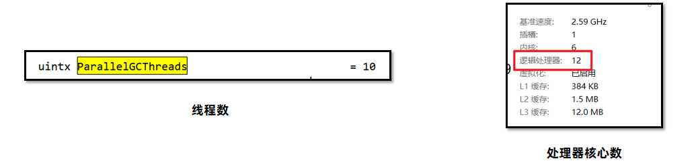

最终可以得到这张图：


并发标记和并发清理阶段，会使用3个线程并行处理。重新标记阶段会使用10个线程处理。

由于CPU的核心数有限，并发阶段会影响用户线程执行的性能。

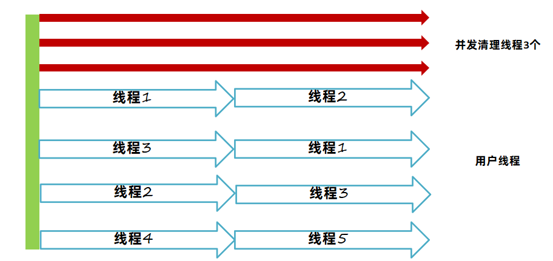

#### 年轻代-Parallel Scavenge垃圾回收器

Parallel Scavenge是JDK8默认的年轻代垃圾回收器，多线程并行回收，关注的是系统的吞吐量。具备自动调整堆内存大小的特点。


**回收年代和算法：**

年轻代

复制算法

**优点**

吞吐量高，而且手动可控。为了提高吞吐量，虚拟机会动态调整堆的参数

**缺点**

不能保证单次的停顿时间

**适用场景**

后台任务，不需要与用户交互，并且容易产生大量的对象。比如：大数据的处理，大文件导出

**常用参数：**

Parallel Scavenge允许手动设置最大暂停时间和吞吐量。Oracle官方建议在使用这个组合时，不要设置堆内存的最大值，垃圾回收器会根据最大暂停时间和吞吐量自动调整内存大小。

- 最大暂停时间，`-XX:MaxGCPauseMillis=n` 设置每次垃圾回收时的最大停顿毫秒数
- 吞吐量，`-XX:GCTimeRatio=n` 设置吞吐量为n（用户线程执行时间 = n/n + 1）
- 自动调整内存大小, `-XX:+UseAdaptiveSizePolicy`设置可以让垃圾回收器根据吞吐量和最大停顿的毫秒数自动调整内存大小

#### 老年代-Parallel Old垃圾回收器

Parallel Old是为Parallel Scavenge收集器设计的老年代版本，利用多线程并发收集。

参数： -XX:+UseParallelGC  或

​           -XX:+UseParallelOldGC可以使用Parallel Scavenge + Parallel Old这种组合。

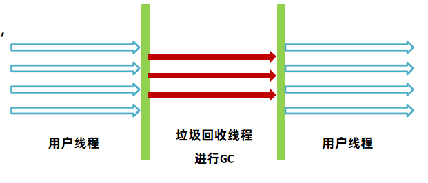

**回收年代和算法：**

老年代

标记-整理算法

**优点**

并发收集，在多核CPU下效率较高

**缺点**

暂停时间会比较长

**适用场景**

与Parallel Scavenge配套使用

### G1垃圾回收器

JDK9之后默认的垃圾回收器是G1（Garbage First）垃圾回收器。Parallel Scavenge关注吞吐量，允许用户设置最大暂停时间 ，但是会减少年轻代可用空间的大小。CMS关注暂停时间，但是吞吐量方面会下降。

而G1设计目标就是将上述两种垃圾回收器的优点融合：

1.支持巨大的堆空间回收，并有较高的吞吐量。

2.支持多CPU并行垃圾回收。

3.允许用户设置最大暂停时间。

JDK9之后强烈建议使用G1垃圾回收器。

G1出现之前的垃圾回收器，年轻代和老年代一般是连续的，如下图：


G1的整个堆会被划分成多个大小相等的区域，称之为区Region，区域不要求是连续的。分为Eden、Survivor、Old区。Region的大小通过堆空间大小/2048计算得到，也可以通过参数-XX:G1HeapRegionSize=32m指定(其中32m指定region大小为32M)，Region size必须是2的指数幂，取值范围从1M到32M。

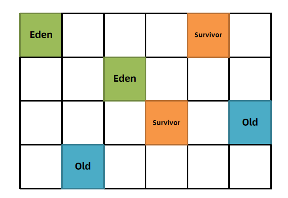

G1垃圾回收有两种方式：

1、年轻代回收（Young GC）

2、混合回收（Mixed GC）

#### 年轻代回收

年轻代回收（Young GC），回收Eden区和Survivor区中不用的对象。会导致STW，G1中可以通过参数

-XX:MaxGCPauseMillis=n（默认200）  设置每次垃圾回收时的最大暂停时间毫秒数，G1垃圾回收器会尽可能地保证暂停时间。

1、新创建的对象会存放在Eden区。当G1判断年轻代区不足（max默认60%），无法分配对象时需要回收时会执行Young GC。


2、标记出Eden和Survivor区域中的存活对象，

3、根据配置的最大暂停时间选择某些区域将存活对象复制到一个新的Survivor区中（年龄+1），清空这些区域。


G1在进行Young GC的过程中会去记录每次垃圾回收时每个Eden区和Survivor区的平均耗时，以作为下次回收时的参考依据。这样就可以根据配置的最大暂停时间计算出本次回收时最多能回收多少个Region区域了。

比如 -XX:MaxGCPauseMillis=n（默认200），每个Region回收耗时40ms，那么这次回收最多只能回收4个Region。

4、后续Young GC时与之前相同，只不过Survivor区中存活对象会被搬运到另一个Survivor区。


5、当某个存活对象的年龄到达阈值（默认15），将被放入老年代。


6、部分对象如果大小超过Region的一半，会直接放入老年代，这类老年代被称为Humongous区。比如堆内存是4G，每个Region是2M，只要一个大对象超过了1M就被放入Humongous区，如果对象过大会横跨多个Region。


7、多次回收之后，会出现很多Old老年代区，此时总堆占有率达到阈值时

（-XX:InitiatingHeapOccupancyPercent默认45%）会触发混合回收MixedGC。回收所有年轻代和部分老年代的对象以及大对象区。采用复制算法来完成。


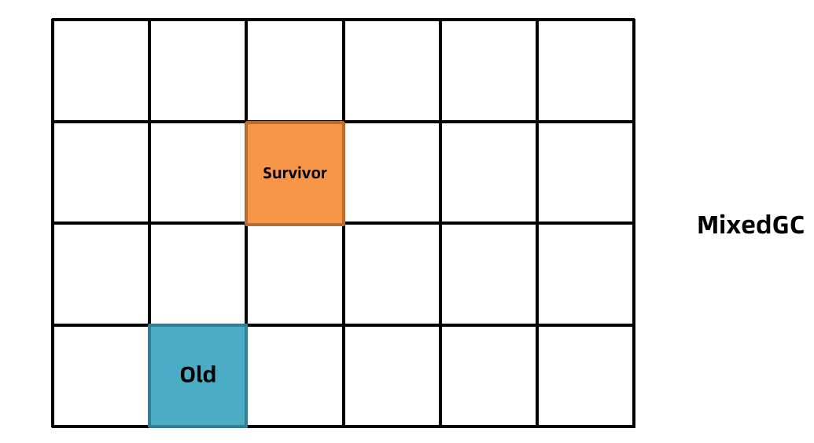

#### 混合回收

混合回收分为：初始标记（initial mark）、并发标记（concurrent mark）、最终标记（remark或者Finalize Marking）、并发清理（cleanup）

G1对老年代的清理会选择存活度最低的区域来进行回收，这样可以保证回收效率最高，这也是G1（Garbage first）名称的由来。

   

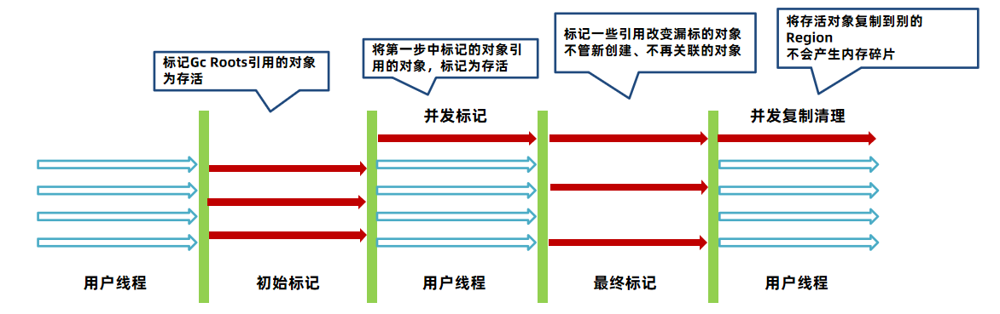

G1对老年代的清理会选择存活度最低的区域来进行回收，这样可以保证回收效率最高，这也是G1（Garbage first）名称的由来。最后清理阶段使用复制算法，不会产生内存碎片。


注意：如果清理过程中发现没有足够的空Region存放转移的对象，会出现Full GC。单线程执行标记-整理算法，此时会导致用户线程的暂停。所以尽量保证应该用的堆内存有一定多余的空间。

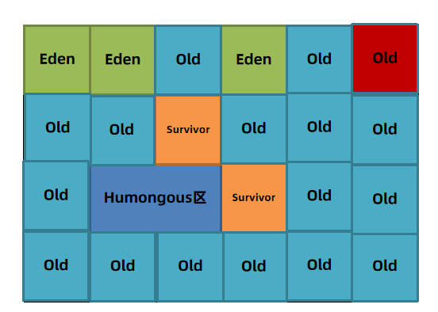

#### G1 – Garbage First 垃圾回收器

参数1： `-XX:+UseG1GC`  打开G1的开关，JDK9之后默认不需要打开

参数2：`-XX:MaxGCPauseMillis=毫秒值` 最大暂停的时

**回收年代和算法：**

年轻代+老年代

复制算法

**优点**

对比较大的堆如超过6G的堆回收时，延迟可控

不会产生内存碎片

并发标记的SATB算法效率高

**缺点**

JDK8之前还不够成熟

**适用场景**

JDK8最新版本、JDK9之后建议默认使用

使用以下代码测试g1垃圾回收器，打印出每个阶段的时间:

```Java
package chapter04.gc;

import java.io.IOException;
import java.util.ArrayList;
import java.util.List;

/**
 * 垃圾回收器案例3
 */
//-XX:+UseG1GC   -Xmn8g -Xmx16g -XX:SurvivorRatio=8  -XX:+PrintGCDetails -verbose:gc 
public class GcDemo2 {

    public static void main(String[] args) throws IOException {
        int count = 0;
        List<Object> list = new ArrayList<>();
        while (true){
            //System.out.println(++count);
            if(count++ % 10240 == 0){
                list.clear();
            }
//            byte[] bytes = new byte[1024 * 1024 * 1];
            list.add(new byte[1024 * 1024 * 1 / 2]);
//            System.gc();
        }
    }
}
```

每个region大小为2m，一共有84个young区，26个幸存者区。

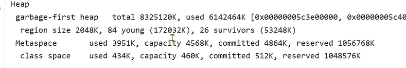

初始标记花了0.0478秒。

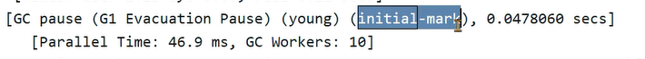

并发标记总共耗时10ms，不会产生STW。


### 总结

垃圾回收器的组合关系虽然很多，但是针对几个特定的版本，比较好的组合选择如下：

JDK8及之前：

ParNew + CMS（关注暂停时间）、Parallel Scavenge + Parallel Old (关注吞吐量)、 G1（JDK8之前不建议，较大堆并且关注暂停时间）

JDK9之后:

G1（默认）

从JDK9之后，由于G1日趋成熟，JDK默认的垃圾回收器已经修改为G1，所以强烈建议在生产环境上使用G1。

G1的实现原理将在《原理篇》中介绍，更多前沿技术ZGC、GraalVM将在《高级篇》中介绍。


# 实战篇

## 1、内存调优

### 1.1 内存溢出和内存泄漏

内存泄漏（memory leak）：在Java中如果不再使用一个对象，但是该对象依然在GC ROOT的引用链上，这个对象就不会被垃圾回收器回收，这种情况就称之为内存泄漏。

内存泄漏绝大多数情况都是由堆内存泄漏引起的，所以后续没有特别说明则讨论的都是堆内存泄漏。

比如图中，如果学生对象1不再使用

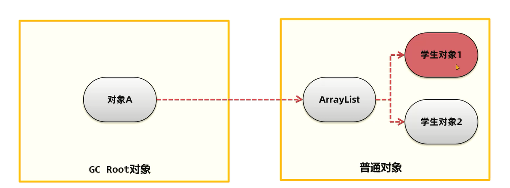

可以选择将ArrayList到学生对象1的引用删除：

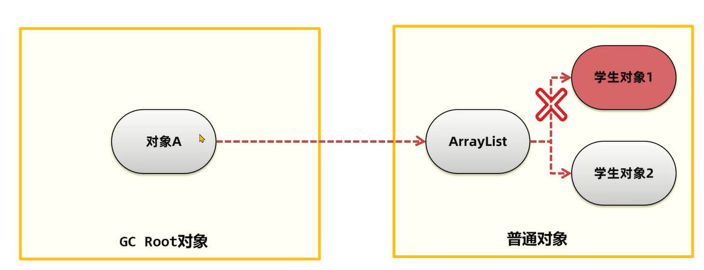

或者将对象A堆ArrayList的引用删除，这样所有的学生对象包括ArrayList都可以回收：


但是如果不移除这两个引用中的任何一个，学生对象1就属于内存泄漏了。

少量的内存泄漏可以容忍，但是如果发生持续的内存泄漏，就像滚雪球雪球越滚越大，不管有多大的内存迟早会被消耗完，最终导致的结果就是内存溢出。但是产生内存溢出并不是只有内存泄漏这一种原因。        


这些学生对象如果都不再使用，越积越多，就会导致超过堆内存的上限出现内存溢出。

正常情况的内存结构图如下：

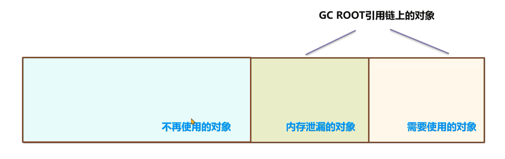

内存溢出出现时如下：


内存泄漏的对象和依然在GC ROOT引用链上需要使用的对象加起来占满了内存空间，无法为新的对象分配内存。

#### 内存泄漏的常见场景：

1、内存泄漏导致溢出的常见场景是大型的Java后端应用中，在处理用户的请求之后，没有及时将用户的数据删除。随着用户请求数量越来越多，内存泄漏的对象占满了堆内存最终导致内存溢出。

这种产生的内存溢出会直接导致用户请求无法处理，影响用户的正常使用。重启可以恢复应用使用，但是在运行一段时间之后依然会出现内存溢出。

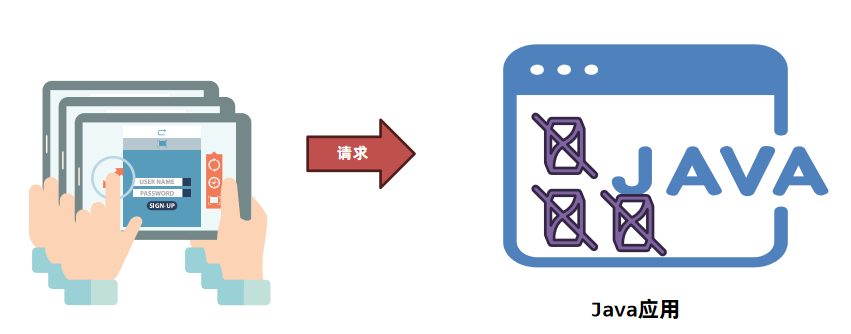

代码：

```Java
package com.itheima.jvmoptimize.controller;

import com.itheima.jvmoptimize.entity.UserEntity;
import org.springframework.web.bind.annotation.GetMapping;
import org.springframework.web.bind.annotation.PostMapping;
import org.springframework.web.bind.annotation.RequestMapping;
import org.springframework.web.bind.annotation.RestController;

import java.util.ArrayList;
import java.util.HashMap;
import java.util.List;
import java.util.Map;

@RestController
@RequestMapping("/leak2")
public class LeakController2 {
    private static Map<Long,Object> userCache = new HashMap<>();

    /**
     * 登录接口 放入hashmap中
     */
    @PostMapping("/login")
    public void login(String name,Long id){
        userCache.put(id,new byte[1024 * 1024 * 300]);
    }


    /**
     * 登出接口，删除缓存的用户信息
     */

    @GetMapping("/logout")
    public void logout(Long id){
        userCache.remove(id);
    }

}
```

设置虚拟机参数，将最大堆内存设置为1g:


在Postman中测试，登录id为1的用户：


调用logout接口，id为1那么数据会正常删除：


连续调用login传递不同的id，但是不调用logout


调用几次之后就会出现内存溢出：


2、第二种常见场景是分布式任务调度系统如Elastic-job、Quartz等进行任务调度时，被调度的Java应用在调度任务结束中出现了内存泄漏，最终导致多次调度之后内存溢出。

这种产生的内存溢出会导致应用执行下次的调度任务执行。同样重启可以恢复应用使用，但是在调度执行一段时间之后依然会出现内存溢出。


开启定时任务：


定时任务代码：

```Java
package com.itheima.jvmoptimize.task;

import com.itheima.jvmoptimize.leakdemo.demo4.Outer;
import org.springframework.scheduling.annotation.Scheduled;
import org.springframework.stereotype.Component;

import java.util.ArrayList;
import java.util.List;

@Component
public class LeakTask {

    private int count = 0;
    private List<Object> list = new ArrayList<>();

    @Scheduled(fixedRate = 100L)
    public void test(){
        System.out.println("定时任务调用" + ++count);
        list.add(new Outer().newList());
    }
}
```

启动程序之后很快就出现了内存溢出：

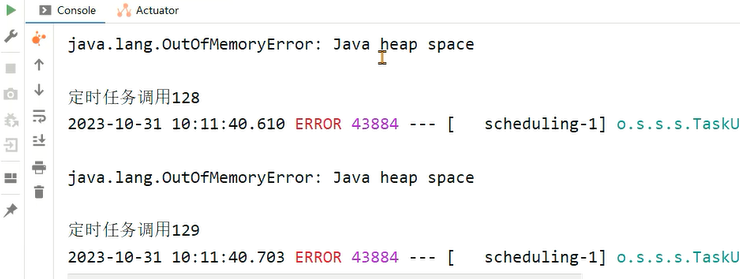

### 1.2 解决内存溢出的方法


首先要熟悉一些常用的监控工具：

#### 1.2.1 常用监控工具

##### Top命令

top命令是linux下用来查看系统信息的一个命令，它提供给我们去实时地去查看系统的资源，比如执行时的进程、线程和系统参数等信息。进程使用的内存为RES（常驻内存）- SHR（共享内存）


**优点：**

- 操作简单
- 无额外的软件安装

**缺点：**

只能查看最基础的进程信息，无法查看到每个部分的内存占用（堆、方法区、堆外） 

##### VisualVM

VisualVM是多功能合一的Java故障排除工具并且他是一款可视化工具，整合了命令行 JDK 工具和轻量级分析功能，功能非常强大。这款软件在Oracle JDK 6~8 中发布，但是在 Oracle JDK 9 之后不在JDK安装目录下需要单独下载。下载地址：https://visualvm.github.io/

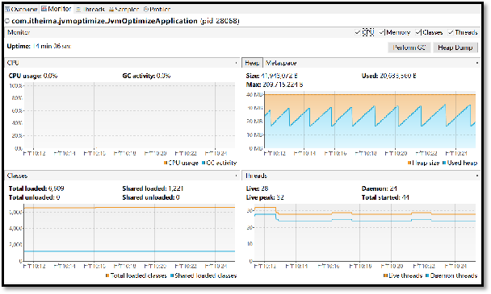

**优点：**

- 功能丰富，实时监控CPU、内存、线程等详细信息
- 支持Idea插件，开发过程中也可以使用

**缺点：**

对大量集群化部署的Java进程需要手动进行管理

如果需要进行远程监控，可以通过jmx方式进行连接。在启动java程序时添加如下参数：

```Java
-Djava.rmi.server.hostname=服务器ip地址
-Dcom.sun.management.jmxremote
-Dcom.sun.management.jmxremote.port=9122
-Dcom.sun.management.jmxremote.ssl=false
-Dcom.sun.management.jmxremote.authenticate=false
```

右键点击remote

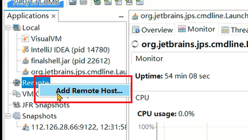

填写服务器的ip地址：

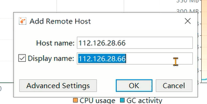

右键添加JMX连接

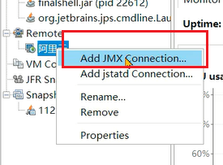

填写ip地址和端口号，勾选不需要SSL安全验证：

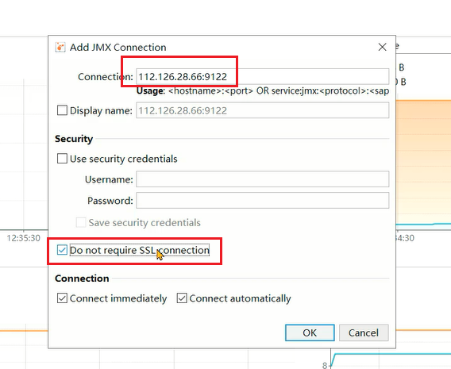

双击成功连接。

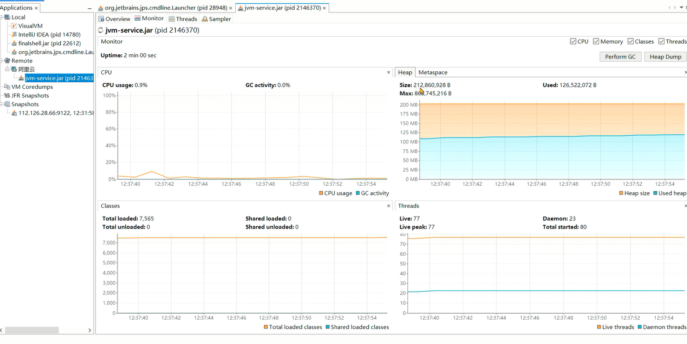

##### Arthas

Arthas 是一款线上监控诊断产品，通过全局视角实时查看应用 load、内存、gc、线程的状态信息，并能在不修改应用代码的情况下，对业务问题进行诊断，包括查看方法调用的出入参、异常，监测方法执行耗时，类加载信息等，大大提升线上问题排查效率。


**优点：**

- 功能强大，不止于监控基础的信息，还能监控单个方法的执行耗时等细节内容。
- 支持应用的集群管理

**缺点：**

部分高级功能使用门槛较高

###### **使用阿里arthas tunnel管理所有的需要监控的程序**

背景：

小李的团队已经普及了arthas的使用，但是由于使用了微服务架构，生产环境上的应用数量非常多，使用arthas还得登录到每一台服务器上再去操作非常不方便。他看到官方文档上可以使用tunnel来管理所有需要监控的程序。

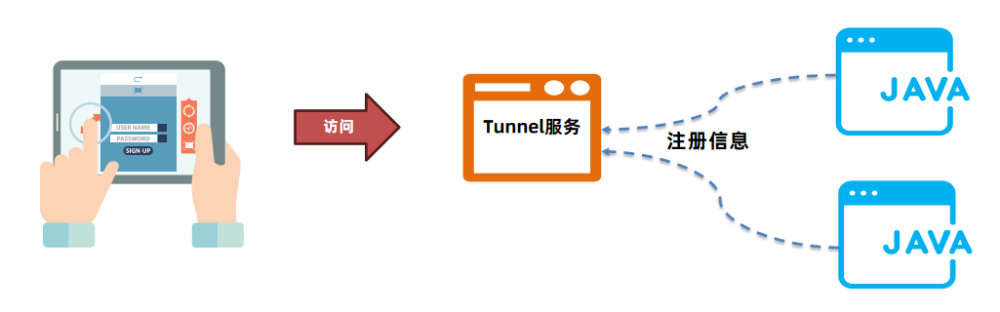

步骤：

在Spring Boot程序中添加arthas的依赖(支持Spring Boot2)，在配置文件中添加tunnel服务端的地址，便于tunnel去监控所有的程序。

2. 将tunnel服务端程序部署在某台服务器上并启动。
3. 启动java程序
4. 打开tunnel的服务端页面，查看所有的进程列表，并选择进程进行arthas的操作。

pom.xml添加依赖：

```XML
<dependency>
    <groupId>com.taobao.arthas</groupId>
    <artifactId>arthas-spring-boot-starter</artifactId>
    <version>3.7.1</version>
</dependency>
```

application.yml中添加配置:

```Properties
arthas:
  #tunnel地址，目前是部署在同一台服务器，正式环境需要拆分
  tunnel-server: ws://localhost:7777/ws
  #tunnel显示的应用名称，直接使用应用名
  app-name: ${spring.application.name}
  #arthas http访问的端口和远程连接的端口
  http-port: 8888
  telnet-port: 9999
```

在资料中找到arthas-tunnel-server.3.7.1-fatjar.jar上传到服务器，并使用

`nohup java -jar -Darthas.enable-detail-pages=true arthas-tunnel-server.3.7.1-fatjar.jar & ` 命令启动该程序。`-Darthas.enable-detail-pages=true`参数作用是可以有一个页面展示内容。通过`服务器ip地址:8080/apps.html`打开页面，目前没有注册上来任何应用。

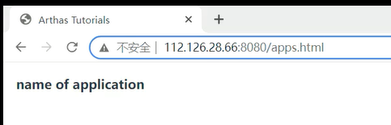

启动spring boot应用，如果在一台服务器上，注意区分端口。

```Properties
-Dserver.port=tomcat端口号
-Darthas.http-port=arthas的http端口号
-Darthas.telnet-port=arthas的telnet端口号端口号
```


最终就能看到两个应用：


单击应用就可以进入操作arthas了。

##### Prometheus+Grafana

Prometheus+Grafana是企业中运维常用的监控方案，其中Prometheus用来采集系统或者应用的相关数据，同时具备告警功能。Grafana可以将Prometheus采集到的数据以可视化的方式进行展示。

Java程序员要学会如何读懂Grafana展示的Java虚拟机相关的参数。

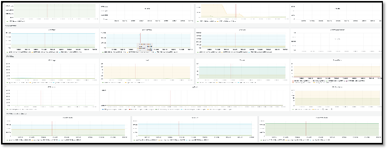

**优点：**

- 支持系统级别和应用级别的监控，比如linux操作系统、Redis、MySQL、Java进程。
- 支持告警并允许自定义告警指标，通过邮件、短信等方式尽早通知相关人员进行处理

**缺点：**

环境搭建较为复杂，一般由运维人员完成

###### 阿里云环境搭建（了解即可）

这一小节主要是为了让同学们更好地去阅读监控数据，所以提供一整套最简单的环境搭建方式，觉得困难可以直接跳过。企业中环境搭建的工作由运维人员来完成。

1、在pom文件中添加依赖

```XML
<dependency>
    <groupId>io.micrometer</groupId>
    <artifactId>micrometer-registry-prometheus</artifactId>
    <scope>runtime</scope>
</dependency>
<dependency>
    <groupId>org.springframework.boot</groupId>
    <artifactId>spring-boot-starter-actuator</artifactId>

    <exclusions><!-- 去掉springboot默认配置 -->
        <exclusion>
            <groupId>org.springframework.boot</groupId>
            <artifactId>spring-boot-starter-logging</artifactId>
        </exclusion>
    </exclusions>
</dependency>
```

2、添加配置项

```Properties
management:
  endpoint:
    metrics:
      enabled: true #支持metrics
    prometheus:
      enabled: true #支持Prometheus
  metrics:
    export:
      prometheus:
        enabled: true
    tags:
      application: jvm-test #实例名采集
  endpoints:
    web:
      exposure:
        include: '*' #开放所有端口
```

这两步做完之后，启动程序。

3、通过地址：`ip地址:端口号/actuator/prometheus`访问之后可以看到jvm相关的指标数据。


4、创建阿里云Prometheus实例


5、选择ECS服务

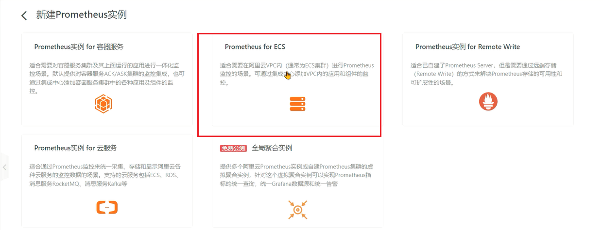

6、在自己的ECS服务器上找到网络和交换机

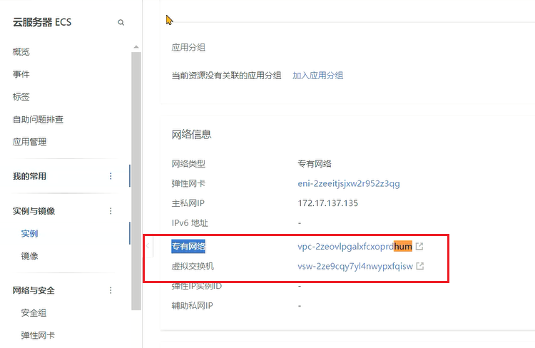

7、选择对应的网络：


填写内容，与ECS里边的网络设置保持一致


8、选中新的实例，选择MicroMeter

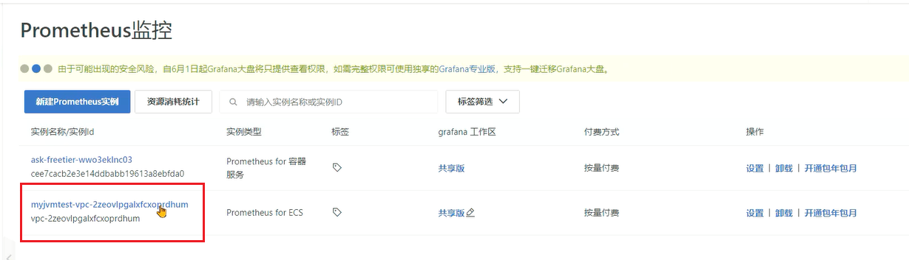


9、给ECS添加标签；

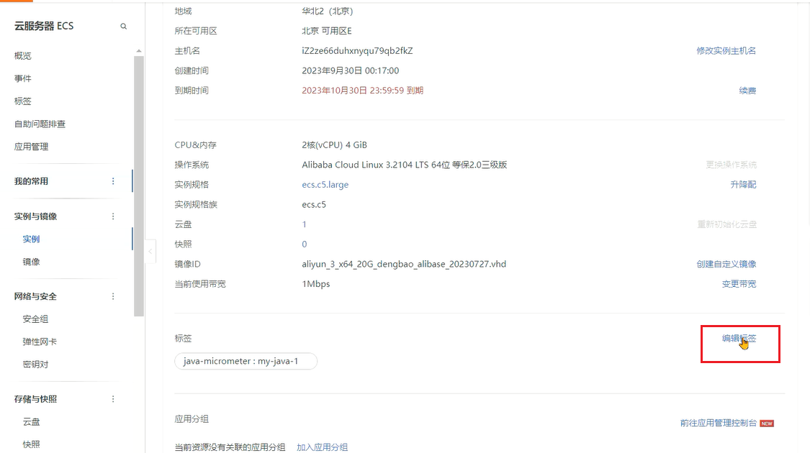


10、填写内容，注意ECS的标签

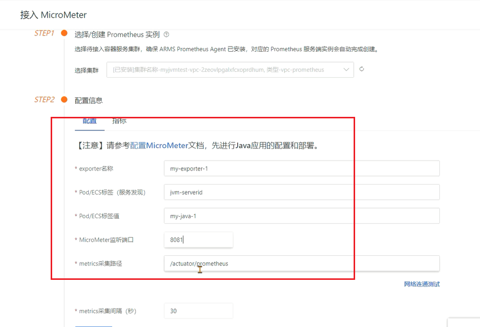

11、点击大盘就可以看到指标了


12、指标内容:


#### 1.2.2 堆内存状况的对比

- 正常情况
  - 处理业务时会出现上下起伏，业务对象频繁创建内存会升高，触发MinorGC之后内存会降下来。
  - 手动执行FULL GC之后，内存大小会骤降，而且每次降完之后的大小是接近的。
  - 长时间观察内存曲线应该是在一个范围内。
  - 

  - 出现内存泄漏
    - 处于持续增长的情况，即使Minor GC也不能把大部分对象回收
    - 手动FULL GC之后的内存量每一次都在增长
    - 长时间观察内存曲线持续增长

#### 1.2.3 产生内存溢出原因一 ：代码中的内存泄漏

总结了6种产生内存泄漏的原因，均来自于java代码的不当处理：

- equals()和hashCode()，不正确的equals()和hashCode()实现导致内存泄漏
- ThreadLocal的使用，由于线程池中的线程不被回收导致的ThreadLocal内存泄漏
- 内部类引用外部类，非静态的内部类和匿名内部类的错误使用导致内存泄漏
- String的intern方法，由于JDK6中的字符串常量池位于永久代，intern被大量调用并保存产生的内存泄漏
- 通过静态字段保存对象，大量的数据在静态变量中被引用，但是不再使用，成为了内存泄漏
- 资源没有正常关闭，由于资源没有调用close方法正常关闭，导致的内存溢出

##### 案例1：equals()和hashCode()导致的内存泄漏

问题：

在定义新类时没有重写正确的equals()和hashCode()方法。在使用HashMap的场景下，如果使用这个类对象作为key，HashMap在判断key是否已经存在时会使用这些方法，如果重写方式不正确，会导致相同的数据被保存多份。

正常情况：

1、以JDK8为例，首先调用hash方法计算key的哈希值，hash方法中会使用到key的hashcode方法。根据hash方法的结果决定存放的数组中位置。

2、如果没有元素，直接放入。如果有元素，先判断key是否相等，会用到equals方法，如果key相等，直接替换value；key不相等，走链表或者红黑树查找逻辑，其中也会使用equals比对是否相同。


异常情况：

1、hashCode方法实现不正确，会导致相同id的学生对象计算出来的hash值不同，可能会被分到不同的槽中。


2、equals方法实现不正确，会导致key在比对时，即便学生对象的id是相同的，也被认为是不同的key。

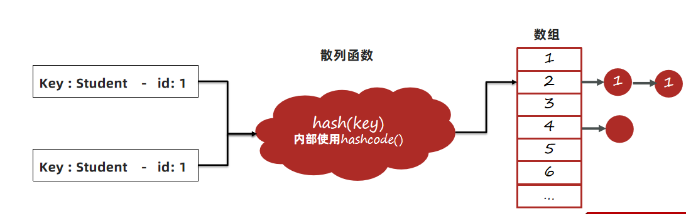

3、长时间运行之后HashMap中会保存大量相同id的学生数据。


```Java
package com.itheima.jvmoptimize.leakdemo.demo2;

import org.apache.commons.lang3.builder.EqualsBuilder;
import org.apache.commons.lang3.builder.HashCodeBuilder;

import java.util.Objects;

public class Student {
    private String name;
    private Integer id;
    private byte[] bytes = new byte[1024 * 1024];

    public String getName() {
        return name;
    }

    public void setName(String name) {
        this.name = name;
    }

    public Integer getId() {
        return id;
    }

    public void setId(Integer id) {
        this.id = id;
    }

  
}
package com.itheima.jvmoptimize.leakdemo.demo2;

import java.util.HashMap;
import java.util.Map;

public class Demo2 {
    public static long count = 0;
    public static Map<Student,Long> map = new HashMap<>();
    public static void main(String[] args) throws InterruptedException {
        while (true){
            if(count++ % 100 == 0){
                Thread.sleep(10);
            }
            Student student = new Student();
            student.setId(1);
            student.setName("张三");
            map.put(student,1L);
        }
    }
}
```

运行之后通过visualvm观察：

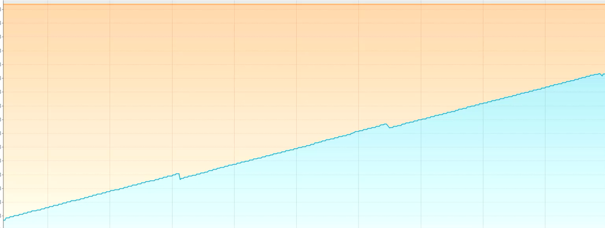

出现内存泄漏的现象。

解决方案：

1、在定义新实体时，始终重写equals()和hashCode()方法。

2、重写时一定要确定使用了唯一标识去区分不同的对象，比如用户的id等。

3、hashmap使用时尽量使用编号id等数据作为key，不要将整个实体类对象作为key存放。

代码：

```Properties
package com.itheima.jvmoptimize.leakdemo.demo2;

import org.apache.commons.lang3.builder.EqualsBuilder;
import org.apache.commons.lang3.builder.HashCodeBuilder;

import java.util.Objects;

public class Student {
    private String name;
    private Integer id;
    private byte[] bytes = new byte[1024 * 1024];

    public String getName() {
        return name;
    }

    public void setName(String name) {
        this.name = name;
    }

    public Integer getId() {
        return id;
    }

    public void setId(Integer id) {
        this.id = id;
    }

    @Override
    public boolean equals(Object o) {
        if (this == o) {
            return true;
        }

        if (o == null || getClass() != o.getClass()) {
            return false;
        }

        Student student = (Student) o;

        return new EqualsBuilder().append(id, student.id).isEquals();
    }

    @Override
    public int hashCode() {
        return new HashCodeBuilder(17, 37).append(id).toHashCode();
    }
}
```

##### 案例2：内部类引用外部类

问题：

1、非静态的内部类默认会持有外部类，尽管代码上不再使用外部类，所以如果有地方引用了这个非静态内部类，会导致外部类也被引用，垃圾回收时无法回收这个外部类。

2、匿名内部类对象如果在非静态方法中被创建，会持有调用者对象，垃圾回收时无法回收调用者。

```Java
package com.itheima.jvmoptimize.leakdemo.demo3;

import java.io.IOException;
import java.util.ArrayList;

public class Outer{
    private byte[] bytes = new byte[1024 * 1024]; //外部类持有数据
    private static String name  = "测试";
    class Inner{
        private String name;
        public Inner() {
            this.name = Outer.name;
        }
    }

    public static void main(String[] args) throws IOException, InterruptedException {
//        System.in.read();
        int count = 0;
        ArrayList<Inner> inners = new ArrayList<>();
        while (true){
            if(count++ % 100 == 0){
                Thread.sleep(10);
            }
            inners.add(new Outer().new Inner());
        }
    }
}
package com.itheima.jvmoptimize.leakdemo.demo4;

import java.io.IOException;
import java.util.ArrayList;
import java.util.List;

public class Outer {
    private byte[] bytes = new byte[1024 * 1024 * 10];
    public List<String> newList() {
        List<String> list = new ArrayList<String>() {{
            add("1");
            add("2");
        }};
        return list;
    }

    public static void main(String[] args) throws IOException {
        System.in.read();
        int count = 0;
        ArrayList<Object> objects = new ArrayList<>();
        while (true){
            System.out.println(++count);
            objects.add(new Outer().newList());
        }
    }
}
```

解决方案：

1、这个案例中，使用内部类的原因是可以直接获取到外部类中的成员变量值，简化开发。如果不想持有外部类对象，应该使用静态内部类。

2、使用静态方法，可以避免匿名内部类持有调用者对象。

```Java
package com.itheima.jvmoptimize.leakdemo.demo3;

import java.io.IOException;
import java.util.ArrayList;

public class Outer{
    private byte[] bytes = new byte[1024 * 1024]; //外部类持有数据
    private static String name  = "测试";
    static class Inner{
        private String name;
        public Inner() {
            this.name = Outer.name;
        }
    }

    public static void main(String[] args) throws IOException, InterruptedException {
//        System.in.read();
        int count = 0;
        ArrayList<Inner> inners = new ArrayList<>();
        while (true){
            if(count++ % 100 == 0){
                Thread.sleep(10);
            }
            inners.add(new Inner());
        }
    }
}
package com.itheima.jvmoptimize.leakdemo.demo4;

import java.io.IOException;
import java.util.ArrayList;
import java.util.List;

public class Outer {
    private byte[] bytes = new byte[1024 * 1024 * 10];
    public static List<String> newList() {
        List<String> list = new ArrayList<String>() {{
            add("1");
            add("2");
        }};
        return list;
    }

    public static void main(String[] args) throws IOException {
        System.in.read();
        int count = 0;
        ArrayList<Object> objects = new ArrayList<>();
        while (true){
            System.out.println(++count);
            objects.add(newList());
        }
    }
}
```

##### 案例3：ThreadLocal的使用

问题：

如果仅仅使用手动创建的线程，就算没有调用ThreadLocal的remove方法清理数据，也不会产生内存泄漏。因为当线程被回收时，ThreadLocal也同样被回收。但是如果使用线程池就不一定了。

```Java
package com.itheima.jvmoptimize.leakdemo.demo5;

import java.util.concurrent.*;

public class Demo5 {
    public static ThreadLocal<Object> threadLocal = new ThreadLocal<>();

    public static void main(String[] args) throws InterruptedException {
        ThreadPoolExecutor threadPoolExecutor = new ThreadPoolExecutor(Integer.MAX_VALUE, Integer.MAX_VALUE,
                0, TimeUnit.DAYS, new SynchronousQueue<>());
        int count = 0;
        while (true) {
            System.out.println(++count);
            threadPoolExecutor.execute(() -> {
                threadLocal.set(new byte[1024 * 1024]);
            });
            Thread.sleep(10);
        }


    }
}
```

解决方案：

线程方法执行完，一定要调用ThreadLocal中的remove方法清理对象。

```Java
package com.itheima.jvmoptimize.leakdemo.demo5;

import java.util.concurrent.*;

public class Demo5 {
    public static ThreadLocal<Object> threadLocal = new ThreadLocal<>();

    public static void main(String[] args) throws InterruptedException {
        ThreadPoolExecutor threadPoolExecutor = new ThreadPoolExecutor(Integer.MAX_VALUE, Integer.MAX_VALUE,
                0, TimeUnit.DAYS, new SynchronousQueue<>());
        int count = 0;
        while (true) {
            System.out.println(++count);
            threadPoolExecutor.execute(() -> {
                threadLocal.set(new byte[1024 * 1024]);
                threadLocal.remove();
            });
            Thread.sleep(10);
        }


    }
}
```

##### 案例4：String的intern方法

问题：

JDK6中字符串常量池位于堆内存中的Perm Gen永久代中，如果不同字符串的intern方法被大量调用，字符串常量池会不停的变大超过永久代内存上限之后就会产生内存溢出问题。

```Java
package com.itheima.jvmoptimize.leakdemo.demo6;

import org.apache.commons.lang3.RandomStringUtils;

import java.util.ArrayList;
import java.util.List;

public class Demo6 {
    public static void main(String[] args) {
        while (true){
            List<String> list = new ArrayList<String>();
            int i = 0;
            while (true) {
                //String.valueOf(i++).intern(); //JDK1.6 perm gen 不会溢出
                list.add(String.valueOf(i++).intern()); //溢出
            }
        }
    }
}
```

解决方案：

1、注意代码中的逻辑，尽量不要将随机生成的字符串加入字符串常量池

2、增大永久代空间的大小，根据实际的测试/估算结果进行设置-XX:MaxPermSize=256M

##### 案例5：通过静态字段保存对象

问题：

如果大量的数据在静态变量中被长期引用，数据就不会被释放，如果这些数据不再使用，就成为了内存泄漏。

解决方案：

1、尽量减少将对象长时间的保存在静态变量中，如果不再使用，必须将对象删除（比如在集合中）或者将静态变量设置为null。

2、使用单例模式时，尽量使用懒加载，而不是立即加载。

```Java
package com.itheima.jvmoptimize.leakdemo.demo7;

import org.springframework.context.annotation.Lazy;
import org.springframework.stereotype.Component;

@Lazy //懒加载
@Component
public class TestLazy {
    private byte[] bytes = new byte[1024 * 1024 * 1024];
}
```

3、Spring的Bean中不要长期存放大对象，如果是缓存用于提升性能，尽量设置过期时间定期失效。

```Java
package com.itheima.jvmoptimize.leakdemo.demo7;

import com.github.benmanes.caffeine.cache.Cache;
import com.github.benmanes.caffeine.cache.Caffeine;

import java.time.Duration;

public class CaffineDemo {
    public static void main(String[] args) throws InterruptedException {
        Cache<Object, Object> build = Caffeine.newBuilder()
        //设置100ms之后就过期
                 .expireAfterWrite(Duration.ofMillis(100))
                .build();
        int count = 0;
        while (true){
            build.put(count++,new byte[1024 * 1024 * 10]);
            Thread.sleep(100L);
        }
    }
}
```

##### 案例6：资源没有正常关闭

问题：

连接和流这些资源会占用内存，如果使用完之后没有关闭，这部分内存不一定会出现内存泄漏，但是会导致close方法不被执行。

```Java
package com.itheima.jvmoptimize.leakdemo.demo1;

import java.io.FileInputStream;
import java.io.IOException;
import java.io.InputStream;
import java.net.URL;
import java.net.URLConnection;
import java.sql.*;

//-Xmx50m -Xms50m
public class Demo1 {

    // JDBC driver name and database URL
    static final String JDBC_DRIVER = "com.mysql.cj.jdbc.Driver";
    static final String DB_URL = "jdbc:mysql:///bank1";

    //  Database credentials
    static final String USER = "root";
    static final String PASS = "123456";

    public static void leak() throws SQLException {
        //Connection conn = null;
        Statement stmt = null;
        Connection conn = DriverManager.getConnection(DB_URL, USER, PASS);

        // executes a valid query
        stmt = conn.createStatement();
        String sql;
        sql = "SELECT id, account_name FROM account_info";
        ResultSet rs = stmt.executeQuery(sql);

        //STEP 4: Extract data from result set
        while (rs.next()) {
            //Retrieve by column name
            int id = rs.getInt("id");
            String name = rs.getString("account_name");

            //Display values
            System.out.print("ID: " + id);
            System.out.print(", Name: " + name + "\n");
        }

    }

    public static void main(String[] args) throws InterruptedException, SQLException {
        while (true) {
            leak();
        }
    }
}
```

同学们可以测试一下这段代码会不会产生内存泄漏，应该是不会的。但是这个结论不是确定的，所以建议编程时养成良好的习惯，尽量关闭不再使用的资源。

解决方案：

1、为了防止出现这类的资源对象泄漏问题，必须在finally块中关闭不再使用的资源。

2、从 Java 7 开始，使用try-with-resources语法可以用于自动关闭资源。

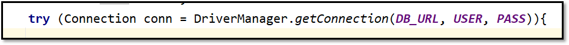

#### 1.2.4 产生内存溢出原因二 ： 并发请求问题

通过发送请求向Java应用获取数据，正常情况下Java应用将数据返回之后，这部分数据就可以在内存中被释放掉。

接收到请求时创建对象:


响应返回之后，对象就可以被回收掉：


并发请求问题指的是由于用户的并发请求量有可能很大，同时处理数据的时间很长，导致大量的数据存在于内存中，最终超过了内存的上限，导致内存溢出。这类问题的处理思路和内存泄漏类似，首先要定位到对象产生的根源。


那么怎么模拟并发请求呢？

使用Apache Jmeter软件可以进行并发请求测试。

Apache Jmeter是一款开源的测试软件，使用Java语言编写，最初是为了测试Web程序，目前已经发展成支持数据库、消息队列、邮件协议等不同类型内容的测试工具。

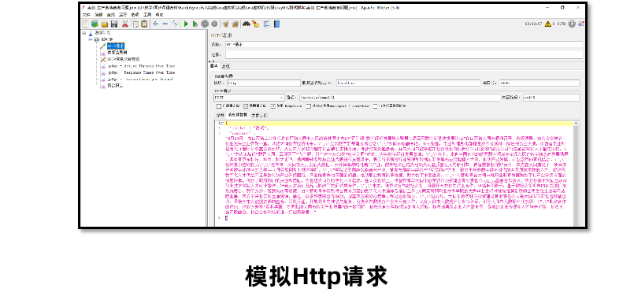


Apache Jmeter支持插件扩展，生成多样化的测试结果。

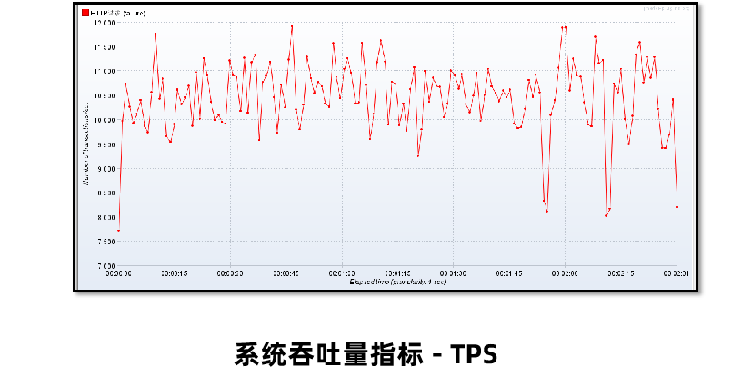

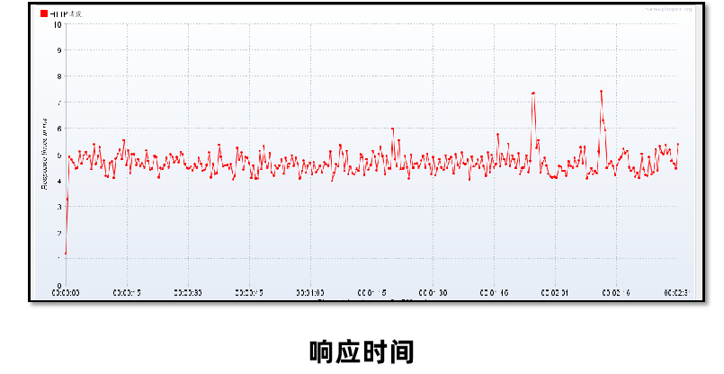

##### 使用Jmeter进行并发测试，发现内存溢出问题

背景：

小李的团队发现有一个微服务在晚上8点左右用户使用的高峰期会出现内存溢出的问题，于是他们希望在自己的开发环境能重现类似的问题。

步骤：

1、安装Jmeter软件，添加线程组。

打开资料中的Jmeter，找到bin目录，双击`jmeter.bat`启动程序。


2. 在线程组中增加Http请求，添加随机参数。

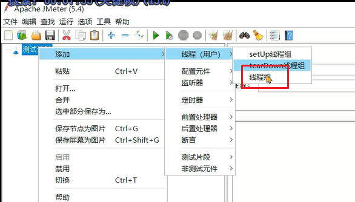

添加线程组参数：

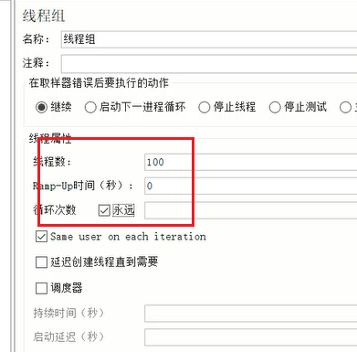

添加Http请求：


添加http参数：


接口代码：

```Java
/**
 * 大量数据 + 处理慢
 */
@GetMapping("/test")
public void test1() throws InterruptedException {
    byte[] bytes = new byte[1024 * 1024 * 100];//100m
    Thread.sleep(10 * 1000L);
}
```

3. 在线程组中添加监听器 – 聚合报告，用来展示最终结果。


4. 启动程序，运行线程组并观察程序是否出现内存溢出。

添加虚拟机参数：

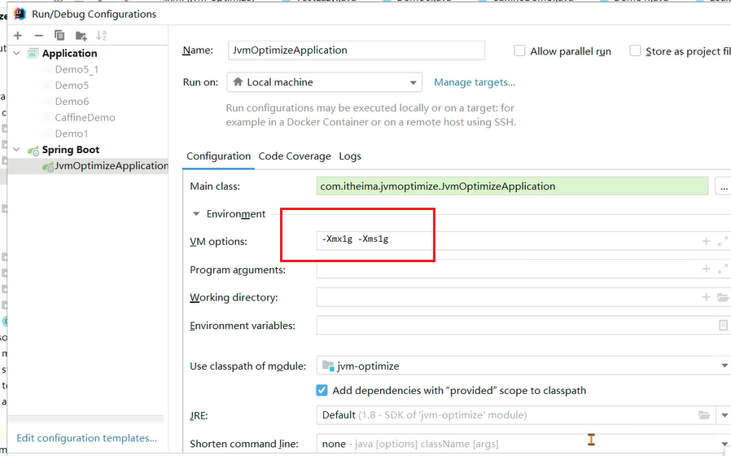

点击运行：


很快就出现了内存溢出：


再来看一个案例：

1、设置线程池参数：


2、设置http接口参数


3、代码：

```Java
/**
 * 登录接口 传递名字和id,放入hashmap中
 */
@PostMapping("/login")
public void login(String name,Long id){
    userCache.put(id,new UserEntity(id,name));
}
```

4、我们想生成随机的名字和id,选择函数助手对话框


5、选择Random随机数生成器

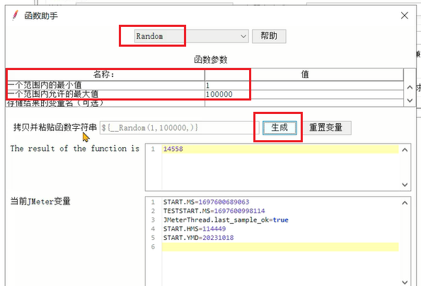

6、让随机数生成器生效，值中直接ctrl + v就行，已经被复制到粘贴板了。

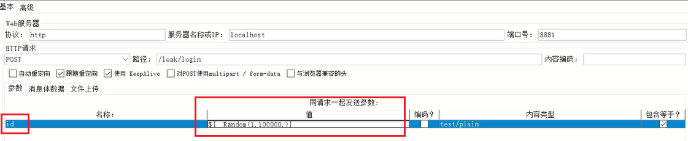

7、字符串也是同理的设置方法：

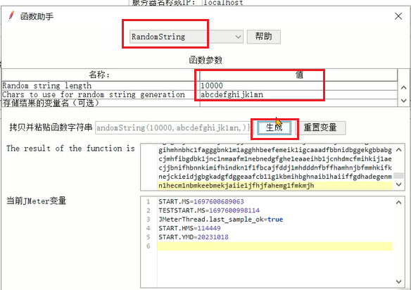

8、添加name字段：


9、点击测试，一段时间之后同样出现了内存溢出：

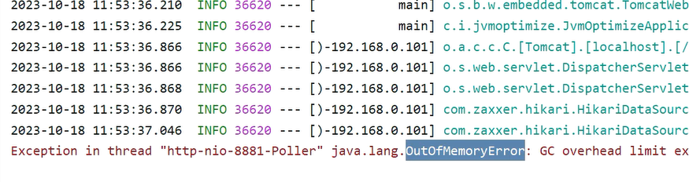

#### 1.2.5 诊断

##### 内存快照

当堆内存溢出时，需要在堆内存溢出时将整个堆内存保存下来，生成内存快照(Heap Profile )文件。

使用MAT打开hprof文件，并选择内存泄漏检测功能，MAT会自行根据内存快照中保存的数据分析内存泄漏的根源。

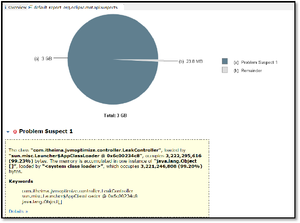

生成内存快照的Java虚拟机参数：

​    `-XX:+HeapDumpOnOutOfMemoryError`：发生OutOfMemoryError错误时，自动生成hprof内存快照文件。

​    `-XX:HeapDumpPath=<path>`：指定hprof文件的输出路径。

使用MAT打开hprof文件，并选择内存泄漏检测功能，MAT会自行根据内存快照中保存的数据分析内存泄漏的根源。

在程序中添加jvm参数：

```Java
-Xmx256m -Xms256m -XX:+HeapDumpOnOutOfMemoryError -XX:HeapDumpPath=D:\jvm\dump\test1.hprof
```

运行程序之后：

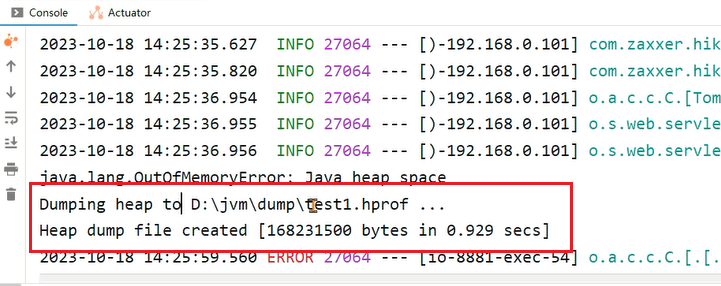

使用MAT打开hprof文件（操作步骤见前文GC Root小节），首页就展示了MAT检测出来的内存泄漏问题原因。

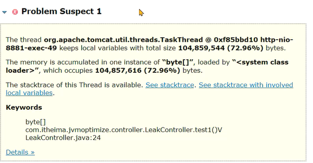

点击Details查看详情，这个线程持有了大量的字节数组：

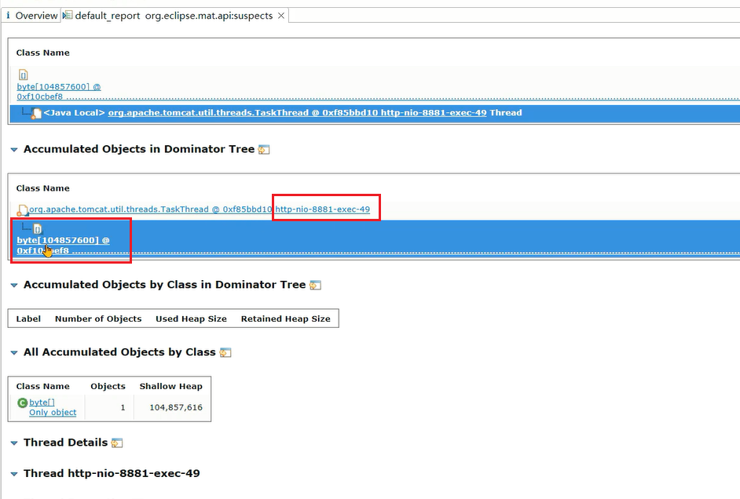

继续往下来，还可以看到溢出时线程栈，通过栈信息也可以怀疑下是否是因为这句代码创建了大量的对象：

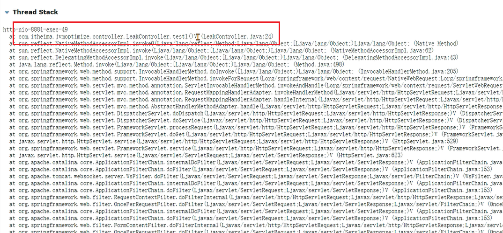

##### MAT内存泄漏检测的原理

MAT提供了称为支配树（Dominator Tree）的对象图。支配树展示的是对象实例间的支配关系。在对象引用图中，所有指向对象B的路径都经过对象A，则认为对象A支配对象B。

如下图，A引用B、C，B、C引用D, C引用E，D、E引用F，转成支配树之后。由于E只有C引用，所以E挂在C上。接下来B、C、D、F都由其他至少1个对象引用，所以追溯上去，只有A满足支配它们的条件。


支配树中对象本身占用的空间称之为浅堆(Shallow Heap）。

支配树中对象的子树就是所有被该对象支配的内容，这些内容组成了对象的深堆（Retained Heap），也称之为保留集（ Retained Set ） 。深堆的大小表示该对象如果可以被回收，能释放多大的内存空间。

如下图：C自身包含一个浅堆，而C底下挂了E，所以C+E占用的空间大小代表C的深堆。


需求：

使用如下代码生成内存快照，并分析TestClass对象的深堆和浅堆。

如何在不内存溢出情况下生成堆内存快照？-XX:+HeapDumpBeforeFullGC可以在FullGC之前就生成内存快照。

```Java
package com.itheima.jvmoptimize.matdemo;

import org.openjdk.jol.info.ClassLayout;

import java.util.ArrayList;
import java.util.List;

//-XX:+HeapDumpBeforeFullGC -XX:HeapDumpPath=D:/jvm/dump/mattest.hprof
public class HeapDemo {
    public static void main(String[] args) {
        TestClass a1 = new TestClass();
        TestClass a2 = new TestClass();
        TestClass a3 = new TestClass();
        String s1 = "itheima1";
        String s2 = "itheima2";
        String s3 = "itheima3";

        a1.list.add(s1);

        a2.list.add(s1);
        a2.list.add(s2);

        a3.list.add(s3);

        //System.out.print(ClassLayout.parseClass(TestClass.class).toPrintable());
        s1 = null;
        s2 = null;
        s3 = null;
        System.gc();
    }
}

class TestClass {
    public List<String> list = new ArrayList<>(10);
}
```

上面代码的引用链如下：

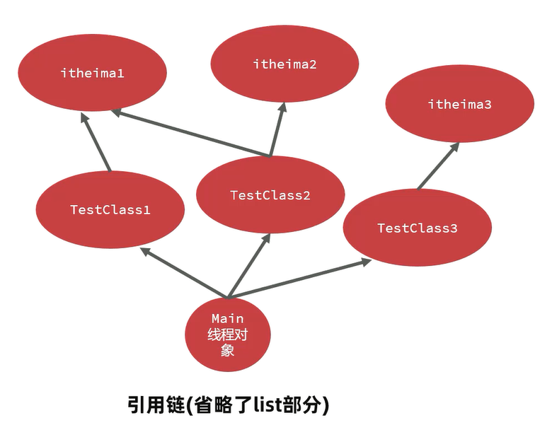

转换成支配树，`TestClass`简称为tc。tc1 tc2 tc3都是直接挂在main线程对象上，itheima2 itheima3都只能通过tc2和tc3访问，所以直接挂上。itheima1不同，他可以由tc1 tc2访问，所以他要挂载他们的上级也就是main线程对象上：

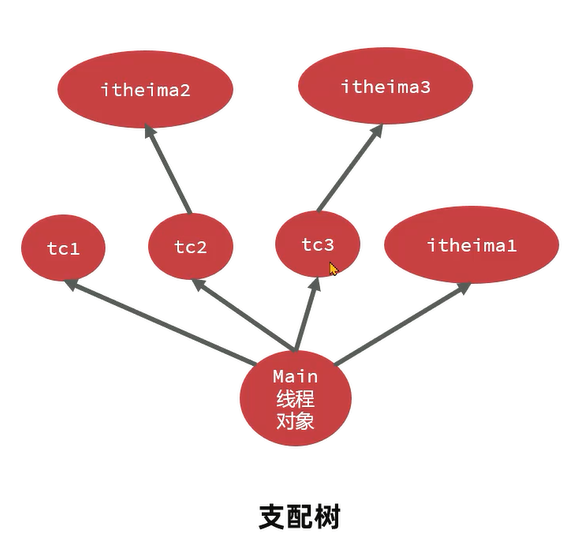

使用mat来分析，添加虚拟机参数：


在FullGC之后产生了内存快照文件：


直接查看MAT的支配树功能：


输入main进行搜索：

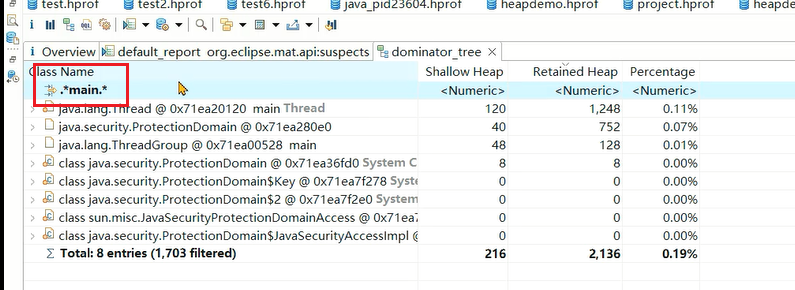

可以看到结构与之前分析的是一致的：


 同时可以看到字符串的浅堆大小和深堆大小：


为什么字符串对象的浅堆大小是24字节，深堆大小是56字节呢？首先字符串对象引用了字符数组，字符数组的字节大小底下有展示是32字节，那我们只需要搞清楚浅堆大小也就是他自身为什么是24字节就可以了。使用`jol`框架打印下对象大小（原理篇会详细展开讲解，这里先有个基本的认知）。

添加依赖：

```XML
<dependency>
    <groupId>org.openjdk.jol</groupId>
    <artifactId>jol-core</artifactId>
    <version>0.9</version>
</dependency>
```

使用代码打印：

```Java
public class StringSize {
    public static void main(String[] args) {
        //使用JOL打印String对象
        System.out.print(ClassLayout.parseClass(String.class).toPrintable());
    }
}
```

结果如下：


对象头占用了12字节，value字符数组的引用占用了4字节，int类型的hash字段占用4字节，还有4字节是对象填充，所以加起来是24字节。至于对象填充、对象头是做什么用的，在《原理篇》中会详细讲解。

MAT就是根据支配树，从叶子节点向根节点遍历，如果发现深堆的大小超过整个堆内存的一定比例阈值，就会将其标记成内存泄漏的“嫌疑对象”。


##### 服务器上的内存快照导出和分析

刚才我们都是在本地导出内存快照的，并且是程序已经出现了内存溢出，接下来我们要做到防范于未然，一旦看到内存大量增长就去分析内存快照，那此时内存还没溢出，怎么样去获得内存快照文件呢？

**背景：**

小李的团队通过监控系统发现有一个服务内存在持续增长，希望尽快通过内存快照分析增长的原因，由于并未产生内存溢出所以不能通过HeapDumpOnOutOfMemoryError参数生成内存快照。

**思路：**

导出运行中系统的内存快照，比较简单的方式有两种，注意只需要导出标记为存活的对象：

通过JDK自带的jmap命令导出，格式为：

​      jmap -dump:live,format=b,file=文件路径和文件名 进程ID

通过arthas的heapdump命令导出，格式为：

​      heapdump --live  文件路径和文件名 

先使用`jps`或者`ps -ef`查看进程ID:

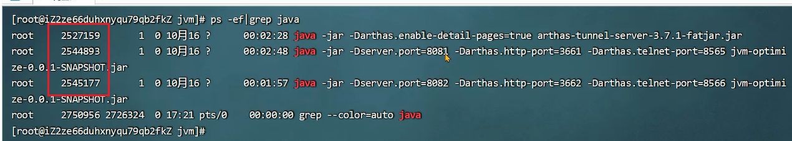

 通过`jmap`命令导出内存快照文件，live代表只保存存活对象，format=b用二进制方式保存：

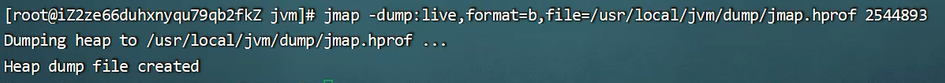

也可以在arthas中输出`heapdump`命令：

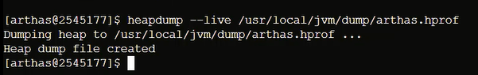

接下来下载到本地分析即可。

**大文件的处理**

在程序员开发用的机器内存范围之内的快照文件，直接使用MAT打开分析即可。但是经常会遇到服务器上的程序占用的内存达到10G以上，开发机无法正常打开此类内存快照，此时需要下载服务器操作系统对应的MAT。下载地址：https://eclipse.dev/mat/downloads.php 通过MAT中的脚本生成分析报告：

 **./ParseHeapDump.sh 快照文件路径 org.eclipse.mat.api:suspects org.eclipse.mat.api:overview org.eclipse.mat.api:top_components**


> 注意：默认MAT分析时只使用了1G的堆内存，如果快照文件超过1G，需要修改MAT目录下的MemoryAnalyzer.ini配置文件调整最大堆内存。

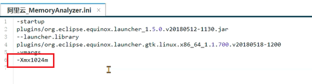

最终会生成报告文件：

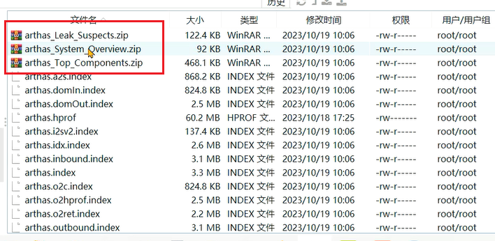

将这些文件下载到本地，解压之后打开index.html文件：

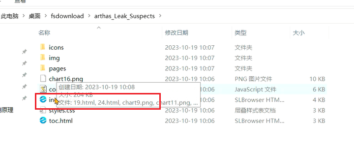

同样可以看到类似的报告：


##### 案例1 - 分页查询文章接口的内存溢出：

背景：

小李负责的新闻资讯类项目采用了微服务架构，其中有一个文章微服务，这个微服务在业务高峰期出现了内存溢出的现象。

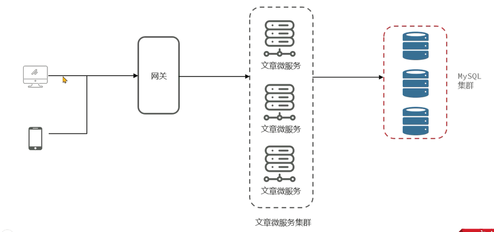

解决思路：

1、服务出现OOM内存溢出时，生成内存快照。

2、使用MAT分析内存快照，找到内存溢出的对象。

3、尝试在开发环境中重现问题，分析代码中问题产生的原因。

4、修改代码。

5、测试并验证结果。

代码使用的是`com.itheima.jvmoptimize.practice.oom.controller.DemoQueryController`：


首先将项目打包，放到服务器上，同时使用如下启动命令启动。设置了最大堆内存为512m，同时堆内存溢出时会生成hprof文件：


编写JMeter脚本进行压测，size数据量一次性获取10000条，线程150，每个线程执行10次方法调用：


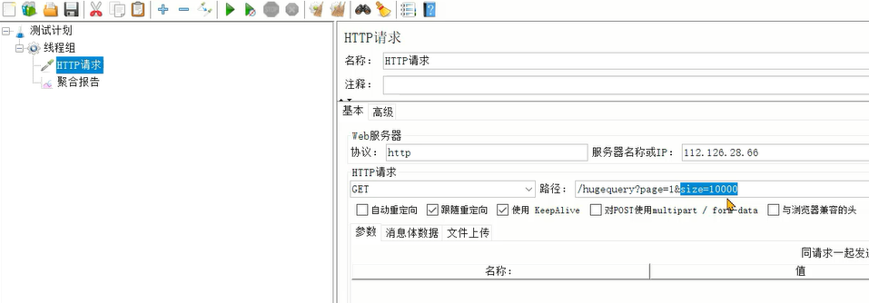

执行之后可以发现服务器上已经生成了`hprof`文件：


将其下载到本地，通过MAT分析发现是Mysql返回的ResultSet存在大量的数据：


通过支配树，可以发现里边包含的数据，如果数据有一些特殊的标识，其实就可以判断出来是哪个接口产生的数据：

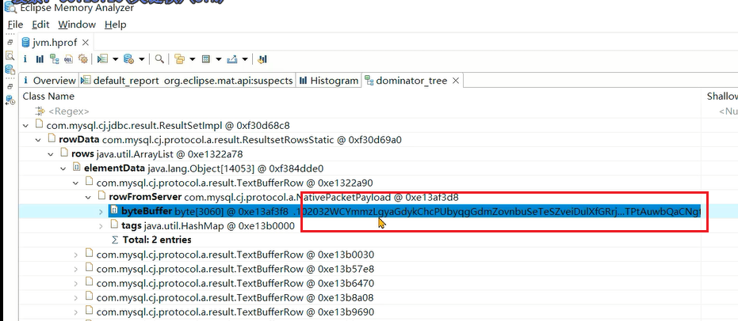

如果想知道每个线程在执行哪个方法，先找到spring的HandlerMethod对象：

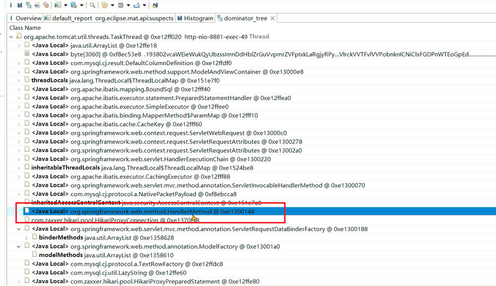

接着去找引用关系：

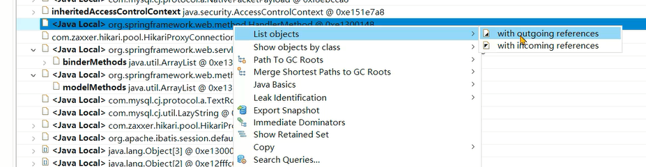

通过描述信息就可以看到接口：


通过直方图的查找功能，也可以找到项目里哪些对象比较多：

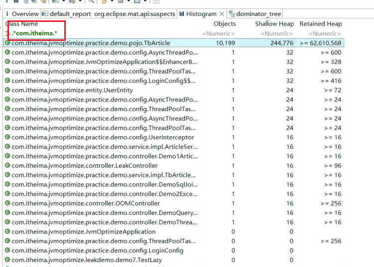

**问题根源：**

文章微服务中的分页接口没有限制最大单次访问条数，并且单个文章对象占用的内存量较大，在业务高峰期并发量较大时这部分从数据库获取到内存之后会占用大量的内存空间。

**解决思路：**

1、与产品设计人员沟通，限制最大的单次访问条数。

以下代码，限制了每次访问的最大条数为100条

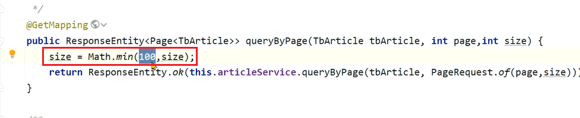

2、分页接口如果只是为了展示文章列表，不需要获取文章内容，可以大大减少对象的大小。

把文章内容去掉，减少对象大小：

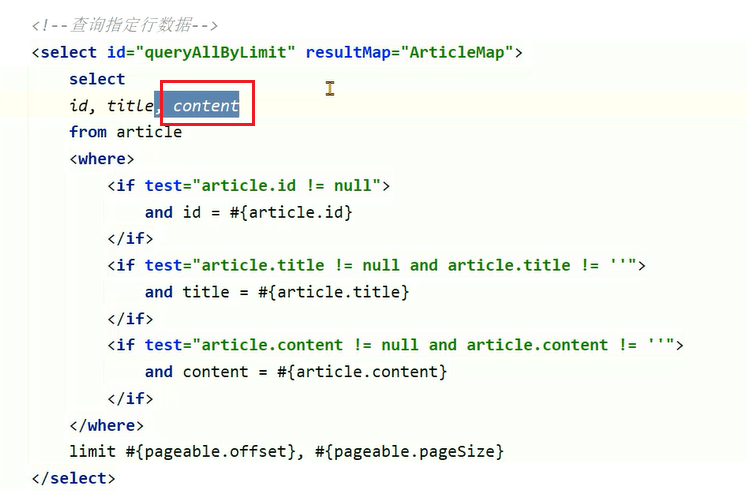

3、在高峰期对微服务进行限流保护。

##### 案例2 - Mybatis导致的内存溢出：

背景：

小李负责的文章微服务进行了升级，新增加了一个判断id是否存在的接口，第二天业务高峰期再次出现了内存溢出，小李觉得应该和新增加的接口有关系。


解决思路：

1、服务出现OOM内存溢出时，生成内存快照。

2、使用MAT分析内存快照，找到内存溢出的对象。

3、尝试在开发环境中重现问题，分析代码中问题产生的原因。

4、修改代码。

5、测试并验证结果。

通过分析hprof发现调用的方法，但是这个仅供参考：

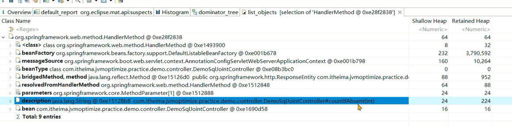

分析支配树，找到大对象来源，是一些字符串，里边还包含SQL


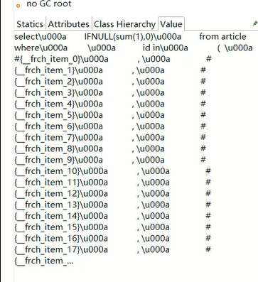

通过SQL内容搜索下可以找到对应的方法：


发现里边用了foreach，如果循环内容很大，会产生特别大的一个SQL语句。

直接打开jmeter，打开测试脚本进行测试:

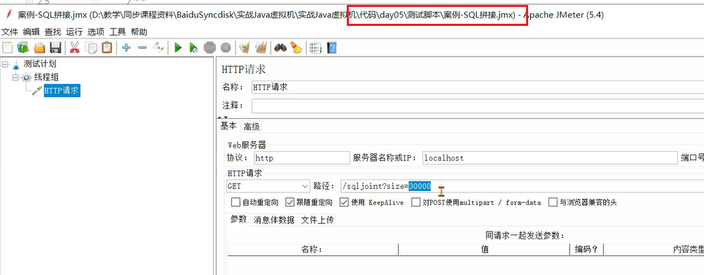

本地测试之后，出现了内存溢出：


问题根源：

Mybatis在使用foreach进行sql拼接时，会在内存中创建对象，如果foreach处理的数组或者集合元素个数过多，会占用大量的内存空间。

解决思路：

1、限制参数中最大的id个数。

2、将id缓存到redis或者内存缓存中，通过缓存进行校验。

##### 案例3 - 导出大文件内存溢出

小李团队使用的是k8s将管理系统部署到了容器中，所以这一次我们使用阿里云的k8s环境还原场景，并解决问题。阿里云的k8s整体规划如下：

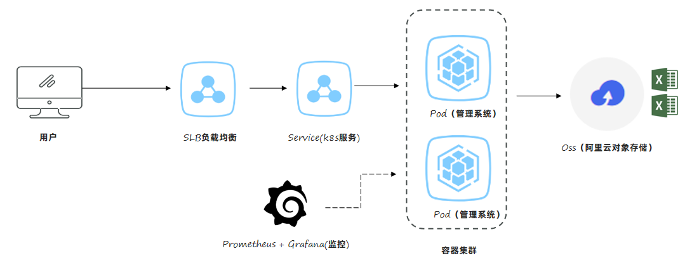

###### **K8S环境搭建（了解即可）**

1、创建镜像仓库

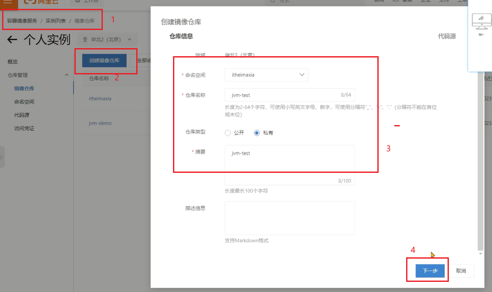

2、项目中添加Dockerfile文件

```Dockerfile
FROM openjdk:8-jre

MAINTAINER xiadong <xiadong@itcast.cn>

RUN ln -sf /usr/share/zoneinfo/Asia/Shanghai /etc/localtime

ADD jvm-optimize-0.0.1-SNAPSHOT.jar /app/

CMD ["java", "-Xmx512m", "-Xms512m", "-Dfile.encoding=UTF-8", "-XX:+HeapDumpOnOutOfMemoryError","-XX:HeapDumpPath=/opt/dump/heapdump.hprof","-jar", "/app/jvm-optimize-0.0.1-SNAPSHOT.jar"]

EXPOSE 8881
```

3、完全按照阿里云的教程执行命令：


4、推送成功之后，镜像仓库中已经出现了镜像：


5、通过镜像构建k8s中的pod:

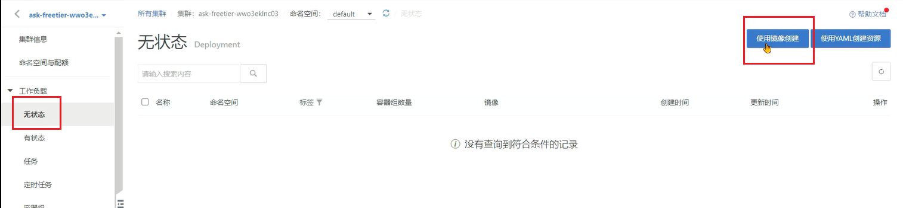

6、选择刚才的镜像：


7、在OSS中创建一个Bucket：


8、创建存储声明，选择刚才的Bucket：


9、选择这个存储声明，并添加hprof文件生成的路径映射，要和Dockerfile中虚拟机参数里的路径相同：


10、创建一个service，填写配置，方便外网进行访问。

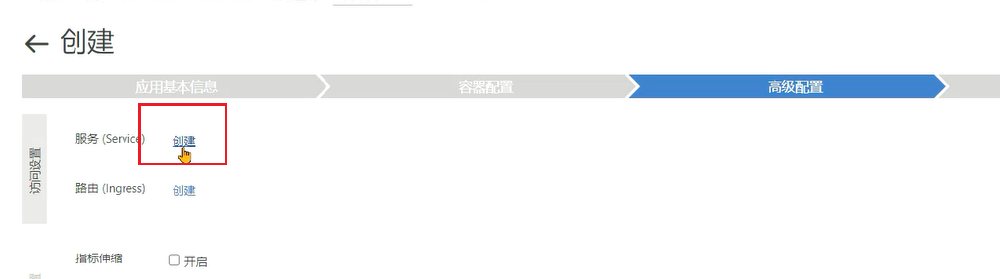


11、打开jmeter文件并测试：

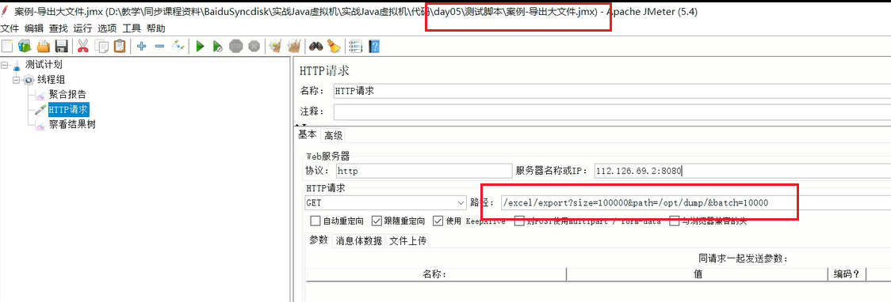

12、OSS中出现了这个hprof文件：

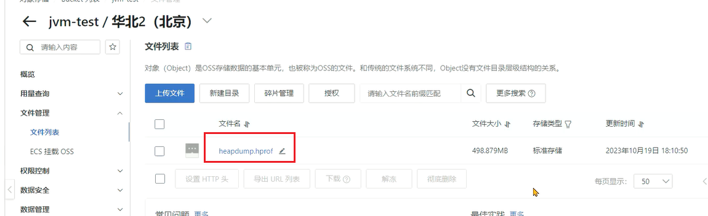

13、从直方图就可以看到是导出文件导致的内存溢出：

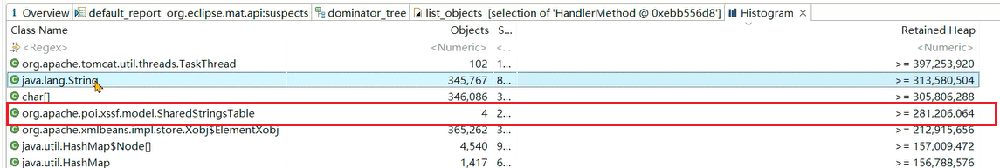

问题根源：

Excel文件导出如果使用POI的XSSFWorkbook，在大数据量（几十万）的情况下会占用大量的内存。

代码：`com.itheima.jvmoptimize.practice.oom.controller.Demo2ExcelController`

解决思路：

1、使用poi的SXSSFWorkbook。

2、hutool提供的BigExcelWriter减少内存开销。

```Dockerfile
 //http://www.hutool.cn/docs/#/poi/Excel%E5%A4%A7%E6%95%B0%E6%8D%AE%E7%94%9F%E6%88%90-BigExcelWriter
    @GetMapping("/export_hutool")
    public void export_hutool(int size, String path) throws IOException {


        List<List<?>> rows = new ArrayList<>();
        for (int i = 0; i < size; i++) {
           rows.add( CollUtil.newArrayList(RandomStringUtils.randomAlphabetic(1000)));
        }

        BigExcelWriter writer= ExcelUtil.getBigWriter(path + RandomStringUtils.randomAlphabetic(10) + ".xlsx");
// 一次性写出内容，使用默认样式
        writer.write(rows);
// 关闭writer，释放内存
        writer.close();


    }
```

3、使用easy excel，对内存进行了大量的优化。

```Dockerfile
//https://easyexcel.opensource.alibaba.com/docs/current/quickstart/write#%E9%87%8D%E5%A4%8D%E5%A4%9A%E6%AC%A1%E5%86%99%E5%85%A5%E5%86%99%E5%88%B0%E5%8D%95%E4%B8%AA%E6%88%96%E8%80%85%E5%A4%9A%E4%B8%AAsheet
@GetMapping("/export_easyexcel")
public void export_easyexcel(int size, String path,int batch) throws IOException {

    // 方法1: 如果写到同一个sheet
    String fileName = path + RandomStringUtils.randomAlphabetic(10) + ".xlsx";
    // 这里注意 如果同一个sheet只要创建一次
    WriteSheet writeSheet = EasyExcel.writerSheet("测试").build();
    // 这里 需要指定写用哪个class去写
    try (ExcelWriter excelWriter = EasyExcel.write(fileName, DemoData.class).build()) {
        // 分100次写入
        for (int i = 0; i < batch; i++) {
            // 分页去数据库查询数据 这里可以去数据库查询每一页的数据
            List<DemoData> datas = new ArrayList<>();
            for (int j = 0; j < size / batch; j++) {
                DemoData demoData = new DemoData();
                demoData.setString(RandomStringUtils.randomAlphabetic(1000));
                datas.add(demoData);
            }
            excelWriter.write(datas, writeSheet);
            //写入之后datas数据就可以释放了
        }
    }

}
```

##### 案例4 – ThreadLocal使用时占用大量内存

背景：

小李负责了一个微服务，但是他发现系统在没有任何用户使用时，也占用了大量的内存。导致可以使用的内存大大减少。

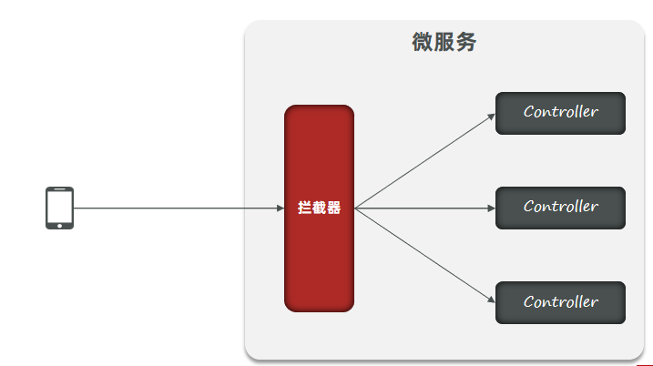

1、打开jmeter测试脚本


2、内存有增长，但是没溢出。所以通过jmap命令导出hprof文件

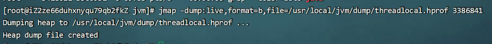

3、MAT分析之后发现每个线程中都包含了大量的对象：

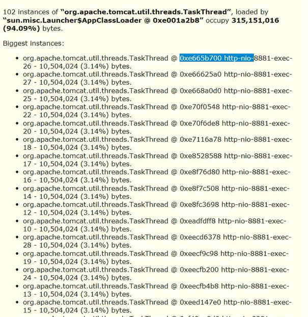

4、在支配树中可以发现是ThreadLocalMap导致的内存增长：

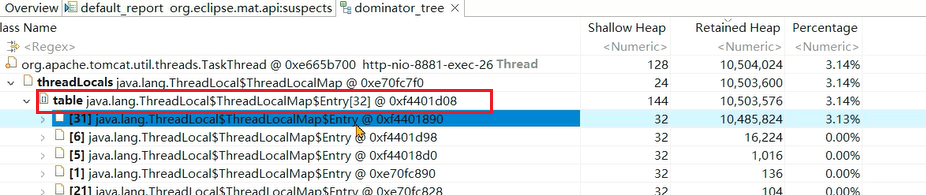

5、ThreadLocalMap就是ThreadLocal对象保存数据的地方，所以只要分析ThreadLocal代码即可。在拦截器中，ThreadLocal清理的代码被错误的放在postHandle中，如果接口发生了异常，这段代码不会调用到，这样就产生了内存泄漏，将其移动到afterCompletion就可以了。


问题根源和解决思路：

很多微服务会选择在拦截器preHandle方法中去解析请求头中的数据，并放入一些数据到ThreadLocal中方便后续使用。在拦截器的afterCompletion方法中，必须要将ThreadLocal中的数据清理掉。

##### 案例5 – 文章内容审核接口的内存问题

背景：

文章微服务中提供了文章审核接口，会调用阿里云的内容安全接口进行文章中文字和图片的审核，在自测过程中出现内存占用较大的问题。

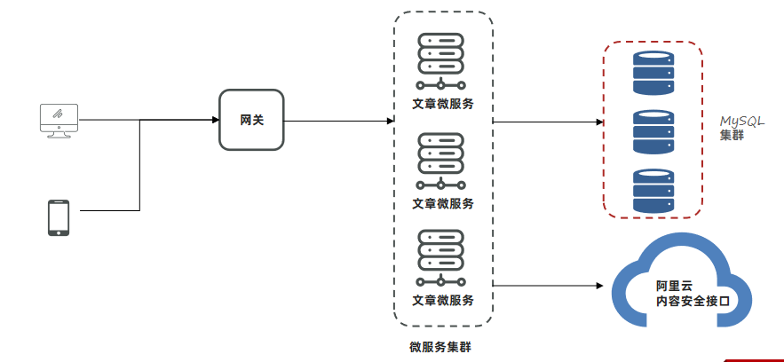

###### 设计1：使用SpringBoot中的@Async注解进行异步的审核。

###### `com.itheima.jvmoptimize.practice.oom.controller.Demo1ArticleController`类中的`article1`方法


1、打开jmeter脚本，已经准好了一段测试用的文本。


2、运行测试，发现线程数一直在增加：

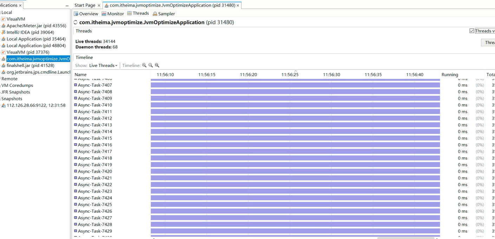

3、发现是因为异步线程池的最大线程数设置了Integer的最大值，所以只要没到上限就一直创建线程：

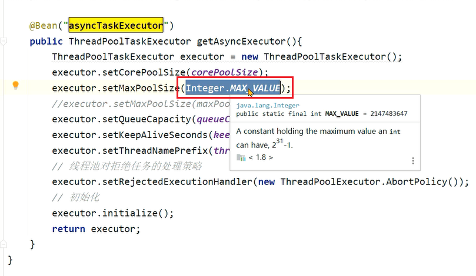

4、接下来修改为100，再次测试：

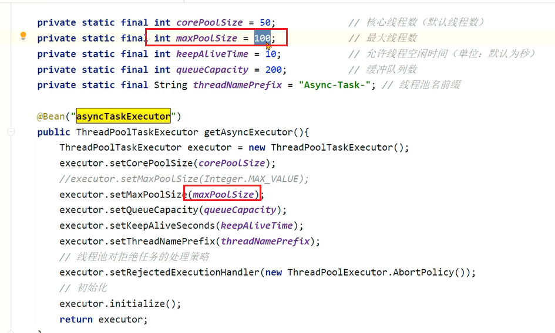

5、这次线程数相对来说比较正常：


存在问题：

1、线程池参数设置不当，会导致大量线程的创建或者队列中保存大量的数据。

2、任务没有持久化，一旦走线程池的拒绝策略或者服务宕机、服务器掉电等情况很有可能会丢失任务。

###### 设计2：使用生产者和消费者模式进行处理，队列数据可以实现持久化到数据库。

代码实现：article2方法

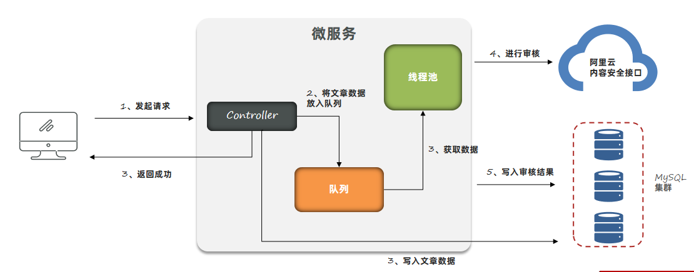

1、测试之后发现，出现内存泄漏问题(其实并不是泄漏，而是内存中存放了太多的对象，但是从图上看着像内存泄漏了)：

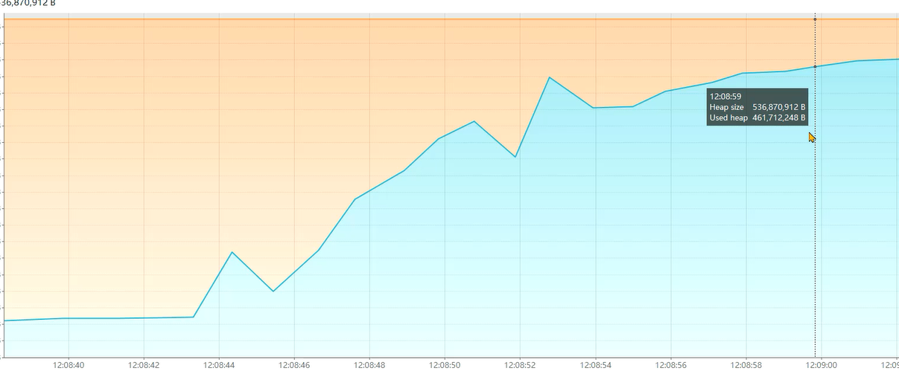

2、每次接口调用之后，都会将数据放入队列中。

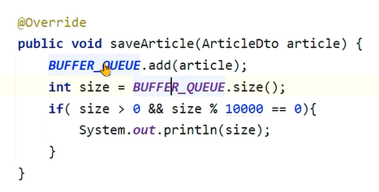

3、而这个队列没有设置上限：


4、调整一下上限设置为2000：


5、这次就没有出现内存泄漏问题了：


存在问题：

1、队列参数设置不正确，会保存大量的数据。

2、实现复杂，需要自行实现持久化的机制，否则数据会丢失。

###### 设计3：使用mq消息队列进行处理，由mq来保存文章的数据。发送消息的服务和拉取消息的服务可以是同一个，也可以不是同一个。

代码方法：article3

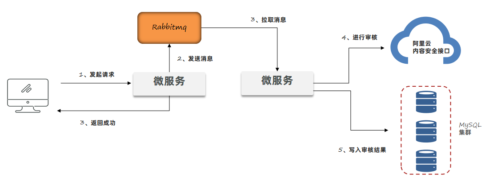

测试结果：

内存没有出现膨胀的情况

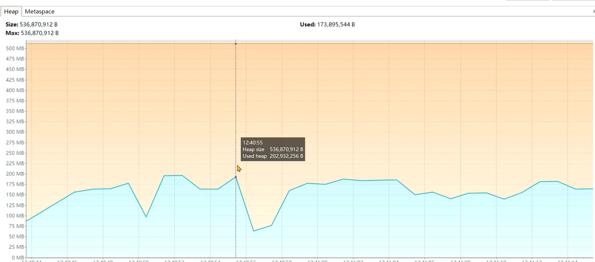

问题根源和解决思路：

在项目中如果要使用异步进行业务处理，或者实现生产者 – 消费者的模型，如果在Java代码中实现，会占用大量的内存去保存中间数据。

尽量使用Mq消息队列，可以很好地将中间数据单独进行保存，不会占用Java的内存。同时也可以将生产者和消费者拆分成不同的微服务。

##### 在线定位问题

诊断问题有两种方法，之前我们介绍的是第一种：

- 生成内存快照并分析。

优点：

   通过完整的内存快照准确地判断出问题产生的原因

缺点：

 内存较大时，生成内存快照较慢，这个过程中会影响用户的使用

 通过MAT分析内存快照，至少要准备1.5 – 2倍大小的内存空间

- 在线定位问题

优点：

   无需生成内存快照，整个过程对用户的影响较小

缺点：

 无法查看到详细的内存信息

 需要通过arthas或者btrace工具调测发现问题产生的原因，需要具备一定的经验

###### 安装Jmeter插件

为了监控响应时间RT、每秒事务数TPS等指标，需要在Jmeter上安装gc插件。

1、打开资料中的插件包并解压。

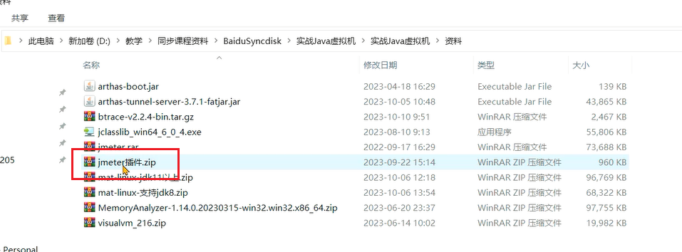

2、按插件包中的目录，复制到jmeter安装目录的lib目录下。

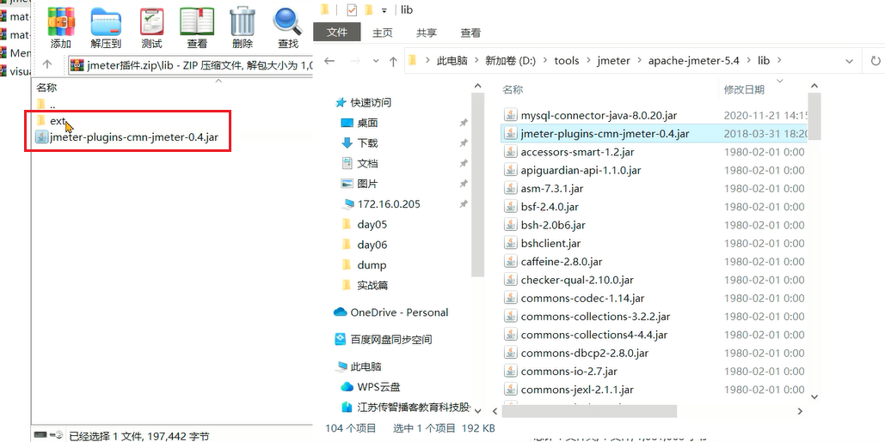

3、重启之后就可以在监听器中看到三个选项，分别是活跃线程数、响应时间RT、每秒事务数TPS。

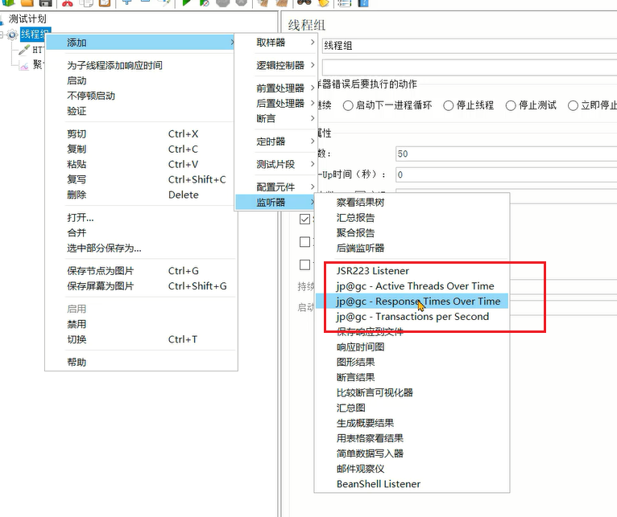

###### Arthas stack命令在线定位步骤

1、使用jmap -histo:live 进程ID > 文件名 命令将内存中存活对象以直方图的形式保存到文件中，这个过程会影响用户的时间，但是时间比较短暂。

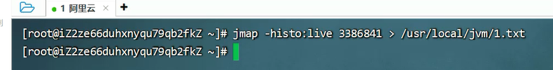

2、分析内存占用最多的对象，一般这些对象就是造成内存泄 打开1.txt文件，从图中可以看到，有一个UserEntity对象占用非常多的内存。


漏的原因。

3、使用arthas的stack命令，追踪对象创建的方法被调用的调用路径，找到对象创建的根源。也可以使用btrace工具编写脚本追踪方法执行的过程。

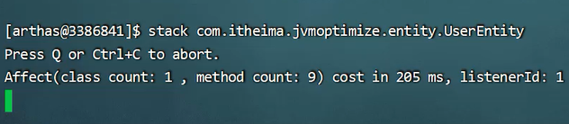

接下来启动jmeter脚本，会发现有大量的方法调用这样不利于观察。


加上 `-n 1 ` 参数，限制只查看一笔调用：

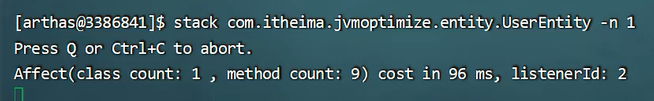

这样就定位到了是`login`接口中创建的对象：

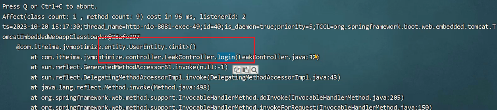

###### btrace在线定位问题步骤

相比较arthas的stack命令，btrace允许我们自己编写代码获取感兴趣的内容，灵活性更高。

BTrace 是一个在Java 平台上执行的追踪工具，可以有效地用于线上运行系统的方法追踪，具有侵入性小、对性能的影响微乎其微等特点。 项目中可以使用btrace工具，打印出方法被调用的栈信息。 使用方法： 1、下载btrace工具， 官方地址：https://github.com/btraceio/btrace/releases/latest

在资料中也给出了：

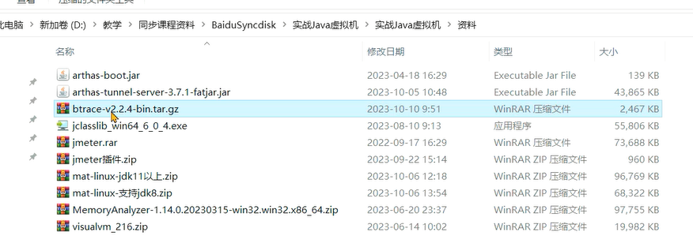

2、编写btrace脚本，通常是一个java文件 依赖：

```XML
<dependencies>
        <dependency>
            <groupId>org.openjdk.btrace</groupId>
            <artifactId>btrace-agent</artifactId>
            <version>${btrace.version}</version>
            <scope>system</scope>
            <systemPath>D:\tools\btrace-v2.2.4-bin\libs\btrace-agent.jar</systemPath>
        </dependency>

        <dependency>
            <groupId>org.openjdk.btrace</groupId>
            <artifactId>btrace-boot</artifactId>
            <version>${btrace.version}</version>
            <scope>system</scope>
            <systemPath>D:\tools\btrace-v2.2.4-bin\libs\btrace-boot.jar</systemPath>
        </dependency>

        <dependency>
            <groupId>org.openjdk.btrace</groupId>
            <artifactId>btrace-client</artifactId>
            <version>${btrace.version}</version>
            <scope>system</scope>
            <systemPath>D:\tools\btrace-v2.2.4-bin\libs\btrace-client.jar</systemPath>
        </dependency>
    </dependencies>
```

代码：

代码非常简单，就是打印出栈信息。clazz指定类，method指定监控的方法。

```Java
import org.openjdk.btrace.core.annotations.*;

import static org.openjdk.btrace.core.BTraceUtils.jstack;
import static org.openjdk.btrace.core.BTraceUtils.println;

@BTrace
public class TracingUserEntity {
        @OnMethod(
            clazz="com.itheima.jvmoptimize.entity.UserEntity",
            method="/.*/")
        public static void traceExecute(){
                jstack();
        }
}
```

3、将btrace工具和脚本上传到服务器，在服务器上运行 `btrace 进程ID 脚本文件名` 。

配置btrace环境变量，与JDK配置方式基本相同：

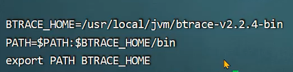

在服务器上运行 `btrace 进程ID 脚本文件名`:


4、观察执行结果。 启动jmeter之后，同样获取到了栈信息：

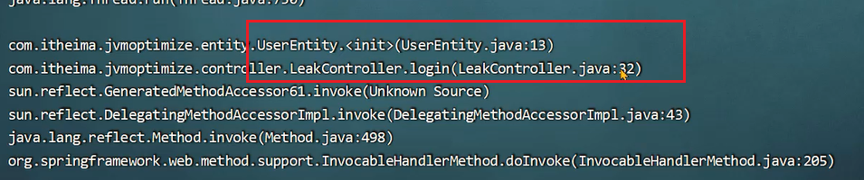

## 2、GC调优

GC调优指的是对垃圾回收（Garbage Collection）进行调优。GC调优的主要目标是避免由垃圾回收引起程序性能下降。

GC调优的核心分成三部分：

1、通用Jvm参数的设置。

2、特定垃圾回收器的Jvm参数的设置。

3、解决由频繁的FULLGC引起的程序性能问题。

GC调优没有没有唯一的标准答案，如何调优与硬件、程序本身、使用情况均有关系，重点学习调优的工具和方法。

### 2.1 GC调优的核心指标

所以判断GC是否需要调优，需要从三方面来考虑，与GC算法的评判标准类似：

1.吞吐量(Throughput) 吞吐量分为业务吞吐量和垃圾回收吞吐量

业务吞吐量指的在一段时间内，程序需要完成的业务数量。比如企业中对于吞吐量的要求可能会是这样的：

支持用户每天生成10000笔订单

在晚上8点到10点，支持用户查询50000条商品信息

保证高吞吐量的常规手段有两条：

1、优化业务执行性能，减少单次业务的执行时间

2、优化垃圾回收吞吐量

#### 2.1.1 垃圾回收吞吐量

垃圾回收吞吐量指的是 CPU 用于执行用户代码的时间与 CPU 总执行时间的比值，即吞吐量 = 执行用户代码时间 /（执行用户代码时间 + GC时间）。吞吐量数值越高，垃圾回收的效率就越高，允许更多的CPU时间去处理用户的业务，相应的业务吞吐量也就越高。


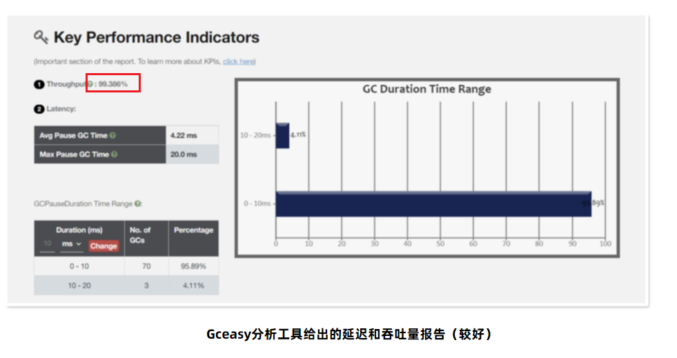

#### 2.1.2 延迟（Latency）

1. 延迟指的是从用户发起一个请求到收到响应这其中经历的时间。比如企业中对于延迟的要求可能会是这样的：

1. 所有的请求必须在5秒内返回给用户结果

1. 延迟 = GC延迟 + 业务执行时间，所以如果GC时间过长，会影响到用户的使用。


#### 2.1.3 内存使用量

1. 内存使用量指的是Java应用占用系统内存的最大值，一般通过Jvm参数调整，在满足上述两个指标的前提下，这个值越小越好。


### 2.2 GC调优的步骤


#### 2.2.1 发现问题 - 常用工具

#####  jstat工具

Jstat工具是JDK自带的一款监控工具，可以提供各种垃圾回收、类加载、编译信息

等不同的数据。使用方法为：`jstat -gc 进程ID 每次统计的间隔（毫秒） 统计次数 `

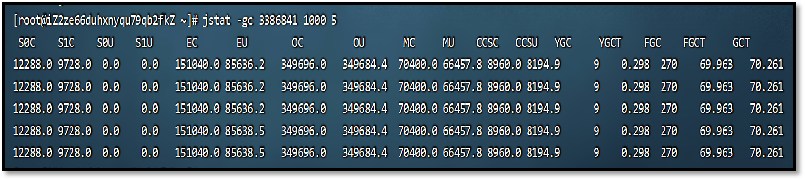

C代表Capacity容量，U代表Used使用量

S – 幸存者区，E – 伊甸园区，O – 老年代，M – 元空间

YGC、YGT：年轻代GC次数和GC耗时（单位：秒）

FGC、FGCT：Full GC次数和Full GC耗时

GCT：GC总耗时

优点：

 操作简单

 无额外的软件安装

缺点：

 无法精确到GC产生的时间，只能用于判断GC是否存在问题 

##### Visualvm插件

VisualVm中提供了一款Visual GC插件，实时监控Java进程的堆内存结构、堆内存变化趋势以及垃圾回收时间的变化趋势。同时还可以监控对象晋升的直方图。


优点：

 适合开发使用，能直观的看到堆内存和GC的变化趋势

缺点：

 对程序运行性能有一定影响

 生产环境程序员一般没有权限进行操作

安装方法：

1、打开插件页面

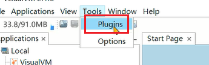

2、安装Visual GC插件

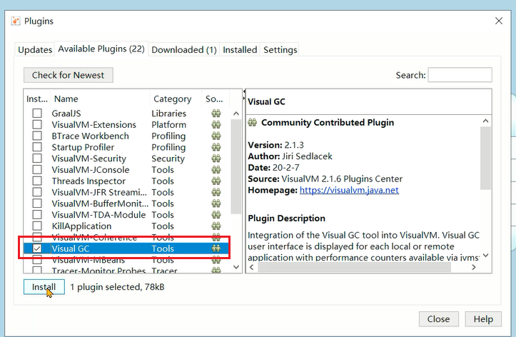

3、选择标签就可以看到内容：

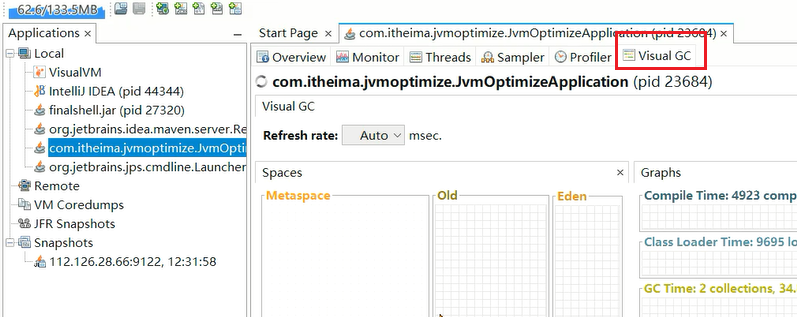

##### Prometheus + Grafana

Prometheus+Grafana是企业中运维常用的监控方案，其中Prometheus用来采系统或者应用的相关数据，同时具备告警功能。Grafana可以将Prometheus采集到的数据以可视化的方式进行展示。

Java程序员要学会如何读懂Grafana展示的Java虚拟机相关的参数。


优点：

 支持系统级别和应用级别的监控，比如linux操作系统、Redis、MySQL、Java进程。

 支持告警并允许自定义告警指标，通过邮件、短信等方式尽早通知相关人员进行处理

缺点：

 环境搭建较为复杂，一般由运维人员完成

##### GC日志

通过GC日志，可以更好的看到垃圾回收细节上的数据，同时也可以根据每款垃圾回收器的不同特点更好地发现存在的问题。

使用方法（JDK 8及以下）：-XX:+PrintGCDetails  -Xloggc:文件名

使用方法（JDK 9+）：-Xlog:gc*:file=文件名

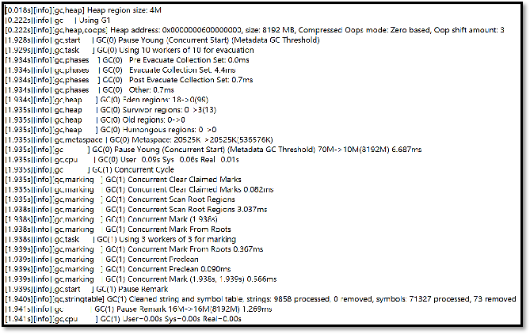

1、添加虚拟机参数：

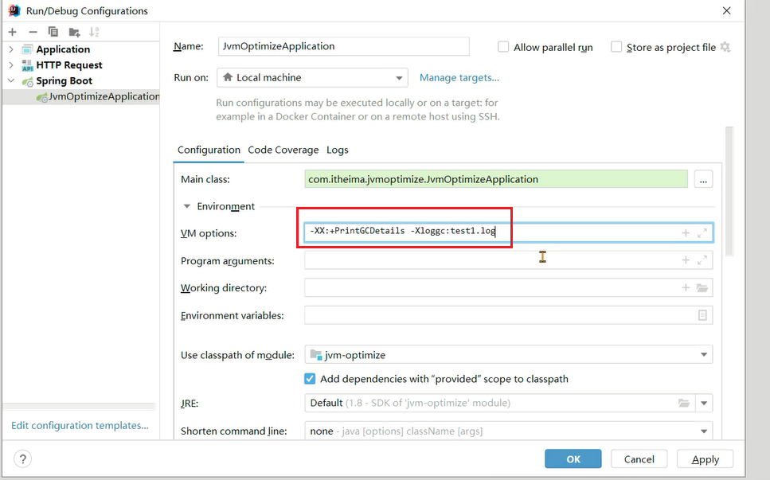

2、打开日志文件就可以看到GC日志

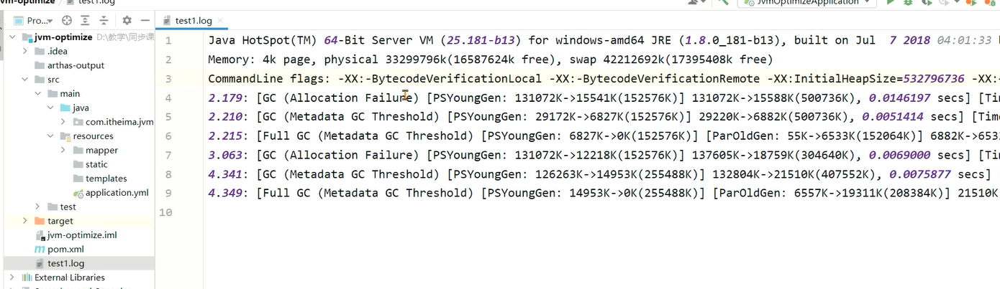

3、分析GC日志

###### 分析GC日志 - GCViewer

GCViewer是一个将GC日志转换成可视化图表的小工具，github地址： https://github.com/chewiebug/GCViewer 使用方法：java -jar gcviewer_1.3.4.jar 日志文件.log

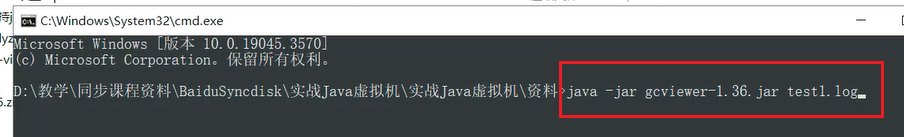

右下角是基础信息，左边是内存趋势图


###### 分析GC日志 - GCEasy

GCeasy是业界首款使用AI机器学习技术在线进行GC分析和诊断的工具。定位内存泄漏、GC延迟高的问题，提供JVM参数优化建议，支持在线的可视化工具图表展示。 官方网站：https://gceasy.io/ 


使用方法：

1、选择文件，找到GC日志并上传


2、点击Analyze分析就可以看到报告，每个账号每个月能免费上传5个GC日志。

建议部分：

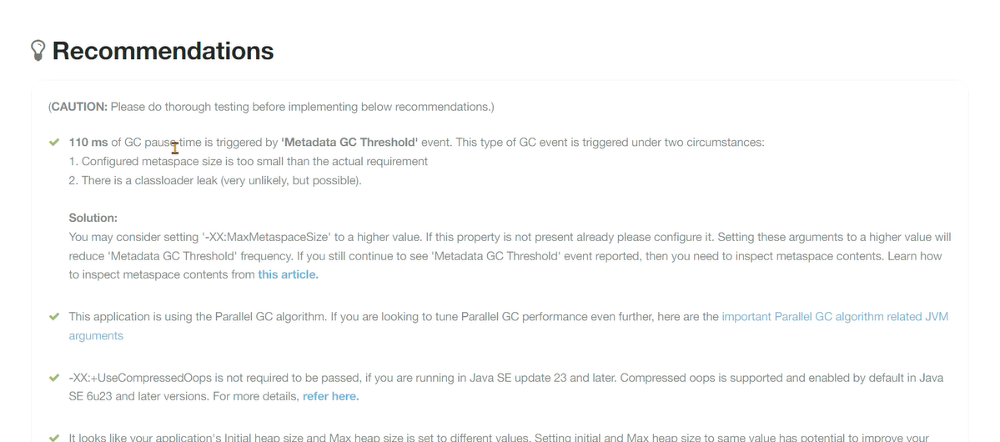

内存情况：


GC关键性指标：


GC的趋势图：

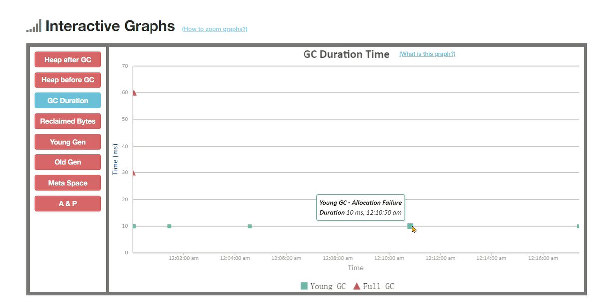

引发GC的原因：

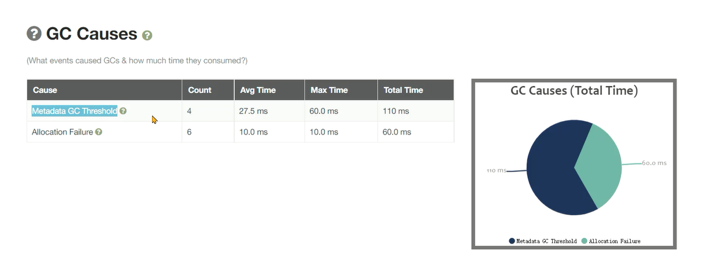

#### 2.2.2 常见的GC模式

根据内存的趋势图，我们可以将GC的情况分成几种模式

##### 1、正常情况

特点：呈现锯齿状，对象创建之后内存上升，一旦发生垃圾回收之后下降到底部，并且每次下降之后的内存大小接近，存留的对象较少。


##### 2、缓存对象过多

特点：呈现锯齿状，对象创建之后内存上升，一旦发生垃圾回收之后下降到底部，并且每次下降之后的内存大小接近，处于比较高的位置。

问题产生原因： 程序中保存了大量的缓存对象，导致GC之后无法释放，可以使用MAT或者HeapHero等工具进行分析内存占用的原因。

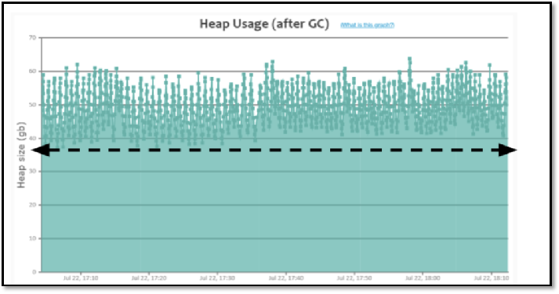

##### 3、内存泄漏

特点：呈现锯齿状，每次垃圾回收之后下降到的内存位置越来越高，最后由于垃圾回收无法释放空间导致对象无法分配产生OutOfMemory的错误。

问题产生原因： 程序中保存了大量的内存泄漏对象，导致GC之后无法释放，可以使用MAT或者HeapHero等工具进行分析是哪些对象产生了内存泄漏。

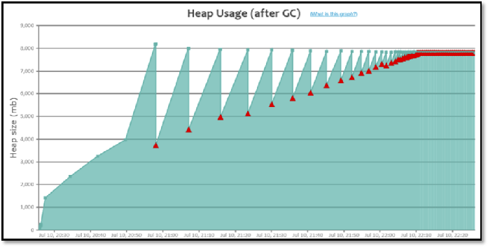

##### 4、持续的FullGC

特点：在某个时间点产生多次Full GC，CPU使用率同时飙高，用户请求基本无法处理。一段时间之后恢复正常。

问题产生原因： 在该时间范围请求量激增，程序开始生成更多对象，同时垃圾收集无法跟上对象创建速率，导致持续地在进行FULL GC。GC分析报告

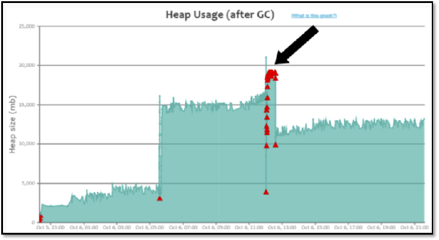

比如如下报告就产生了持续的FULL GC：


整体的延迟就变得很长：

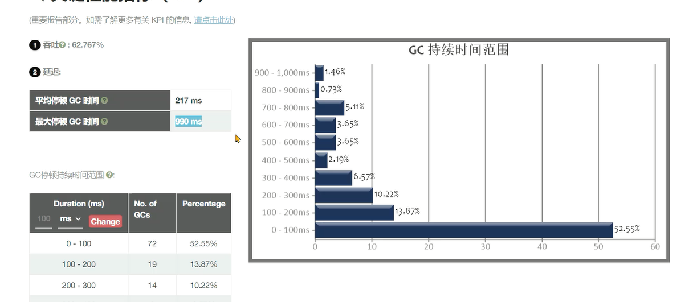

原因就是老年代满了：


由于分配不了对象，导致频繁的FULLGC：


##### 5、元空间不足导致的FULLGC

特点：堆内存的大小并不是特别大，但是持续发生FULLGC。

问题产生原因： 元空间大小不足，导致持续FULLGC回收元空间的数据。GC分析报告

 元空间并不是满了才触发FULLGC，而是JVM自动会计算一个阈值，如下图中元空间并没有满，但是频繁产生了FULLGC。

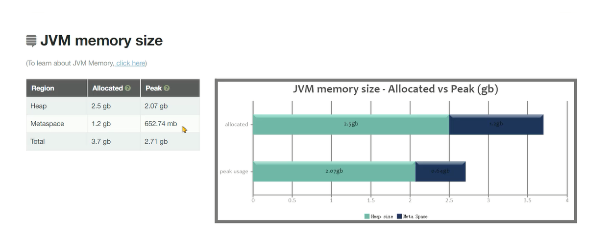

停顿时间也比较长：


非常频繁的FULLGC:

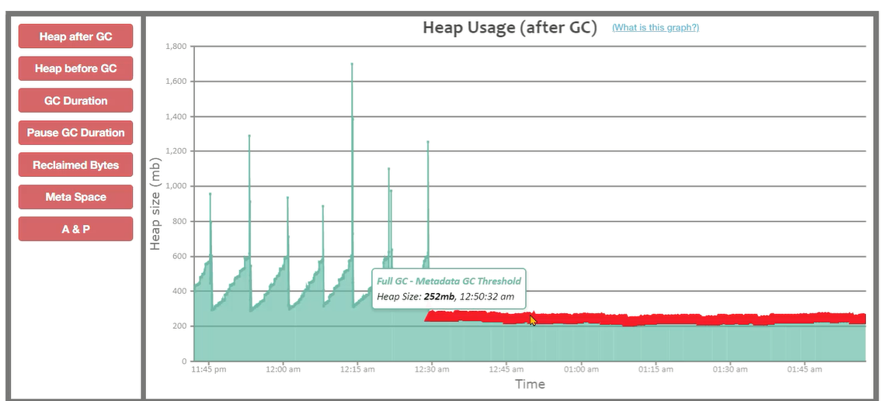

#### 2.2.3 解决GC问题的手段

解决GC问题的手段中，前三种是比较推荐的手段，第四种仅在前三种无法解决时选用：

- 优化基础JVM参数，基础JVM参数的设置不当，会导致频繁FULLGC的产生
- 减少对象产生，大多数场景下的FULLGC是由于对象产生速度过快导致的，减少对象产生可以有效的缓解FULLGC的发生
- 更换垃圾回收器，选择适合当前业务场景的垃圾回收器，减少延迟、提高吞吐量
- 优化垃圾回收器参数，优化垃圾回收器的参数，能在一定程度上提升GC效率

##### 优化基础JVM参数

**参数1 ： -Xmx 和 –Xms**

-Xmx参数设置的是最大堆内存，但是由于程序是运行在服务器或者容器上，计算可用内存时，要将元空间、操作系统、其它软件占用的内存排除掉。

案例： 服务器内存4G，操作系统+元空间最大值+其它软件占用1.5G，-Xmx可以设置为2g。

最合理的设置方式应该是根据最大并发量估算服务器的配置，然后再根据服务器配置计算最大堆内存的值。


参数1 ： -Xmx 和 –Xms

-Xms用来设置初始堆大小，建议将-Xms设置的和-Xmx一样大，有以下几点好处：

- 运行时性能更好，堆的扩容是需要向操作系统申请内存的，这样会导致程序性能短期下降。
- 可用性问题，如果在扩容时其他程序正在使用大量内存，很容易因为操作系统内存不足分配失败。
- 启动速度更快，Oracle官方文档的原话：如果初始堆太小，Java 应用程序启动会变得很慢，因为 JVM 被迫频繁执行垃圾收集，直到堆增长到更合理的大小。为了获得最佳启动性能，请将初始堆大小设置为与最大堆大小相同。

**参数2 ： -XX:MaxMetaspaceSize 和 –XX:MetaspaceSize**

-XX:MaxMetaspaceSize=值  参数指的是最大元空间大小，默认值比较大，如果出现元空间内存泄漏会让操作系统可用内存不可控，建议根据测试情况设置最大值，一般设置为256m。

-XX:MetaspaceSize=值 参数指的是到达这个值之后会触发FULLGC（网上很多文章的初始元空间大小是错误的），后续什么时候再触发JVM会自行计算。如果设置为和MaxMetaspaceSize一样大，就不会FULLGC，但是对象也无法回收。


计算出来第一次因元空间触发FULLGC的阈值：

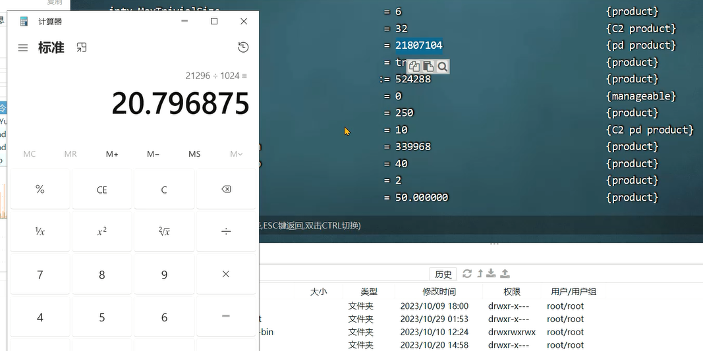

**参数3 ： -Xss虚拟机栈大小**

如果我们不指定栈的大小，JVM 将创建一个具有默认大小的栈。大小取决于操作系统和计算机的体系结构。

比如Linux x86 64位 ： 1MB，如果不需要用到这么大的栈内存，完全可以将此值调小节省内存空间，合理值为256k – 1m之间。

使用：-Xss256k

**参数4 ： 不建议手动设置的参数**

由于JVM底层设计极为复杂，一个参数的调整也许让某个接口得益，但同样有可能影响其他更多接口。

-Xmn 年轻代的大小，默认值为整个堆的1/3，可以根据峰值流量计算最大的年轻代大小，尽量让对象只存放在年轻代，不进入老年代。但是实际的场景中，接口的响应时间、创建对象的大小、程序内部还会有一些定时任务等不确定因素都会导致这个值的大小并不能仅凭计算得出，如果设置该值要进行大量的测试。G1垃圾回收器尽量不要设置该值，G1会动态调整年轻代的大小。


‐XX:SurvivorRatio 伊甸园区和幸存者区的大小比例，默认值为8。

‐XX:MaxTenuringThreshold 最大晋升阈值，年龄大于此值之后，会进入老年代。另外JVM有动态年龄判断机制：将年龄从小到大的对象占据的空间加起来，如果大于survivor区域的50%，然后把等于或大于该年龄的对象，放入到老年代。

比如下图中，年龄1+年龄2+年龄3 = 55m已经超过了S区的50%，所以会将年龄3及以上的对象全部放入老年代。

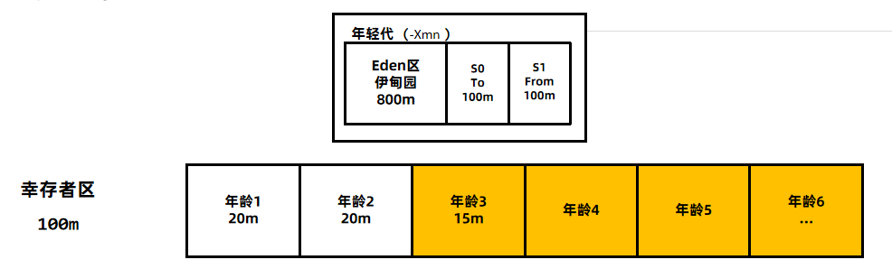

**其他参数 ：**

 -XX:+DisableExplicitGC

禁止在代码中使用System.gc()， System.gc()可能会引起FULLGC，在代码中尽量不要使用。使用DisableExplicitGC参数可以禁止使用System.gc()方法调用。

-XX:+HeapDumpOnOutOfMemoryError：发生OutOfMemoryError错误时，自动生成hprof内存快照文件。

  -XX:HeapDumpPath=<path>：指定hprof文件的输出路径。

打印GC日志

JDK8及之前 ： -XX:+PrintGCDetails -XX:+PrintGCDateStamps -Xloggc:文件路径

JDK9及之后 ： -Xlog:gc*:file=文件路径

**JVM参数模板**

```Java
-Xms1g
-Xmx1g
-Xss256k
-XX:MaxMetaspaceSize=512m 
-XX:+DisableExplicitGC-XX:+HeapDumpOnOutOfMemoryError
-XX:HeapDumpPath=/opt/logs/my-service.hprof-XX:+PrintGCDetails 
-XX:+PrintGCDateStamps 
-Xloggc:文件路径
```

注意：

JDK9及之后gc日志输出修改为 -Xlog:gc*:file=文件名

堆内存大小和栈内存大小根据实际情况灵活调整。

##### 垃圾回收器的选择

**背景**：

小李负责的程序在高峰期遇到了性能瓶颈，团队从业务代码入手优化了多次也取得了不错的效果，这次他希望能采用更合理的垃圾回收器优化性能。

**思路：**

编写Jmeter脚本对程序进行压测，同时添加RT响应时间、每秒钟的事务数

等指标进行监控。

选择不同的垃圾回收器进行测试，并发量分别设置50、100、200，观察

数据的变化情况。

3. JDK8 下 ParNew + CMS 组合 ： -XX:+UseParNewGC -XX:+UseConcMarkSweepGC

​                 默认组合 ： PS + PO

​    JDK8使用g1 : -XX:+UseG1GC    JDK11 默认 g1

**测试用代码：**

```
com.itheima.jvmoptimize.fullgcdemo.Demo2Controller
```

1、使用jmeter测试脚本


2、添加基础JVM测试参数：

```Java
-Xms8g -Xmx8g -Xss256k -XX:MaxMetaspaceSize=512m  -XX:+DisableExplicitGC -XX:+HeapDumpOnOutOfMemoryError -XX:HeapDumpPath=D:/test.hprof  -verbose:gc -XX:+PrintGCDetails -XX:+PrintGCTimeStamps
```

JDK8默认情况下测试的是PS+PO组合 

###### 测试结果：

| 垃圾回收器 | 参数                                       | 50并发（最大响应时间） | 100并发（最大响应时间） | 200并发（最大响应时间） |
| ---------- | ------------------------------------------ | ---------------------- | ----------------------- | ----------------------- |
| PS+PO      | 默认                                       | 260ms                  | 474ms                   | 930ms                   |
| CMS        | *-XX:+UseParNewGC -XX:+UseConcMarkSweepGC* | 157ms                  | 未测试                  | 833ms                   |
| G1         | JDK11默认                                  | 未测试                 | 未测试                  | 248ms                   |

由此可见使用了JDK11之后使用G1垃圾回收器，性能优化结果还是非常明显的。其他测试数据同学们有兴趣可以自行去测试一下。

##### 优化垃圾回收器的参数

这部分优化效果未必出色，仅当前边的一些手动无效时才考虑。

一个优化的案例：

CMS的并发模式失败（concurrent mode failure）现象。由于CMS的垃圾清理线程和用户线程是并行进行的，如果在并发清理的过程中老年代的空间不足以容纳放入老年代的对象，会产生并发模式失败。

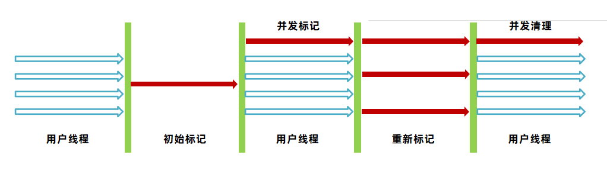

老年代已经满了此时有一些对象要晋升到老年代：

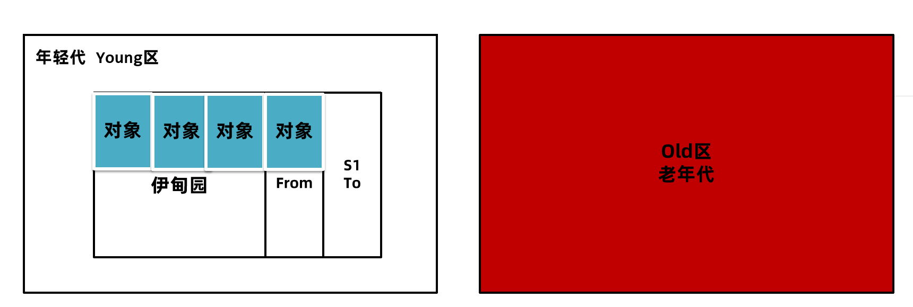

解决方案：

1.减少对象的产生以及对象的晋升。

2.增加堆内存大小

3.优化垃圾回收器的参数，比如-XX:CMSInitiatingOccupancyFraction=值，当老年代大小到达该阈值时，会自动进行CMS垃圾回收，通过控制这个参数提前进行老年代的垃圾回收，减少其大小。

JDK8中默认这个参数值为 -1，根据其他几个参数计算出阈值：

((100 - MinHeapFreeRatio) + (double)(CMSTriggerRatio * MinHeapFreeRatio) / 100.0)

在我本机计算之后的结果是92：


该参数设置完是不会生效的，必须开启-XX:+UseCMSInitiatingOccupancyOnly参数。

调整前和调整之后的效果对比：

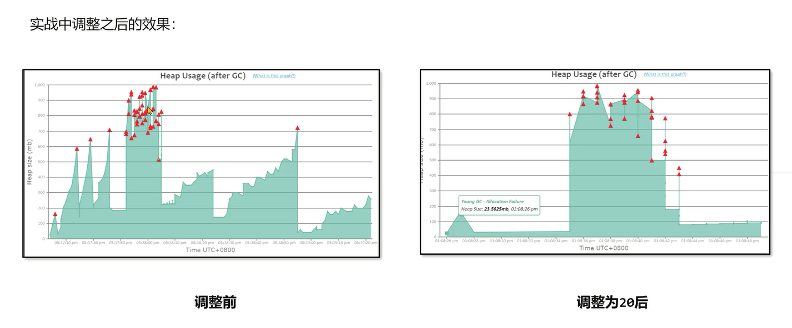

很明显FULLGC产生的次数下降了。

#### 2.2.4 案例实战

**背景：**

小李负责的程序在高峰期经常会出现接口调用时间特别长的现象，他希望能优化程序的性能。

**思路：**

生成GC报告，通过Gceasy工具进行分析，判断是否存在GC问题或者内存问题。

存在内存问题，通过jmap或者arthas将堆内存快照保存下来。

通过MAT或者在线的heaphero工具分析内存问题的原因。

修复问题，并发布上线进行测试。

**测试代码**：`com.itheima.jvmoptimize.fullgcdemo.Practice`

JVM参数：

```Java
-Xms1g -Xmx1g -Xss256k    -XX:MaxMetaspaceSize=256m  -XX:+UseParNewGC -XX:+UseConcMarkSweepGC -XX:+PrintGCDateStamps  -XX:+PrintGCDetails -XX:+DisableExplicitGC -Xloggc:D:/test.log
```

1、打开测试脚本：

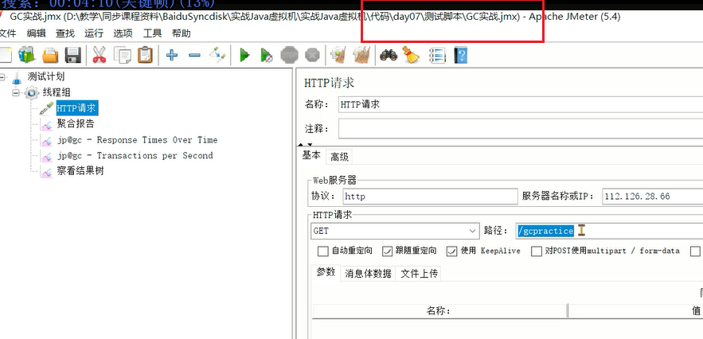

2、发现有几笔响应时间特别长的请求，怀疑是GC引起的：


3、把GC日志上传到GCEasy之后发现内存占用情况很严重：


出现了几次FULLGC,并且FULL GC之后，内存占用也有160m左右:

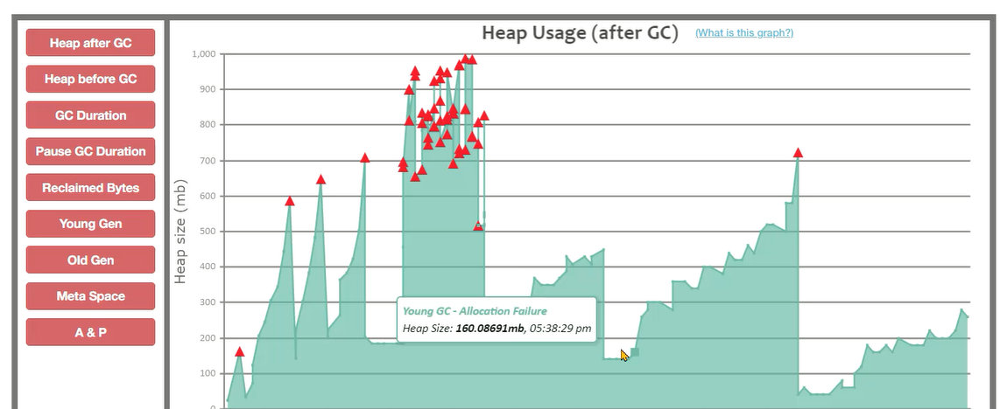

##### 问题1：

发生了连续的FULL GC,堆内存1g如果没有请求的情况下，内存大小在200-300mb之间。

分析：

没有请求的情况下，内存大小并没有处于很低的情况，满足缓存对象过多的情况，怀疑内存种缓存了很多数据。需要将堆内存快照保存下来进行分析。


1、在本地测试，通过visualvm将hprof文件保存下来：

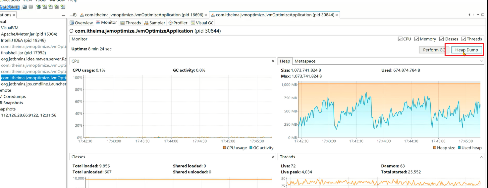

2、通过Heap Hero分析文件，操作方式与GCEasy相同，上传的是hprof文件：


但是我们发现，生成的文件非常小，与接近200m大小不符：


3、怀疑有些对象已经可以回收，所以没有下载下来。使用jmap调整下参数，将live参数去掉，这样即便是垃圾对象也能保存下来：


4、在MAT中分析，选择不可达对象直方图：


5、大量的对象都是字节数组对象：


6.那么这些对象是如何产生的呢？继续往下来，捕捉到有大量的线程对象，如果没有发现这个点，只能去查代码看看哪里创建了大量的字节数组了：

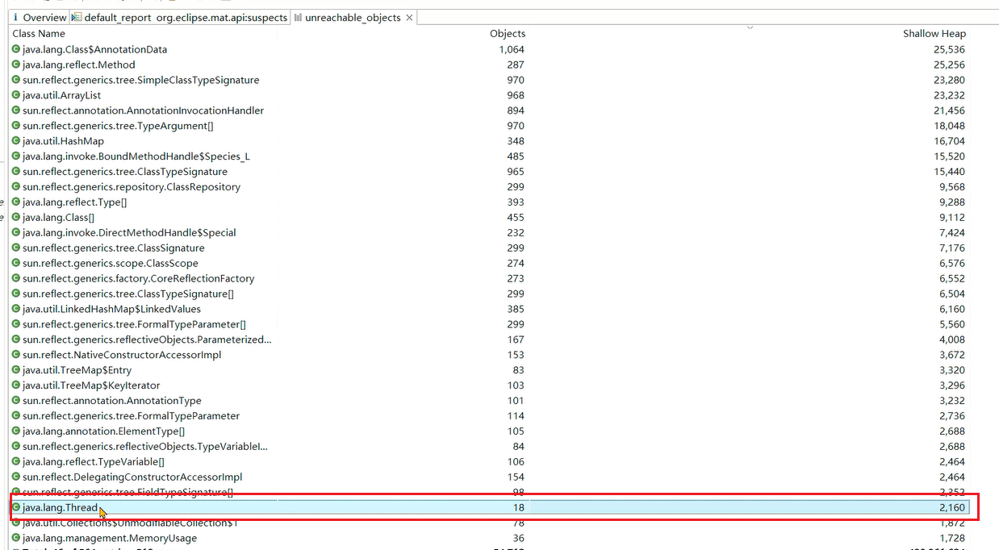

##### 问题2：

由于这些对象已经不在引用链上，无法通过支配树等手段分析创建的位置。

分析：

在不可达对象列表中，除了发现大量的byte[]还发现了大量的线程，可以考虑跟踪线程的栈信息来判断对象在哪里创建。

1、在VisualVM中使用采样功能，对内存采样：


2、观察到这个线程一直在发生变化，说明有线程频繁创建销毁：

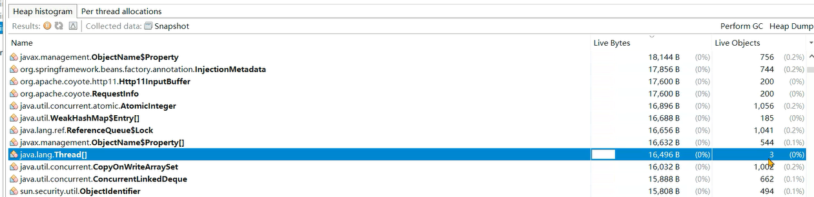

3、选择线程功能，保存线程栈：

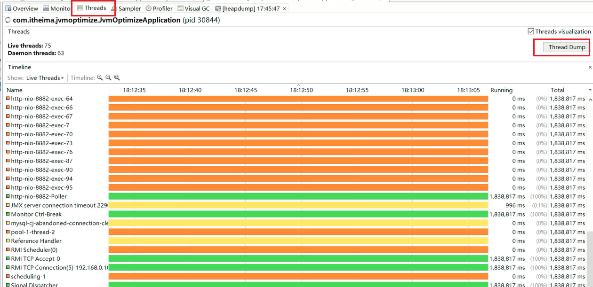

4、抓到了一个线程，线程后边的ID很大，说明已经创建过很多线程了：

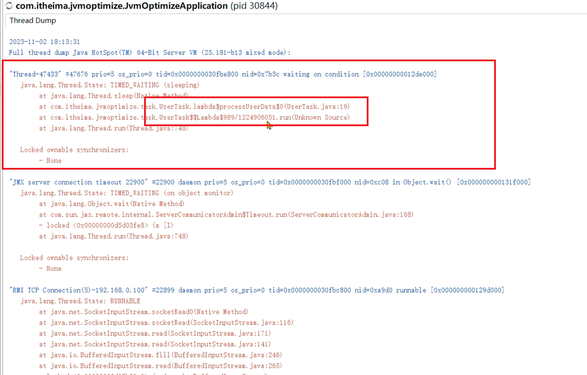

5、通过栈信息找到源代码：

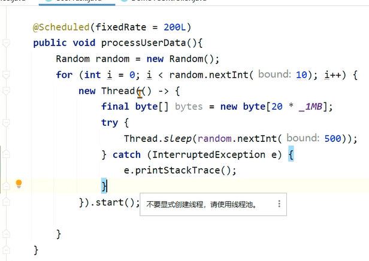

这里有个定时任务，每隔200ms就创建线程。

问题产生原因：

在定时任务中通过线程创建了大量的对象，导致堆内存一直处于比较高的位置。

 

解决方案：

暂时先将这段代码注释掉，测试效果，由于这个服务本身的内存压力比较大，将这段定时任务移动到别的服务中。

##### 问题3：

修复之后内存基本上处于100m左右，但是当请求发生时，依然有频繁FULL GC的发生。

分析：

请求产生的内存大小比当前最大堆内存大，尝试选择配置更高的服务器，将-Xmx和-Xms参数调大一些。


当前的堆内存大小无法支撑请求量，所以要不就将请求量降下来，比如限制tomcat线程数、限流，或者提升服务器配置，增大堆内存。

调整为4G之后的效果，FULLGC数量很少：


##### 案例总结：

1、压力比较大的服务中，尽量不要存放大量的缓存或者定时任务，会影响到服务的内存使用。

2、内存分析发现有大量线程创建时，可以使用导出线程栈来查看线程的运行情况。

3、如果请求确实创建了大量的内存超过了内存上限，只能考虑减少请求时创建的对象，或者使用更大的内存。

4、推荐使用g1垃圾回收器，并且使用较新的JDK可以获得更好的性能。


## 3、性能调优

### 3.1 性能调优解决的问题

应用程序在运行过程中经常会出现性能问题，比较常见的性能问题现象是：

1、通过top命令查看CPU占用率高，接近100甚至多核CPU下超过100都是有可能的。


2、请求单个服务处理时间特别长，多服务使用skywalking等监控系统来判断是哪一个环节性能低下。

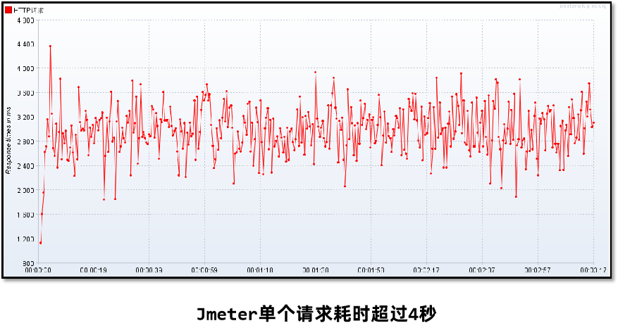

3、程序启动之后运行正常，但是在运行一段时间之后无法处理任何的请求（内存和GC正常）。

### 3.2 性能调优的方法

线程转储（Thread Dump）提供了对所有运行中的线程当前状态的快照。线程转储可以通过jstack、visualvm等工具获取。其中包含了线程名、优先级、线程ID、线程状态、线程栈信息等等内容，可以用来解决CPU占用率高、死锁等问题。

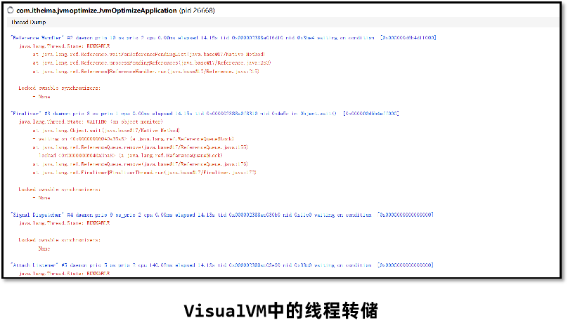

1、通过jps查看进程ID：


2、通过`jstack 进程ID`查看线程栈信息：


3、通过`jstack 进程ID > 文件名`导出线程栈文件


线程转储（Thread Dump）中的几个核心内容： 名称： 线程名称，通过给线程设置合适的名称更容易“见名知意” 优先级（prio）：线程的优先级 Java ID（tid）：JVM中线程的唯一ID 本地 ID (nid)：操作系统分配给线程的唯一ID 状态：线程的状态，分为： NEW – 新创建的线程，尚未开始执行 RUNNABLE –正在运行或准备执行 BLOCKED – 等待获取监视器锁以进入或重新进入同步块/方法 WAITING – 等待其他线程执行特定操作，没有时间限制 TIMED_WAITING – 等待其他线程在指定时间内执行特定操作 TERMINATED – 已完成执行 栈追踪： 显示整个方法的栈帧信息 线程转储的可视化在线分析平台： 1、 https://jstack.review/ 2、 https://fastthread.io/

#### 解决CPU占用率高的问题

应用程序在运行过程中经常会出现性能问题，比较常见的性能问题现象是：

1、通过top命令查看CPU占用率高，接近100甚至多核CPU下超过100都是有可能的。

2、请求单个服务处理时间特别长，多服务使用skywalking等监控系统来判断是哪一个环节性能低下。

3、程序启动之后运行正常，但是在运行一段时间之后无法处理任何的请求（内存和GC正常）。

问题：

监控人员通过prometheus的告警发现CPU占用率一直处于很高的情况，通过top命令看到是由于Java程序引起的，希望能快速定位到是哪一部分代码导致了性能问题。

解决思路：

1、通过top –c 命令找到CPU占用率高的进程，获取它的进程ID。


2、使用top -p 进程ID单独监控某个进程，按H可以查看到所有的线程以及线程对应的CPU使用率，找到CPU使用率特别高的线程。


3、使用 jstack 进程ID 命令可以查看到所有线程正在执行的栈信息。使用 jstack 进程ID > 文件名 保存到文件中方便查看。

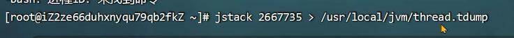

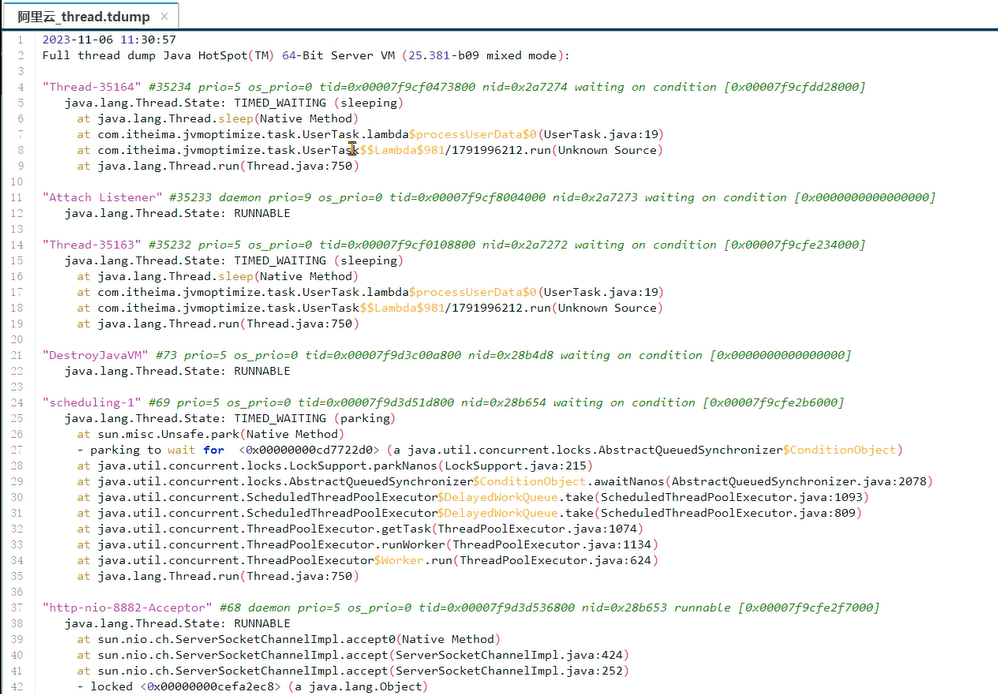

4、找到nid线程ID相同的栈信息，需要将之前记录下的十进制线程号转换成16进制。通过 printf ‘%x\n’ 线程ID 命令直接获得16进制下的线程ID。

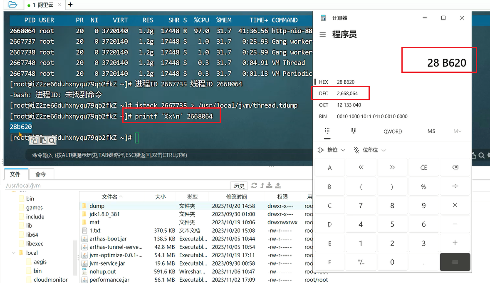


5、找到栈信息对应的源代码，并分析问题产生原因。

在定位CPU占用率高的问题时，比较需要关注的是状态为RUNNABLE的线程。但实际上，有一些线程执行本地方法时并不会消耗CPU，而只是在等待。但 JVM 仍然会将它们标识成“RUNNABLE”状态。


### 3.3 案例实战

#### 案例2：接口响应时间很长的问题

问题：

在程序运行过程中，发现有几个接口的响应时间特别长，需要快速定位到是哪一个方法的代码执行过程中出现了性能问题。

解决思路：

已经确定是某个接口性能出现了问题，但是由于方法嵌套比较深，需要借助于arthas定位到具体的方法。

比如调用链是A方法 -> B方法 -> C方法 -> D方法，整体耗时较长。我们需要定位出来是C方法慢导致的问题。


##### trace命令监控

使用arthas的trace命令，可以展示出整个方法的调用路径以及每一个方法的执行耗时。

命令： `trace 类名 方法名`

添加 `--skipJDKMethod false` 参数可以输出JDK核心包中的方法及耗时。

添加 ‘#cost > 毫秒值’ 参数，只会显示耗时超过该毫秒值的调用。

添加 `–n 数值` 参数，最多显示该数值条数的数据。

所有监控都结束之后，输入`stop`结束监控，重置arthas增强的对象。

测试方法：

```
com.itheima.jvmoptimize.performance.PerformanceController.a()
```

1、使用trace命令，监控方法的执行：


2、发起一次请求调用：


3、显示出了方法调用的耗时占比：

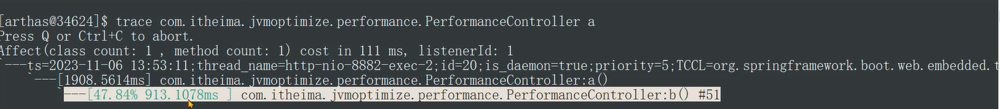

4、添加 `--skipJDKMethod false` 参数可以输出JDK核心包中的方法及耗时：

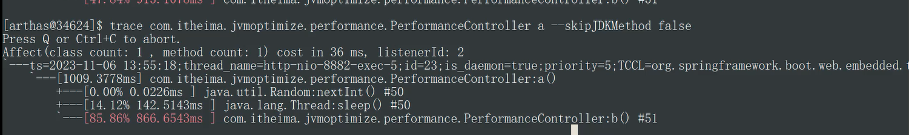

5、添加 ‘#cost > 1000’ 参数，只显示耗时超过1秒的调用。


6、添加 `–n 1` 参数，最多显示1条数据，避免数据太多看起来不清晰。

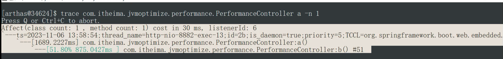

7、所有监控都结束之后，输入`stop`结束监控，重置arthas增强的对象。避免对性能产生影响。


##### watch命令监控

在使用trace定位到性能较低的方法之后，使用watch命令监控该方法，可以获得更为详细的方法信息。

命令：  

```
watch 类名 方法名 ‘{params, returnObj}’ ‘#cost>毫秒值' -x 2
```

`‘{params, returnObj}‘` 代表打印参数和返回值。

`-x` 代表打印的结果中如果有嵌套（比如对象里有属性），最多只展开2层。允许设置的最大值为4。

测试方法：

```
com.itheima.jvmoptimize.performance.PerformanceController.a()
```

1、执行命令，发起一笔接口调用：

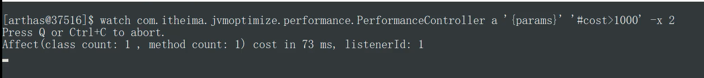

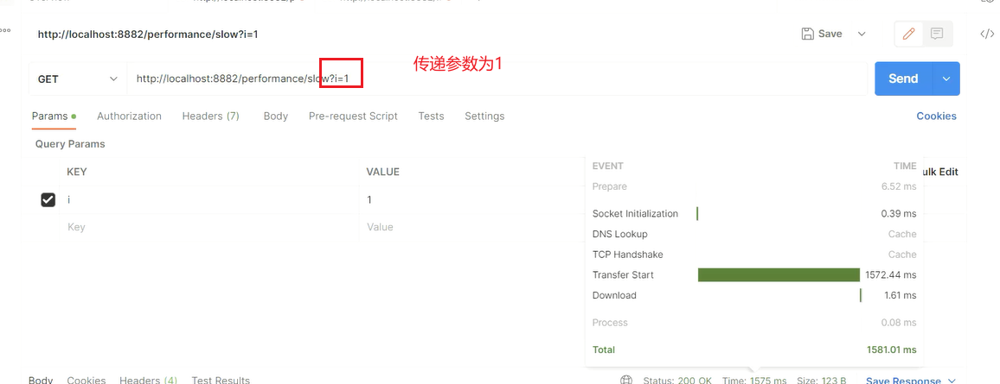

2、cost = 1565ms代表方法执行时间是1.56秒，result = 后边是参数的内容，首先是一个集合（既可以获取返回值，也可以获取参数），第一个数组就是参数，里边只有一个元素是一个整数值为1。


总结：

1、通过arthas的trace命令，首先找到性能较差的具体方法，如果访问量比较大，建议设置最小的耗时，精确的找到耗时比较高的调用。

2、通过watch命令，查看此调用的参数和返回值，重点是参数，这样就可以在开发环境或者测试环境模拟类似的现象，通过debug找到具体的问题根源。

3、使用stop命令将所有增强的对象恢复。

#### 案例3：定位偏底层的性能问题

问题：

有一个接口中使用了for循环向ArrayList中添加数据，但是最终发现执行时间比较长，需要定位是由于什么原因导致的性能低下。

解决思路：

Arthas提供了性能火焰图的功能，可以非常直观地显示所有方法中哪些方法执行时间比较长。

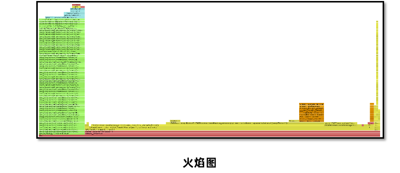

测试方法：

```
com.itheima.jvmoptimize.performance.PerformanceController.test6()
```

使用arthas的profile命令，生成性能监控的火焰图。

命令1：  profiler start  开始监控方法执行性能

命令2：  profiler stop --format html  以HTML的方式生成火焰图

火焰图中一般找绿色部分Java中栈顶上比较平的部分，很可能就是性能的瓶颈。

1、使用命令开始监控：


2、发送请求测试：

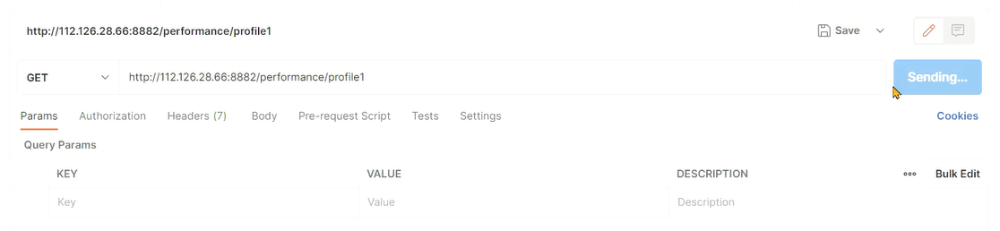

3、执行命令结束，并生成火焰图的HTML


4、观察火焰图的结果：

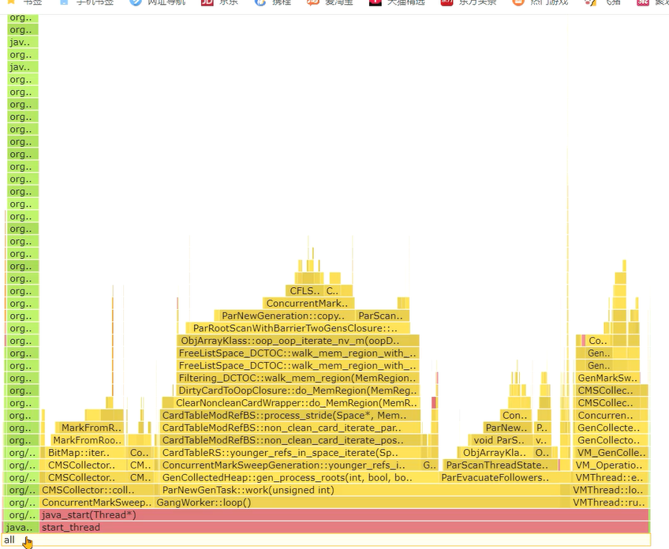

火焰图中重点关注左边部分，是我们自己编写的代码的执行性能，右边是Java虚拟机底层方法的性能。火焰图中会展示出Java虚拟机自身方法执行的时间。

火焰图中越宽的部分代表执行时间越长，比如：

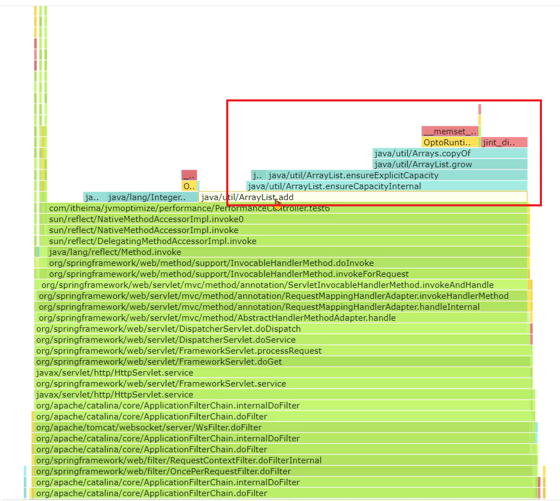

很明显ArrayList类中的add方法调用花费了大量的时间，这其中可以发现一个copyOf方法，数组的拷贝占用时间较多。

观察源码可以知道，频繁的扩容需要多次将老数组中的元素复制到新数组，浪费了大量的时间。


在ArrayList的构造方法中，设置一下最大容量，一开始就让它具备这样的大小，避免频繁扩容带来的影响：

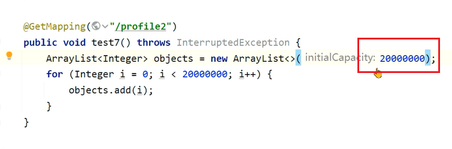

最终这部分开销就没有了，宽度变大是因为我放大了这张图：


总结：

偏底层的性能问题，特别是由于JDK中某些方法被大量调用导致的性能低下，可以使用火焰图非常直观的找到原因。

这个案例中是由于创建ArrayList时没有手动指定容量，导致使用默认的容量而在添加对象过程中发生了多次的扩容，扩容需要将原来数组中的元素复制到新的数组中，消耗了大量的时间。通过火焰图可以看到大量的调用，修复完之后节省了20% ~ 50%的时间。

#### 案例4：线程被耗尽问题

问题：

程序在启动运行一段时间之后，就无法接受任何请求了。将程序重启之后继续运行，依然会出现相同的情况。

解决思路：

线程耗尽问题，一般是由于执行时间过长，分析方法分成两步：

1、检测是否有死锁产生，无法自动解除的死锁会将线程永远阻塞。

2、如果没有死锁，再使用案例1的打印线程栈的方法检测线程正在执行哪个方法，一般这些大量出现的方法就是慢方法。

死锁：两个或以上的线程因为争夺资源而造成互相等待的现象。

死锁问题，学习黑马程序员《JUC并发编程》相关章节。 地址 ： https://www.bilibili.com/video/BV16J411h7Rd?p=115

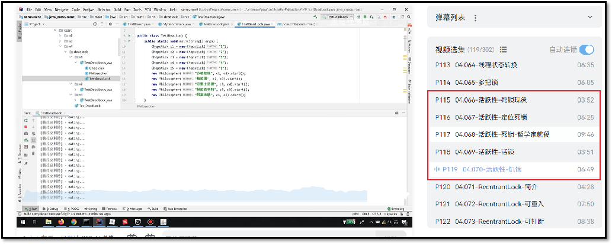

解决方案：

线程死锁可以通过三种方法定位问题：

测试方法：

```
com.itheima.jvmoptimize.performance.PerformanceController.test6()
com.itheima.jvmoptimize.performance.PerformanceController.test7()
```

先调用deadlock1(test6)方法

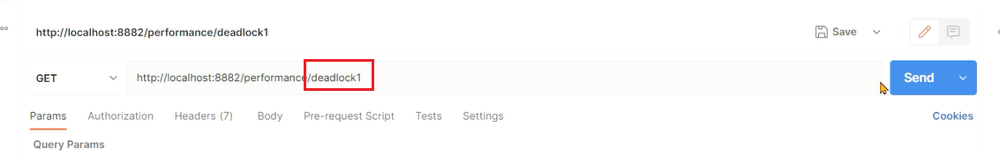

再调用deadlock2(test7)方法，就可以产生死锁


1、 jstack -l 进程ID > 文件名  将线程栈保存到本地。

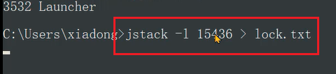

在文件中搜索deadlock即可找到死锁位置：


2、 开发环境中使用visual vm或者Jconsole工具，都可以检测出死锁。使用线程快照生成工具就可以看到死锁的根源。生产环境的服务一般不会允许使用这两种工具连接。


3、使用fastthread自动检测线程问题。 https://fastthread.io/ Fastthread和Gceasy类似，是一款在线的AI自动线程问题检测工具，可以提供线程分析报告。通过报告查看是否存在死锁问题。

在visualvm中保存线程栈：


选择文件并点击分析：

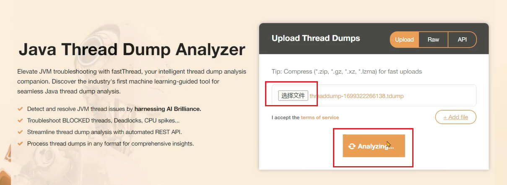

死锁分析报告：


### 3.4 JMH基准测试框架

面试中容易问到性能测试问题：


Java程序在运行过程中，JIT即时编译器会实时对代码进行性能优化，所以仅凭少量的测试是无法真实反应运行系统最终给用户提供的性能。如下图，随着执行次数的增加，程序性能会逐渐优化。

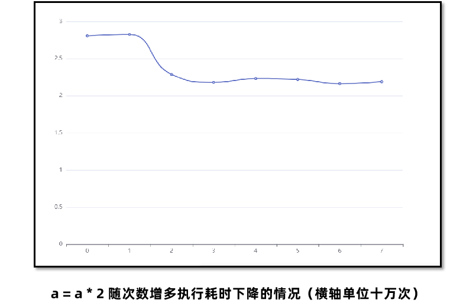

所以简单地打印时间是不准确的，JIT有可能还没有对程序进行性能优化，我们拿到的测试数据和最终用户使用的数据是不一致的。

OpenJDK中提供了一款叫JMH（Java Microbenchmark Harness）的工具，可以准确地对Java代码进行基准测试，量化方法的执行性能。 官网地址：https://github.com/openjdk/jmhc JMH会首先执行预热过程，确保JIT对代码进行优化之后再进行真正的迭代测试，最后输出测试的结果。


#### JMH环境搭建：

创建基准测试项目，在CMD窗口中，使用以下命令创建JMH环境项目：

```Shell
mvn archetype:generate \
-DinteractiveMode=false \
-DarchetypeGroupId=org.openjdk.jmh \
-DarchetypeArtifactId=jmh-java-benchmark-archetype \
-DgroupId=org.sample \
-DartifactId=test \
-Dversion=1.0
```

修改POM文件中的JDK版本号和JMH版本号，JMH最新版本号参考Github。


编写测试方法，几个需要注意的点：

- 死代码问题
- 黑洞的用法

初始代码：

```Java
package org.sample;

import org.openjdk.jmh.annotations.*;
import org.openjdk.jmh.results.format.ResultFormatType;
import org.openjdk.jmh.runner.Runner;
import org.openjdk.jmh.runner.RunnerException;
import org.openjdk.jmh.runner.options.Options;
import org.openjdk.jmh.runner.options.OptionsBuilder;

import java.text.SimpleDateFormat;
import java.time.LocalDateTime;
import java.time.format.DateTimeFormatter;
import java.util.Date;
import java.util.concurrent.TimeUnit;

//执行5轮预热，每次持续1秒
@Warmup(iterations = 5, time = 1, timeUnit = TimeUnit.SECONDS)
//执行一次测试
@Fork(value = 1, jvmArgsAppend = {"-Xms1g", "-Xmx1g"})
//显示平均时间，单位纳秒
@BenchmarkMode(Mode.AverageTime)
@OutputTimeUnit(TimeUnit.NANOSECONDS)
@State(Scope.Benchmark)
public class HelloWorldBench {

    @Benchmark
    public int test1() {
        int i = 0;
        i++;
        return i;
    }

    public static void main(String[] args) throws RunnerException {
        Options opt = new OptionsBuilder()
                .include(HelloWorldBench.class.getSimpleName())
                .resultFormat(ResultFormatType.JSON)
                .forks(1)
                .build();

        new Runner(opt).run();
    }
}
```

如果不降i返回，JIT会直接将这段代码去掉，因为它认为你不会使用*i那么我们对i进行的任何处理都是没有意义的，这种代码无法执行的现象称之为**`死代码`*

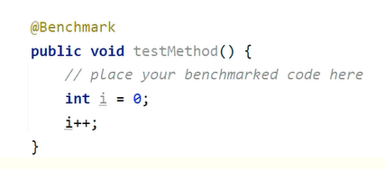

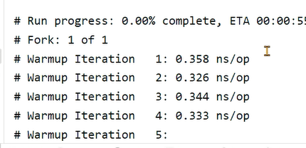

我们可以将i返回，或者添加黑洞来消费这些变量，让JIT无法消除这些代码:

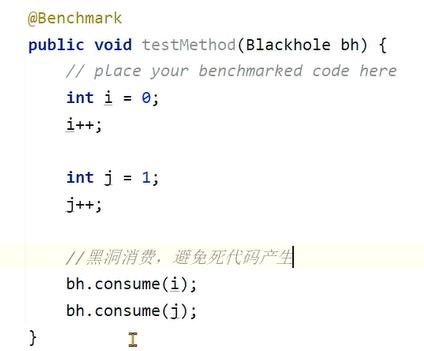


通过maven的verify命令，检测代码问题并打包成jar包。通过 java -jar target/benchmarks.jar 命令执行基准测试。

添加这行参数，可以生成JSON文件，测试结果通过https://jmh.morethan.io/生成可视化的结果。

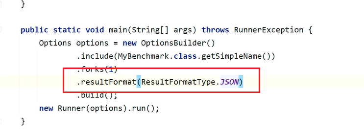

#### 案例：日期格式化方法性能测试 问题：

在JDK8中，可以使用Date进行日期的格式化，也可以使用LocalDateTime进行格式化，使用JMH对比这两种格式化的性能。

**解决思路：**

1、搭建JMH测试环境。

2、编写JMH测试代码。

3、进行测试。

4、比对测试结果。

```Java
package org.sample;

import org.openjdk.jmh.annotations.*;
import org.openjdk.jmh.results.format.ResultFormatType;
import org.openjdk.jmh.runner.Runner;
import org.openjdk.jmh.runner.RunnerException;
import org.openjdk.jmh.runner.options.Options;
import org.openjdk.jmh.runner.options.OptionsBuilder;

import java.text.SimpleDateFormat;
import java.time.LocalDateTime;
import java.time.format.DateTimeFormatter;
import java.util.Date;
import java.util.concurrent.TimeUnit;

//执行5轮预热，每次持续1秒
@Warmup(iterations = 5, time = 1, timeUnit = TimeUnit.SECONDS)
//执行一次测试
@Fork(value = 1, jvmArgsAppend = {"-Xms1g", "-Xmx1g"})
//显示平均时间，单位纳秒
@BenchmarkMode(Mode.AverageTime)
@OutputTimeUnit(TimeUnit.NANOSECONDS)
@State(Scope.Thread)
public class DateBench {


    private static String sDateFormatString = "yyyy-MM-dd HH:mm:ss";
    private Date date = new Date();
    private LocalDateTime localDateTime = LocalDateTime.now();
    private static ThreadLocal<SimpleDateFormat> simpleDateFormatThreadLocal = new ThreadLocal();
    private static final DateTimeFormatter formatter = DateTimeFormatter.ofPattern("yyyy-MM-dd HH:mm:ss");

    @Setup
    public void setUp() {

        SimpleDateFormat sdf = new SimpleDateFormat(sDateFormatString);
        simpleDateFormatThreadLocal.set(sdf);

    }

    @Benchmark
    public String date() {
        SimpleDateFormat simpleDateFormat = new SimpleDateFormat(sDateFormatString);
        return simpleDateFormat.format(date);
    }

    @Benchmark
    public String localDateTime() {
        return localDateTime.format(formatter);
    }
    @Benchmark
    public String localDateTimeNotSave() {
        return localDateTime.format(DateTimeFormatter.ofPattern("yyyy-MM-dd HH:mm:ss"));
    }

    @Benchmark
    public String dateThreadLocal() {
        return simpleDateFormatThreadLocal.get().format(date);
    }


    public static void main(String[] args) throws RunnerException {
        Options opt = new OptionsBuilder()
                .include(DateBench.class.getSimpleName())
                .resultFormat(ResultFormatType.JSON)
                .forks(1)
                .build();

        new Runner(opt).run();
    }
}
```

### 3.5 性能调优综合案例

问题：

小李的项目中有一个获取用户信息的接口性能比较差，他希望能对这个接口在代码中进行彻底的优化，提升性能。

解决思路：

1、使用trace分析性能瓶颈。

2、优化代码，反复使用trace测试性能提升的情况。

3、使用JMH在SpringBoot环境中进行测试。

4、比对测试结果。

```Java
package com.itheima.jvmoptimize.performance.practice.controller;

import com.itheima.jvmoptimize.performance.practice.entity.User;
import com.itheima.jvmoptimize.performance.practice.entity.UserDetails;
import com.itheima.jvmoptimize.performance.practice.service.UserService;
import com.itheima.jvmoptimize.performance.practice.vo.UserVO;
import org.springframework.beans.factory.annotation.Autowired;
import org.springframework.web.bind.annotation.GetMapping;
import org.springframework.web.bind.annotation.RequestMapping;
import org.springframework.web.bind.annotation.RestController;

import java.text.SimpleDateFormat;
import java.time.format.DateTimeFormatter;
import java.util.ArrayList;
import java.util.HashMap;
import java.util.List;
import java.util.Map;
import java.util.stream.Collectors;

@RestController
@RequestMapping("/puser")
public class UserController {

    @Autowired
    private UserService userService;

    private final DateTimeFormatter formatter = DateTimeFormatter.ofPattern("yyyy-MM-dd HH:mm:ss");

    //初始代码
    public List<UserVO> user1(){
        //1.从数据库获取前端需要的详情数据
        List<UserDetails> userDetails = userService.getUserDetails();

        //2.获取缓存中的用户数据
        List<User> users = userService.getUsers();

        SimpleDateFormat simpleDateFormat = new SimpleDateFormat("yyyy-MM-dd HH:mm:ss");
        //3.遍历详情集合，从缓存中获取用户名，生成VO进行填充
        ArrayList<UserVO> userVOS = new ArrayList<>();
        for (UserDetails userDetail : userDetails) {
            UserVO userVO = new UserVO();
            //可以使用BeanUtils对象拷贝
            userVO.setId(userDetail.getId());
            userVO.setRegister(simpleDateFormat.format(userDetail.getRegister2()));
            //填充name
            for (User user : users) {
                if(user.getId().equals(userDetail.getId())){
                    userVO.setName(user.getName());
                }
            }
            //加入集合
            userVOS.add(userVO);
        }

        return userVOS;

    }


    //使用HasmMap存放用户名字
    public List<UserVO> user2(){
        //1.从数据库获取前端需要的详情数据
        List<UserDetails> userDetails = userService.getUserDetails();

        //2.获取缓存中的用户数据
        List<User> users = userService.getUsers();
        //将list转换成hashmap
        HashMap<Long, User> map = new HashMap<>();
        for (User user : users) {
            map.put(user.getId(),user);
        }

        SimpleDateFormat simpleDateFormat = new SimpleDateFormat("yyyy-MM-dd HH:mm:ss");
        //3.遍历详情集合，从缓存中获取用户名，生成VO进行填充
        ArrayList<UserVO> userVOS = new ArrayList<>();
        for (UserDetails userDetail : userDetails) {
            UserVO userVO = new UserVO();
            //可以使用BeanUtils对象拷贝
            userVO.setId(userDetail.getId());
            userVO.setRegister(simpleDateFormat.format(userDetail.getRegister2()));
            //填充name
            userVO.setName(map.get(userDetail.getId()).getName());
            //加入集合
            userVOS.add(userVO);
        }

        return userVOS;

    }


    //优化日期格式化
    public List<UserVO> user3(){
        //1.从数据库获取前端需要的详情数据
        List<UserDetails> userDetails = userService.getUserDetails();

        //2.获取缓存中的用户数据
        List<User> users = userService.getUsers();
        //将list转换成hashmap
        HashMap<Long, User> map = new HashMap<>();
        for (User user : users) {
            map.put(user.getId(),user);
        }

        //3.遍历详情集合，从缓存中获取用户名，生成VO进行填充
        ArrayList<UserVO> userVOS = new ArrayList<>();
        for (UserDetails userDetail : userDetails) {
            UserVO userVO = new UserVO();
            //可以使用BeanUtils对象拷贝
            userVO.setId(userDetail.getId());
            userVO.setRegister(userDetail.getRegister().format(formatter));
            //填充name
            userVO.setName(map.get(userDetail.getId()).getName());
            //加入集合
            userVOS.add(userVO);
        }

        return userVOS;

    }

    @GetMapping
    //使用stream流改写for循环
    public List<UserVO> user4(){
        //1.从数据库获取前端需要的详情数据
        List<UserDetails> userDetails = userService.getUserDetails();

        //2.获取缓存中的用户数据
        List<User> users = userService.getUsers();
        //将list转换成hashmap
        Map<Long, User> map = users.stream().collect(Collectors.toMap(User::getId, o -> o));

        //3.遍历详情集合，从缓存中获取用户名，生成VO进行填充
        return userDetails.stream().map(userDetail -> {
            UserVO userVO = new UserVO();
            //可以使用BeanUtils对象拷贝
            userVO.setId(userDetail.getId());
            userVO.setRegister(userDetail.getRegister().format(formatter));
            //填充name
            userVO.setName(map.get(userDetail.getId()).getName());
            return userVO;
        }).collect(Collectors.toList());

    }

    //使用并行流优化性能
    public List<UserVO> user5(){
        //1.从数据库获取前端需要的详情数据
        List<UserDetails> userDetails = userService.getUserDetails();

        //2.获取缓存中的用户数据
        List<User> users = userService.getUsers();
        //将list转换成hashmap
        Map<Long, User> map = users.parallelStream().collect(Collectors.toMap(User::getId, o -> o));

        //3.遍历详情集合，从缓存中获取用户名，生成VO进行填充
        return userDetails.parallelStream().map(userDetail -> {
            UserVO userVO = new UserVO();
            //可以使用BeanUtils对象拷贝
            userVO.setId(userDetail.getId());
            userVO.setRegister(userDetail.getRegister().format(formatter));
            //填充name
            userVO.setName(map.get(userDetail.getId()).getName());
            return userVO;
        }).collect(Collectors.toList());

    }
}
```

在SpringBoot项目中整合JMH:

1、pom文件中添加依赖:

```XML
<dependency>
    <groupId>org.openjdk.jmh</groupId>
    <artifactId>jmh-core</artifactId>
    <version>${jmh.version}</version>
    <scope>test</scope>
</dependency>
<dependency>
    <groupId>org.openjdk.jmh</groupId>
    <artifactId>jmh-generator-annprocess</artifactId>
    <version>${jmh.version}</version>
    <scope>test</scope>
</dependency>
<properties>
    <java.version>8</java.version>
    <jmh.version>1.37</jmh.version>
</properties>
```

2、测试类中编写:

```Java
package com.itheima.jvmoptimize;

import com.itheima.jvmoptimize.performance.practice.controller.UserController;
import org.junit.jupiter.api.Test;
import org.openjdk.jmh.annotations.*;
import org.openjdk.jmh.infra.Blackhole;
import org.openjdk.jmh.results.format.ResultFormatType;
import org.openjdk.jmh.runner.Runner;
import org.openjdk.jmh.runner.RunnerException;
import org.openjdk.jmh.runner.options.OptionsBuilder;
import org.springframework.boot.SpringApplication;
import org.springframework.context.ApplicationContext;

import java.io.IOException;
import java.util.concurrent.TimeUnit;

//执行5轮预热，每次持续1秒
@Warmup(iterations = 5, time = 1, timeUnit = TimeUnit.SECONDS)
//执行一次测试
@Fork(value = 1, jvmArgsAppend = {"-Xms1g", "-Xmx1g"})
//显示平均时间，单位纳秒
@BenchmarkMode(Mode.AverageTime)
@OutputTimeUnit(TimeUnit.MILLISECONDS)
@State(Scope.Benchmark)
public class PracticeBenchmarkTest {

    private UserController userController;
    private ApplicationContext context;

    //初始化将springboot容器启动 端口号随机
    @Setup
    public void setup() {
        this.context = new SpringApplication(JvmOptimizeApplication.class).run();
        userController = this.context.getBean(UserController.class);
    }

    //启动这个测试用例进行测试
    @Test
    public void executeJmhRunner() throws RunnerException, IOException {

        new Runner(new OptionsBuilder()
                .shouldDoGC(true)
                .forks(0)
                .resultFormat(ResultFormatType.JSON)
                .shouldFailOnError(true)
                .build()).run();
    }

    //用黑洞消费数据，避免JIT消除代码
    @Benchmark
    public void test1(final Blackhole bh) {

        bh.consume(userController.user1());
    }

    @Benchmark
    public void test2(final Blackhole bh) {

        bh.consume(userController.user2());
    }

    @Benchmark
    public void test3(final Blackhole bh) {

        bh.consume(userController.user3());
    }

    @Benchmark
    public void test4(final Blackhole bh) {

        bh.consume(userController.user4());
    }

    @Benchmark
    public void test5(final Blackhole bh) {

        bh.consume(userController.user5());
    }
}
```

总结：

1、本案例中性能问题产生的原因是两层for循环导致的循环次数过多，处理时间在循环次数变大的情况下变得非常长，考虑将一层循环拆出去，创建HashMap用来查询提升性能。

2、使用LocalDateTime替代SimpleDateFormat进行日期的格式化。

3、使用stream流改造代码，这一步可能会导致性能下降，主要是为了第四次优化准备。

4、使用并行流利用多核CPU的优势并行执行提升性能。