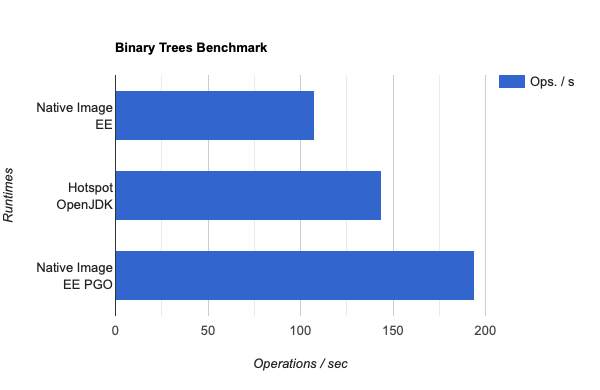

# Binary Tree Benchmark 

This demo shows how to run a Java Microbenchmark Harness (JMH) benchmark as a native executable.

To build a native executable version of this benchmark you need to run the [Tracing Agent](https://www.graalvm.org/dev/reference-manual/native-image/metadata/AutomaticMetadataCollection/) to supply the reflection configuration to the `native-image` builder. This has already been done for you to save time and the generated 
configuration can be found in _src/main/resources/META-INF/native-image/_.

> **Note:** To generate the configuration yourself, ensure that the JMH `fork` parameter is set to `0`, which can be performed from the command line using the option  `-f 0`. It can also be achieved within the code by using the `@Fork` annotation.

## Important Notes on Using JMH with GraalVM Native Image

In order to make a JMH benchmark run as native executable, built by GraalVM Native Image, you can not fork the benchmark process 
in the same way as JMH does when running on the JVM. When running on the JVM JMH will fork a new JVM for each benchmark in order
to ensure there is no interference in the measurements for each benchmark. This forking process is not possible on GraalVM Native Image
and you should consider the following guidance when building JMH benchmarks that are meant to be run as native executables:

* You should only include a single benchmark in each native executable
* You need to annotate the benchmark with, `@Fork(0)` to ensure that the benchmark is not forked
* If you want to profile the benchmark in order to generate an optimised benchmark, you should, obviously, ignore the benchmark results whilst profiling

## Preparation

1. Download and install the latest GraalVM JDK with Native Image using the [GraalVM JDK Downloader](https://github.com/graalvm/graalvm-jdk-downloader). 
    ```bash
    bash <(curl -sL https://get.graalvm.org/jdk) 
    ```

2. Download or clone the repository and navigate into the `jmh/benchmark-binary-tree` directory:
    ```bash
    git clone https://github.com/graalvm/graalvm-demos
    ```
    ```bash
    cd graalvm-demos/jmh/benchmark-binary-tree
    ```

## Build and Run as a Java Application

To build and then run the benchmark as a Java application, run the following commands:

```shell
./mvnw clean package exec:exec
```

Note that within the _pom.xml_ file there are instructions to explicitly turn off GraalVM JIT compiler using the option `-XX:-UseJVMCICompiler`. 
This means that benchmark will run using the C2 JIT compiler.

The application will run the benchmark and display the results to the terminal. The final result is the most significant. You should see something like:

```shell
Benchmark          (binaryTreesN)   Mode  Cnt    Score   Error  Units
BinaryTrees.bench              14  thrpt    6  143.628 ± 9.007  ops/s
```

## Build and Run as a Native Executable

Now build a native executable using Native Image. This demo uses GraalVM Enterprise Native Image, however, if you are using GraalVM Community, you will probably see lower figures for throughput.

1. Build a native executable, run the following command:
    ```shell
    ./mvnw package -Pnative
    ```
2. Run the benchmark as a native executable: 
    ```shell
    ./target/benchmark-binary-tree
    ```
    These are the results obtained with GraalVM Enterprise Native Image 22.3.0:

    ```shell
    Benchmark          (binaryTreesN)   Mode  Cnt    Score   Error  Units
    BinaryTrees.bench              14  thrpt    6  107.388 ± 2.038  ops/s
    ```

## Optimise the Native Image

**Note: This requires Enterprise Edition.**

If you are using GraalVM Enterprise Native Image you can improve the performance of this benchmark by taking 
advantage of a feature named **Profile Guided Optimisations (PGO)**.

First, you will need to build an instrumented version of the native binary that contains extra code to trace the 
execution of the program and to to profile it. Therefore, it will run slower than the previous version. 
When the execution has finished, it will generate a profile file, _default.iprof_, in the root directory. 
This file, containing profiling information about the application, will be used to build a more efficient native executable.

1. To build the instrumented version of the native executable, run the following command:
    ```shell
    ./mvnw package -Pinstrumented
    ```

2. Then run it to generate the profile file:
    ```shell
    ./target/benchmark-binary-tree-instr
    ```

3. Now that you have generated the profile file, build and run the optimised version of the native executable:
    ```shell
    ./mvnw package -Poptimised
    ```
    ```shell
    ./target/benchmark-binary-tree-opt
    ```
    These are the results obtained with GraalVM Enterprise Native Image 22.3.0:
    ```shell
    Benchmark          (binaryTreesN)   Mode  Cnt    Score   Error  Units
    BinaryTrees.bench              14  thrpt    6  194.215 ± 2.746  ops/s
    ```

## Your Mileage May Vary

The results you see will vary depending on the hardware you are running on. The results above are from a 2019 MacBook Pro, i7, 32 GB RAM
running GraalVM Enterprise 22.3.0 for JDK 17.

See the previous data collated into a chart:

